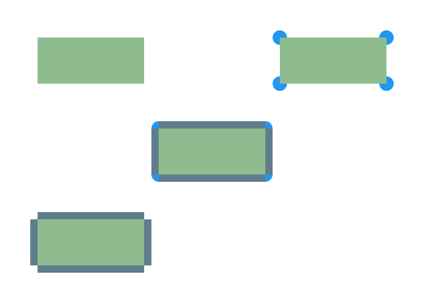

<!-- Copyright (c) 2023 Tobias Briones. All rights reserved. -->
<!-- SPDX-License-Identifier: CC-BY-4.0 -->
<!-- This file is part of https://github.com/tobiasbriones/blog -->

# Removing Cycles: a Round Polygon is Not a Polygon (2023/12/08)


---

## Vague Idea of a Round Rectangle

The popular idea of a round rectangle usually comes from taking a rectangle and
radius arcs to magically round or mutate its borders, which is far from correct.

### Round Rect in Canvas

The canvas APIs take raw primitives, so like the `fillRoundRect` method (and the
API itself analogously), take the top-left, width, and height (i.e., a
rectangle) and the arcs to soften it.

`Methods "fillRect", "fillRoundRect" of the JavaFX GraphicsContext API [2]`

```java
public void fillRect(
    double x,
    double y,
    double w,
    double h
) { /* ... */ }

public void fillRoundRect(
    double x,
    double y,
    double w,
    double h,
    double arcWidth,
    double arcHeight
) { /* ... */ }
```

Sure, the general-purpose canvas API (of HTML5, JavaFX, or whatever platform)
eats some `double` primitives, so it can make sense to say that a rectangle plus
some arcs ~~compose~~ a round rectangle.

This API *suggests that a round rectangle is the composition of a normal
rectangle and arcs,* which is wrong, but understandable in pragmatic terms.

The canvas API is lower-level (as it works with primitive values like `doable`),
so it takes less meaningful data types if at all —not to say it's inherently
mutable 😬—, so it's a misleading guide for high-level designs (though, powerful
for implementation details).

The interpretation that gives the canvas API is similar to one mathematical
definition of a round rectangle, but the issue with this model is that
the `w, h` arguments suggest a rectangle taking the whole lengths (i.e., more
than it is, so leaving out composition) when they should be `w - arcWidth / 2`,
and `h - arcHeight / 2` to *actually* denote an (inner) rectangle —albeit less
practical if using primitives.

That is, the `w, h` arguments are misleading since "rounded rectangles"
don't have width and height since they're not rectangles, but they have an inner
rectangle of `w - arcWidth / 2` times `h - arcHeight / 2` dimensions.

So, the canvas API is fine, but don't fall for the fake friends since primitive
values won't give the idea of high-level (mathematical) constructs.

### The Outer World

There are many more misleading definitions that apparently make sense but would
damage a system design if employed, not to say the very mathematical
definitions.

> Rounded rectangle is a rectangle with chamfered corners. However, these two
> shapes have one more significant difference: rectangles can have three
> dimensions and appear in 3D animation, while rounded rectangles can’t. So, if
> you plan to create 3D animation for your model, we recommend you to use
> rectangles, not rounded rectangles.
>
> Source: *Rounded rectangle* \| AnyLogic Help (under fair use) [3]

The above idea says that "Rounded rectangle **is** a rectangle," which is
totally wrong. It also dares to say that "rectangles can have **three
dimensions**" —also wrong.

It even gets weirder: "while rounded rectangles **can’t**." So if a round
rectangle is a rectangle, why are "rectangles" 3D, but "round rectangles"
can't be?

Of course, those "definitions" make sense in their corresponding context or
software, but you see how they just pass unnoticed as if it were true.

You must pay close attention to all the details and particularly avoid falling
for banal non-mathematical ideas like the misleading "definitions" of a round
rectangle.

## Rounded Rectangle

The definition of a rounded rectangle comes from a model that composes an inner
rectangle, the ellipse arcs defining the round borders, and the four remaining
rectangles of the borders.

First, a "**quadrilateral** is a polygon that has four sides," a
"**parallelogram** is a quadrilateral in which both pairs of opposite sides are
parallel," and a "**rectangle** is a parallelogram that has a right angle" [1].

So, it's clear to prove a rectangle is not a 3D shape and a rounded rectangle is
not a rectangle. That is, proving false the misled random "definitions" from the
internet.

It's clear that a rounded rectangle is *not exactly* "four sides," but much
more, so it's not a rectangle.

Now, there can be various definitions of a "round shape," but this one can be
depicted from the canvas API. I figured out how it takes the values, and it's a
model that takes the whole width and height, as said in
[Round Rect in Canvas](#round-rect-in-canvas).

`Round Rectangle Model`



Let $$a, b$$ be the width and height of the green inner rectangle, and $$r_x,
r_y$$ the radius of the ellipses[^1], respectively.

[^1]: Circles this time to simplify

The canvas API takes $$w = a + 2r_x$$ and $$h = b + 2r_y$$ for
pragmatic/low-level reasons as mentioned, which suggests that it takes a
"single rectangle" and mutates its borders, which is far from real.

Regarding the arcs, they share the same style of the above: $$arcWidth = 2r_x$$
and $$arcHeight = 2r_y$$.

From the high-level mathematical perspective, taking the green rectangle with
$$a$$ and $$b$$ is appropriate since *that **is** an actual rectangle, and you
finish composing the rest*.

If you take the whole `width, height` (commonly suggested out there), you have
more than you need, so they *don't compose well*. If you also take the
`arcWidth, arcHeight` is a flaw as well, since the (short) side of the dark-blue
surrounding rectangles is $$r_x$$ or $$r_y$$, so you either take the "canvas" or
the "math" approach to keep consistent.

Another issue with general-purpose tools is to understand what they actually
mean, so you might think you're drawing something, but it's actually different.
*Creating tests for the drawings is a responsibility* but often complicated, so
**it's best to stand by the theory** to minimize the doubt.

In other words, **the only way to build engineering-grade math software is via
its DSL**.

Rounded rectangles are not rectangles but more complex shapes primarily
composed of rectangles, and you have to be careful with the definitions to be
"on the same page."

## References

[1] Alexander, D. C., & Koeberlein, G. M. (2011). Elementary Geometry for
college students (fifth ed.).

[2] [GraphicsContext (JavaFX 8)](https://docs.oracle.com/javase/8/javafx/api/javafx/scene/canvas/GraphicsContext.html).
(2015, February 10).

[3] [Rounded rectangle \| AnyLogic Help](https://anylogic.help/anylogic/presentation/rounded-rectangle.html).
