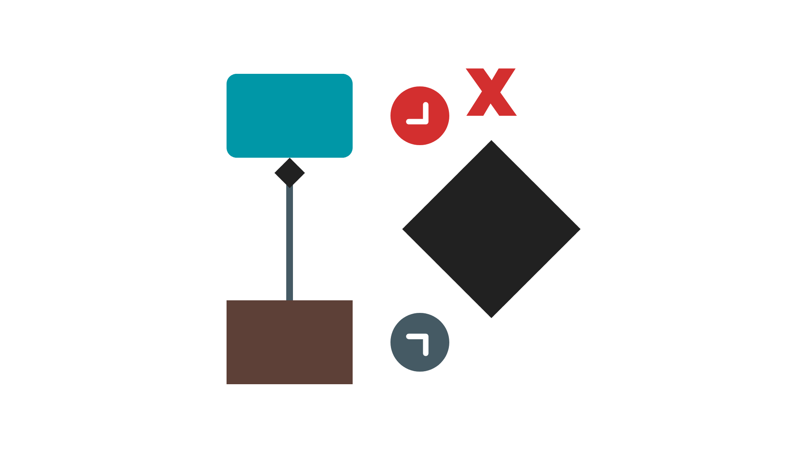
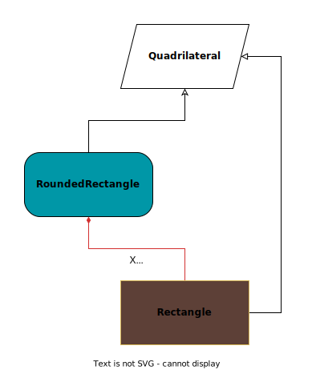

<!-- Copyright (c) 2023 Tobias Briones. All rights reserved. -->
<!-- SPDX-License-Identifier: CC-BY-4.0 -->
<!-- This file is part of https://github.com/tobiasbriones/blog -->

# Removing Cycles: A Rounded Rectangle is Not a Quadrilateral (2023/12/19)



---

## This Quadrilateral Sum Type is not a Partition

As an initial design in the canvas playground, I sent the rounded shapes like
rounded rectangles as part of their corresponding polygon. So, a round rect is
vaguely considered a rect, while a round triangle is vaguely considered a
triangle, etc.

That way, a 4-gon/4-side polygon/quadrilateral can be designed as the
union `Rectangle | RoundRectangle`, but it must not be defined so. The reason
to stay away from this general design flaw has analytical roots and can silently
occur in languages like Java.

`A Rounded Rectangle must not be a Quadrilateral | An Initial Design of 
Quadrilateral Shapes`

```java
public sealed interface Quadrilateral extends Shape {
    record Rectangle(
        double width,
        double height,
        double cx,
        double cy
    ) implements Quadrilateral {
        @Override
        public double area() { return width * height; }
    }

    // TODO wrong design 👎🏻
    record RoundedRectangle(
        Rectangle rectangle,
        double arcX,
        double arcY
    ) implements Quadrilateral {
        @Override
        public double area() {
            // TODO take borders into account if necessary, not a useful
            // feature so far
            return rectangle.area();
        }
    }
}
```

I didn't implement the `area` property because, with proper composition,
everything gets pretty trivial, so I save the effort on these occasions when I
know I'll perform major refactorizations and redesigns.

Even though, as said in
[Ensuring Principle Compliance: This Line Sum Type is Not a Partition](/ensuring-principle-compliance-_-this-line-sum-type-is-not-a-partition-2023-12-07),
we can show that the above `Quadrilateral` sum type *seems to be a partition
(but it's not)*[^1], there are always more design principles to comply like
**acyclicity**. The fact that it's not a partition leads to cycles.

[^1]: A rectangle can't be rounded, and a rounded rectangle can't be straight,
    thus the subsets of our `Quadrilateral` sum type are(?) disjoint and induce
    a partition of our quadrilateral shapes in this case, **if it weren't by the
    issue that `RoundRectangle` is *composed* of a `Rectangle`**

**The `Quadrilateral` sum type is not a partition** since `RoundRectangle` is
composed of `Rectangle`, which is a "sibling" product type of the union, so
**the records of the sum type are coupled, making them non-orthogonal or
dependent**.

The failure of `Quadrilateral` not being a partition is **the first flaw that
must be immediately redesigned for fixing** or else brings interesting issues
like cycles.

Even if it could make sense the idea to put a rounded shape close to its
original shape, it's a fake friend insight.

First, **a rounded rectangle is not a rectangle** as said in
[Designing a Rounded Rectangle Against Pragmatic Misconceptions](/designing-a-rounded-rectangle-against-pragmatic-misconceptions)
—where I also write about these fake friends— and **it's neither a
quadrilateral**. It doesn't have exactly "four sides" so it doesn't belong to
the `Quadrilateral` sum type. It has to be **a different type of composed 
shape**.

The above theory and articles show us not only how a rounded rectangle is not a
rectangle, but further, even if we're fool enough to think so, **the FP design
will tell us it's wrong and how to fix it** (something impossible in ordinary
poorly-engineered paradigms like imperative or Java OOP).

From the pre-initial (experimental) design of `Quadrilateral` biased with fake
friend popular concepts, I worked out the theoretical framework in various
articles to sustain design flaws that also happen generally, such as failing to
design sum types correctly when they don't form a partition, and even further
consequences of this, like the creation of dependent records that can easily
become a cycle or sink.


### Incorrect Coproduct Design Leading to Cycles

The more advanced consequence of why this design is also wrong is a cycle that
has to be removed.

I defined a
[Rounded Rectangle](/designing-a-rounded-rectangle-against-pragmatic-misconceptions#rounded-rectangle)
to help clarify the design I'm facing here.

Imagine I want to employ the fake common sense idea by leaving the rounded
rectangle in `Quadrilateral`.



The flaw is clear: **`RoundedRectangle` is a `Quadrilateral` composed of a
`Rectangle`, which is also a `Quadrilateral`**. Therefore, we have a design
cycle. Records (i.e., `RoundRectangle` and `Rectangle`) of the sum type must be
orthogonal, but `RoundedRectangle` depends on `Rectangle`, so `Quadrilateral`
fails to be a partition by not having mutually disjoint subsets.

If we need to expand the support later, the `Rectangle` field
of `RoundedRectangle` will turn into a general `Quadrilateral` to have rounded
rhombuses and others. Then the cycle would be direct because we would be 
matching a `RoundedRectangle` cyclically for no reason.

`The Sink can be Seen when Pattern Matching | Matching a Quadrilateral`

```java
static QuadrilateralDrawing of(
    GraphicsContext ctx,
    Quadrilateral quadrilateral
) {
    return switch (quadrilateral) {
        case Rectangle rectangle -> new CanvasRectangleDrawing(
            ctx,
            rectangle.width(),
            rectangle.height(),
            rectangle.cx(),
            rectangle.cy()
        );
        case RoundRectangle(var rectangle, var arcX, var arcY) ->
            //                    ↑                    //
            // If you were to pattern-match a          //
            // Quadrilateral, you fall into a loop.    //
            //                                         //
            new CanvasRoundRectangleDrawing(
                ctx,
                rectangle.width(),
                rectangle.height(),
                rectangle.cx(),
                rectangle.cy(),
                arcX,
                arcY
            );
    };
}
```

Then, when matching the `rectangle` field of `RoundedRectangle`, we might as
well be matching a `Quadrilateral` (if we expand from `RoundedRectangle`
to `RoundedQuadrilateral` as said above) again from the beginning, but this
second time will never make sense, *proving that `RoundedRectangle` must not
belong to `Quadrilateral`, which is then a flawed sum type*.

Getting aware that `Quadrilateral` is flawed is direct proof (from the first
statements above), and getting so advanced until this point is something I
wanted to emphasize to denote how the design flaws scale so much.

When not ensuring principle compliance, we can leave behind severe design
issues. In this case, having a record depending on its "sibling" proves how that
can lead to a cycle flaw, and you don't want to mess with cycles, as I've
addressed in other articles.
