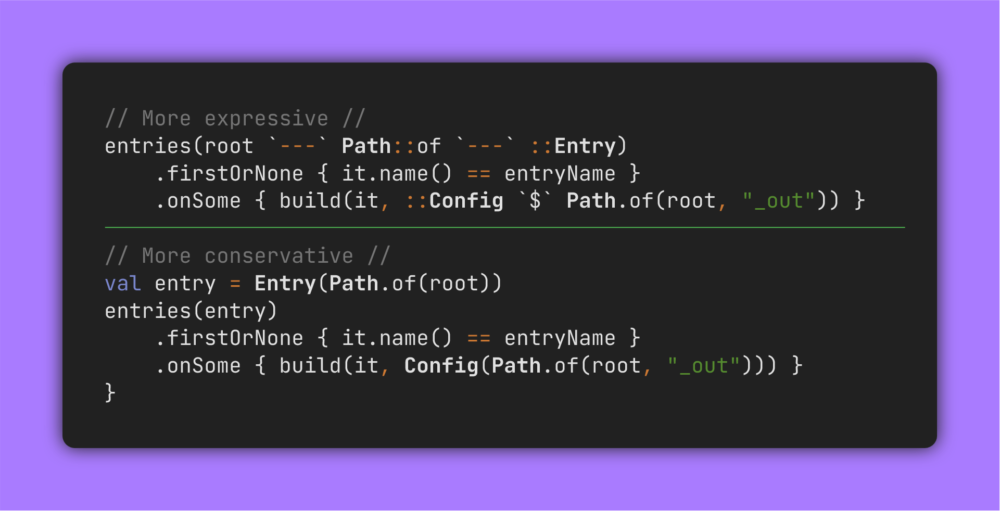
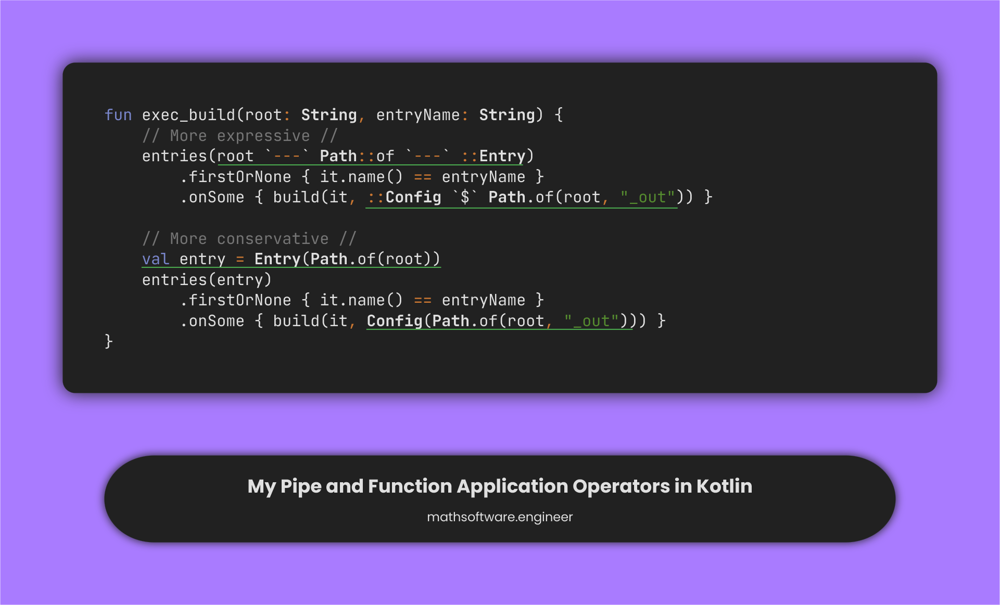

<!-- Copyright (c) 2023 Tobias Briones. All rights reserved. -->
<!-- SPDX-License-Identifier: CC-BY-4.0 -->
<!-- This file is part of https://github.com/tobiasbriones/blog -->

# Applying my Pipe and Application Operators in Kotlin (2023-07-19)



---

I've been applying the operators I designed a couple of days ago to make
Kotlin's FP more expressive.

```kotlin
fun exec_build(root: String, entryName: String) {
    entries(root `---` Path::of `---` ::Entry)
        .firstOrNone { it.name() == entryName }
        .onSome { build(it, ::BuildConfig `$` Path.of(root, "_out")) }
}
```

<figcaption>
<p align="center"><strong>
More Expressive Code with my Pipe and Application Operators
</strong></p>
</figcaption>

```kotlin

fun exec_build(root: String, entryName: String) {
    val entry = Entry(Path.of(root))
    entries(entry)
        .firstOrNone { it.name() == entryName }
        .onSome { build(it, BuildConfig(Path.of(root, "_out"))) }
}
```

<figcaption>
<p align="center"><strong>
More Conservative Code
</strong></p>
</figcaption>

An original (unheard) FP adage refers to "only transformations," not even
identifiers. Of course, not even Haskell has that level of pureness. I mention
it because of the variable names and such.

So, here I removed:

✔ The variable declaration (fragmented) with a cohesive expression to form an
entire whole (the **Stream**).

✔ Some bloated parenthesis with the application operator.



<figcaption>
<p align="center"><strong>
Slide: Pipe and Application Operators
</strong></p>
</figcaption>

Notice, `exec_build` returns `Unit` and naturally has side effects, but removing
the variable statement also would've allowed turning that imperative function
block into an `expression` (i.e., not a code block `{}` but an expression via
the **matching operator** `=`[^1]).

[^1]: The matching operator as in Elixir

The idea of the "matching operator" is to state definitions so there we can see
how a function can be readably stated or defined at some degree with Kotlin's
`=`.

For example, in the following snippet, the function is matched via `=` instead
of being an imperative block `{}` with all the underlying flaws.

```kotlin
enum class Fn {
    Entries,
    Build,
}

fun newFn(value: String): Either<None, Fn> = when (value.lowercase()) {
    "entries" -> Right(Fn.Entries)
    "build" -> Right(Fn.Build)
    else -> Left(None)
}
```

<figcaption>
<p align="center"><strong>
Example of Matching a Function
</strong></p>
</figcaption>

```java
enum Fn {
    Entries,
    Build
}

static Optional<Fn> newFn(String value) {
    return switch (value.toLowerCase(Locale.ROOT)) {
        case "entries" -> Optional.of(Fn.Entries);
        case "build" -> Optional.of(Fn.Build);
        default -> Optional.empty();
    };
}
```

<figcaption>
<p align="center"><strong>
Example of Imperative Boilerplate
</strong></p>
</figcaption>

Otherwise, an imperative code block with `return` would've been needed, like the
above Java snippet —unnecessary. But that's some boilerplate that can be
removed thanks to Kotlin, and so, be turned into a cohesive expression that can
be read fluently "without jumps."

Not to say, when including variables that separate (fragment) the code even
more, with assignments [^2], temporal coupling, etc. That only increases the
"jumps" when reading the code.

[^2]: It's not the same "assigment" than "matching"/"definition"

Even though some things might not be "idiomatic Kotlin," they're still useful
for a more-correct functional approach [^3].

[^3]: I need to use Kotlin as an "industry-grade PureScript," i.e., the
    advantages of Java with a close approach to FP

As you can see, more expressive code inducing a greater degree of functional
purity leads to more cohesive expressions.
