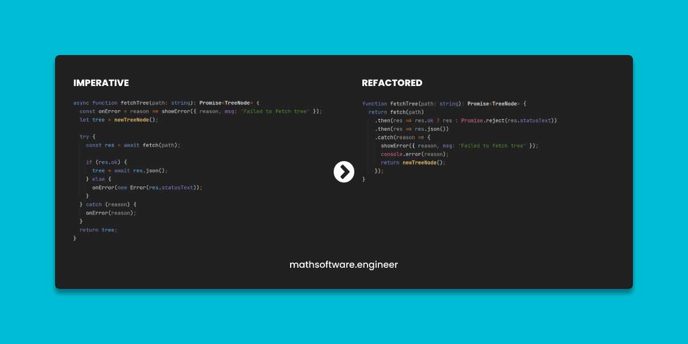

<!-- Copyright (c) 2022-present Tobias Briones. All rights reserved. -->
<!-- SPDX-License-Identifier: CC-BY-4.0 -->
<!-- This file is part of https://github.com/tobiasbriones/blog -->

# From Imperative to Functional: TypeScript Fetch Promise

This
[gist](https://gist.github.com/tobiasbriones/544350fc301ffe32c1dd64d2f6ec6d81)
shows how more functional code is superior to imperative code to
perform a simple fetch request to get JSON value that models a tree data
structure to be represented later by `HTMLCanvasElement`.

Both versions are correct and do the same, the "functional" version still has
some imperative style because JS/TS is not a functional language but the
difference **is clear** again.

By noticing the:

👎🏻 return statement

👎🏻 ternary operator

👎🏻 error handling block

And lack of:

👉🏻 pipe operator

👉🏻 pattern matching

👉🏻 expressions[^1]

[^1]: Notice the stupid semicolons appear when the line of code is imperative,
    sounds familiar isn't it? yes, Rust 🦀

Then we have reasons why the "functional" snippet doesn't get **even better**.
