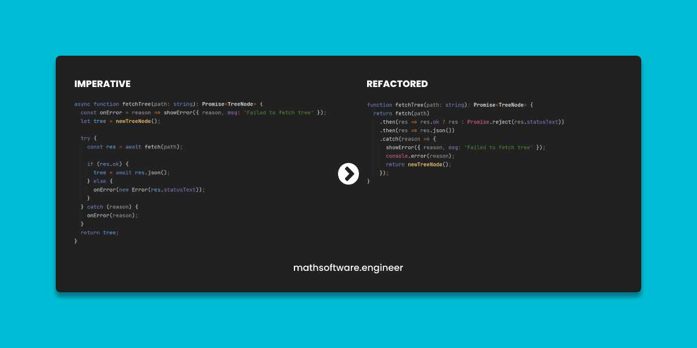

<!-- Copyright (c) 2022-present Tobias Briones. All rights reserved. -->
<!-- SPDX-License-Identifier: CC-BY-4.0 -->
<!-- This file is part of https://github.com/tobiasbriones/blog -->

# From Imperative to Functional: TypeScript Fetch Promise



This
[gist](https://gist.github.com/tobiasbriones/544350fc301ffe32c1dd64d2f6ec6d81)
shows how more functional code is superior to imperative code to
perform a simple fetch request to get a JSON value that models a tree data
structure to be represented later by `HTMLCanvasElement`.

Both versions are correct and do the same, but the "functional" version
still has some imperative style because JS/TS is not a functional language but
the difference **is clear** again.

The difference between both snippets is the following:

```ts
async function fetchTree(path: string): Promise<TreeNode> {
  const onError = reason => showError({ reason, msg: 'Failed to fetch tree' });
  let tree = newTreeNode();

  try {
    const res = await fetch(path);

    if (res.ok) {
      tree = await res.json();
    }
    else {
      onError(new Error(res.statusText));
    }
  }
  catch (reason) {
    onError(reason);
  }
  return tree;
}
```

<figcaption>
<p align="center"><strong>Imperative</strong></p>
</figcaption>


```ts
function fetchTree(path: string): Promise<TreeNode> {
  return fetch(path)
    .then(res => res.ok ? res : Promise.reject(res.statusText))
    .then(res => res.json())
    .catch(reason => {
      showError({ reason, msg: 'Failed to fetch tree' });
      console.error(reason);
      return newTreeNode();
    });
}
```

<figcaption>
<p align="center"><strong>More Functional</strong></p>
</figcaption>

The refactored code (a.k.a. "more functional") **is not functional**, but it 
gets close. This is to avoid introducing functional abstractions like pipes, 
monads, etc., on top of JS/TS which is not a functional language but a mixed 
one as the underlying project is pretty short.

By noticing the:

👎🏻 return statement

👎🏻 ternary operator

👎🏻 error handling block

And lack of:

👉🏻 pipe operator

👉🏻 pattern matching

👉🏻 expressions[^1]

[^1]: Notice the stupid semicolons appear when the line of code is imperative,
    sounds familiar isn't it? yes, Rust 🦀

Then we have reasons why the "functional" snippet doesn't get **even better**.

The imperative version has the following visible problems, and **I encourage 
you to reason the code snippets** to figure them out:

- Imperatively needs to add `async` to the function signature which leads to 
  the "async-await hell" and more boilerplate.
- Usage of mutable variable `tree` for returning the function value in order 
  to avoid a multiple-`return` mess.
- Usage of `try`-`catch` for error handling which has many disadvantages and 
  can be replaced with sum types or monads like Rust does, so there's no 
  reason why we should keep using `try`-`catch` blocks in robust software 
  development.
- Usage of OOP which might enhance lower-level imperative code but is complete 
  nonsense for high-level software (most projects) and yes, more boilerplate.
- As I say below, it still has and needs mixed components 
  (functional/declarative, OO, etc.) so if we could go fully functional 
  (with better languages) why keep writing cheap code like that?
- Has more formatting constraints, I always put the `else` branch on a new 
  line (which gives more LoC) as it is factually the best way to format it.
- It's obviously quite prone to error and hard to read.
- Even the Mozilla docs for `Promise` only show toy examples, and real life 
  error handling gets worse with imperative code. Code on the internet like 
  docs or tutorials almost always skip the status `ok` error handling and go 
  directly to fail when parsing the `JSON` data. Who cares when code is 
  imperative anyway?

Also, notice how throwing from a `try`-`catch` block **is an antipattern** as it
becomes a `goto`[^2][^3].

[^2]: You can learn plenty of these details from IntelliJ IDEA inspections

[^3]: Understanding these details are what make you stand away from bad 
    programmers and make you a competent one

If TS had `try`-expressions (like Kotlin) the imperative version would get
much better regarding correctness and style, but **expressions are
declarative so functional** in the end 😋.

**The more you make a program better, the more functional it gets**, that's
because **FP is the only/original programming paradigm there exists as per
scientific concerns**, and all other paradigms are just cheap workarounds.

Notice we can go "pure functional" but not "pure imperative" or "pure OO" so 
the **workarounds** are clearly the alternative non-functional paradigms.

Another good one I know a lot from experience is that **the more I refactor code
to improve it the more domain-specific it gets**, and FP is clearly the natural
way to go for DSLs.

I used to be a huge fan of Java as an OO approach (still have my good reasons) 
but I got to understand those "clever" ways of programming are **just 
intellectual distractions**.

So, my favorite phrase I use to teach others or tell my story is that the
**simplest designs are the best** and FP is all about simplicity.

Mainstream languages like JavaScript, TypeScript, and Java don't have good
functional support, but we can still build better code regarding robustness 
and clearness by leveraging their available features and our computer science 
knowledge.
