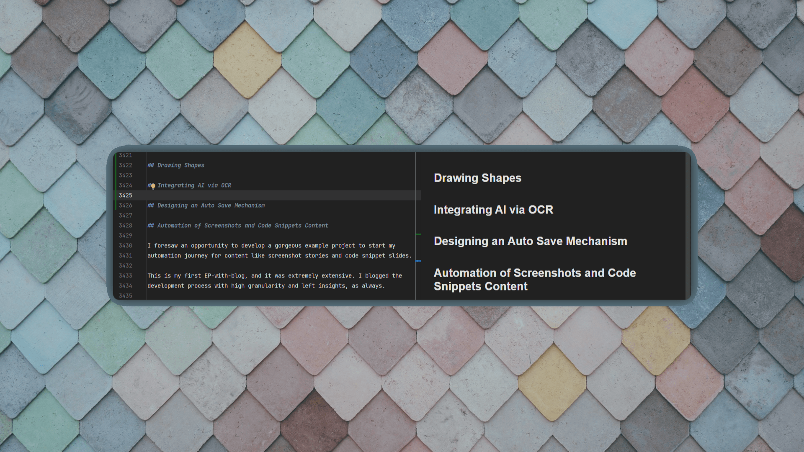
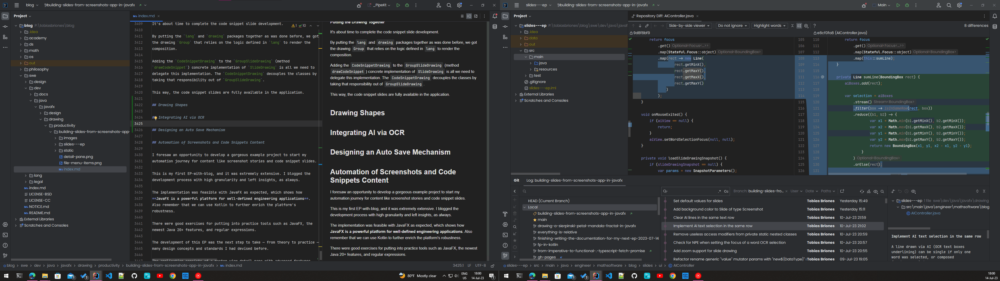
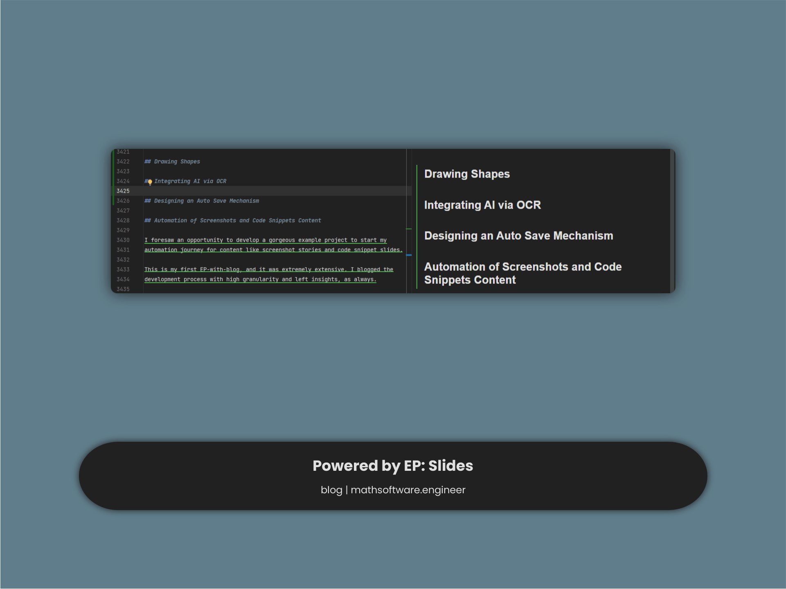

<!-- Copyright (c) 2023 Tobias Briones. All rights reserved. -->
<!-- SPDX-License-Identifier: CC-BY-4.0 -->
<!-- This file is part of https://github.com/tobiasbriones/blog -->

# Finishing Writing the Documentation for my Next EP (2023-07-14)

<figcaption>

Background by
<a href="https://pixabay.com/users/stocksnap-894430">StockSnap</a> via
<a href="https://pixabay.com/photos/tiles-shapes-texture-pattern-art-2617112">Pixabay</a>

</figcaption>

---

I'm about to publish my first and next Blog with EP "Building Slides from
Screenshots App in JavaFX," now that I finished all the code I wanted to add to
the project yesterday, so I just have to blog it to its (extensive) article,
tackle a few details more, and add the abstract.

Now, I can develop EPs for multiple purposes I set. EPs can serve not only as
standalone applications but also as blogs documenting the development process
and more. This can help —among more purposes— to evaluate tech or early-stage
ideas.

The meaning of a blog with EP —unlike a normal EP— is not its project but
**its blog**, so once I publish it, I won't be interested in keep working on its
project. On the other side, if it was a normal EP, I could prove any
ideas at any time since it's an actual standalone project.

This way, I can powerfully scale (one more time) my **career domination** by
showing more of my work in different aspects of my profession. So I feel like
I'm not just the one who "writes the code" but the one "behind all this."

I'll publish
[Building Slides from Screenshots App in JavaFX](/building-slides-from-screenshots-app-in-javafx)
soon with an extensive experience in all kinds of features I ventured into.

For now, I still have to blog some sections for the last features I developed
and then finish other minor details.

<figcaption>

<strong>
IntelliJ: Finishing Writing with the Blog and Project Side-to-Side
</strong>

</figcaption>

Sure, I employ my two monitors, and tons of pro tools like IntelliJ
subscriptions, Git, etc., not to say my knowledge and experience —**building
high-quality content is really hard**[^1].

[^1]: Building **free high-quality original** content is not for everyone; you
    must be super specialized

I still need to engineer general automation tools to handle static files,
derivative contents (e.g., "images" directories), and get rid of Windows, as
you can see in the screenshot.

I also have to build the Kotlin DSLs with FP for *content operations*, that is,
deploying articles from source [^2].

[^2]: I really need to get to this point to get rid of LaTeX as well, to write
    **first-class math via its DSL**

I'm also working on developing other languages for generating Table of Contents
(ToC) and Open Graph (OG) cover images for articles[^3].

[^3]: I manage prototypes for all this, for example, in Photoshop, so I can
    design the DSLs in the future

Proving **ideas for automation** is one of the purposes of this blog: it's so
much I can't standardize right now, but I have to move forward in the meantime.

This time we're talking about a huge article with over 3k lines of markdown, and
the IDE gets slow when I edit it on my machine.

I don't have to create a trillion articles, as one entry can hold a lot of
content. **I always optimize for quality and not quantity** for what matters to
me and MathSwe.

To grasp an idea of my mental model: I think of directories as sum types
(relations, partitions) and articles as (physical) product types. This way, I
build decentralized homogeneous content.

So it's fine if articles are long while they're highly cohesive and lowly
coupled. I always measure this when creating content: something that
*makes you stand over most engineers or practitioners (abstract reasoning
skills)*.

So, for instance, I evaluate some principles for each section *before
committing* (i.e., add something small but mostly correct[^4]) and measure
coupling, so I know I won't introduce side effects (interpretations) if I update
a text.

[^4]: Grammar checking goes here as well

The following is an example of the artifacts that can be produced with the
application:

<figcaption>

<strong>
Screenshot-Slide Sample
</strong>

</figcaption>

It's a `Screenshot` `Slide`, that is, a `Slide` created from a screenshot.

I applied background, an FHD resolution, underlining assisted via AI OCR, a
vertical `Line` `Shape`, and a `Caption` with a title and subtitle.

I will finish writing soon, and with this, I'll get one more great reference for
my blog.
