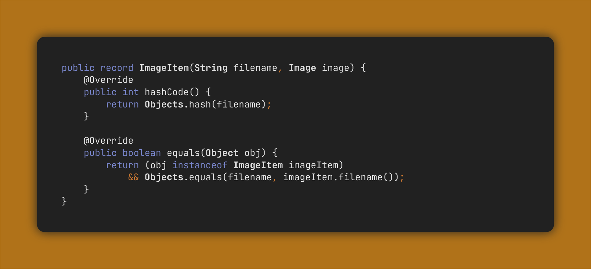
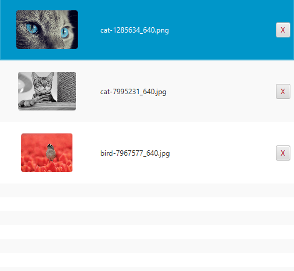

<!-- Copyright (c) 2023 Tobias Briones. All rights reserved. -->
<!-- SPDX-License-Identifier: CC-BY-4.0 -->
<!-- This file is part of https://github.com/tobiasbriones/blog -->

# Overriding Hash Code and Equals in a Record with an Image Field

---

Java Records have several built-in implementations, so some ask when you should
override that default behavior which is a situation I recently came across when
dealing with GUI and binary image files, so I found an opportunity to write
about this topic.

## Example Case

This idea relates to when I was developing a JavaFX app that receives images via
drag-and-drop, and had to override these methods to fix the bug in the GUI.

I already
[explained this](/building-slides-from-screenshots-app-in-javafx#application-data),
but I want to provide more documentation.

This snippet explains why, according to the use case I had with that app.

You may not use a binary file or large data like an `Image` to give an object
identity, which leads us to overwrite the `hashCode` and `equals` methods in a
Java `record`. Even though they're implemented by default, we have to optimize
sometimes.

The truth is that records are known to be "transparent carriers of immutable
data," but they can also contain mutable objects or images that reference disk
effects. Whenever we see any scenario including "mutability, side effects,
binary, etc.," we have the red flag 🚩 to take action there.

If the behavior is not fixed, the side effects will cause problems in
identifying the items. For example, when you update the image in the disk, the
hashes will be different for the same item in the program, so two modified
versions of the same item will match differently. Even if the image in the disk
is the same, it'll happen the same if you create two `Image` objects since
they'll match differently by just being different object instances. Moreover,
using bloated fields to compute an object's identity is nonsense programming
logic and inefficient.

## Updating an Existing Image

This behavior can be depicted as follows.

Let's say I want to update the bird image by drag-and-drop.

If we don't explicitly override the `record` `hashCode`, and `equals` methods
according to our model, the `Image` **binary field** will introduce the **side
effect**:

That is, when we add an existing image to the app, the list of images in the GUI
doesn't remove the old image since it takes both (old and new) images as
different by being **different instances** of **the same model**.

Even though the *file system keeps correctness* (as that's an application logic
affair), that default `record` behavior still leads to correctness (and
performance since you don't want to compute an `Image` hash) *issues on the
front-end* (as that's a GUI affair).

This also shows us that we can have some side effects on less important parts of
a system while **keeping a robust design in the domain**. I optimize as much as
possible for the domain, and any professional software engineer also must.

Now, by fixing this detail, we get the correct behavior in the front-end as
well:

Binary files are always a red flag 🚩 as they're external systems that have to be
pushed to the boundaries, like in FP: the DSL is part of the system, and side
effects go to the boundaries.

This case shows one example of when to override the default implementation of a
Java `record` that has large or binary fields and how a side effect can be
mitigated in a system.

## Update on the Application Development

As a bonus, I leave a pretty slide I created with the underlying application I
was talking about in this article.

Regarding development, I finished the EP and will publish the complete
development documentation as notified in
[Finishing Writing the Documentation for my Next EP (2023-07-14)](/finishing-writing-the-documentation-for-my-next-ep-2023-07-14).

I actually took this article from the app dev article to separate the content,
and I will publish this article that has been ready since long ago right after I
publish the dev one.

Notice the difference in quality this experimental version provides me compared
to the generic code snippet images I generated above via other third-party
generic tools that are always bugged or never work well. This opens a new era
for my technical content creation.

## Setting a Correct Model Identity

Large structures, binary files, memory addresses, and any kind of
poorly-meaningful side effects have to be pushed to the system boundaries, and
we have to avoid merging them into our domain boundaries like in this case where
a Record should be defined via a meaningful key from our application domain
instead of an in-memory image object.
