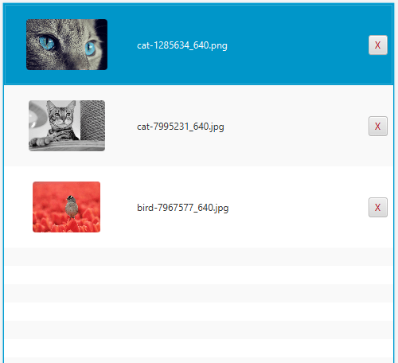

<!-- Copyright (c) 2023 Tobias Briones. All rights reserved. -->
<!-- SPDX-License-Identifier: CC-BY-4.0 -->
<!-- This file is part of https://github.com/tobiasbriones/blog -->

# Overriding Hash Code and Equals in a Record with an Image Field

I already
[explained this](/building-slides-from-screenshots-app-in-javafx#application-data),
but I want to provide more documentation.

This snippet explains why, according to the use case I had with that app.

<figcaption>

<strong>Why Override Hash Code and Equals Methods in a Record</strong>

</figcaption>

To depict this behavior:

Let's say I want to update the bird image by drag-and-drop.

<figcaption>

<strong>Highlighting our Target</strong>

</figcaption>

If we don't explicitly override the `record` `hashCode`, and `equals` methods
according to our model, the `Image` **binary field** will introduce the **side
effect**:

<figcaption>

<strong>GUI Bug that Takes the Updated Image as Brand
New</strong>

</figcaption>

That is, when we add an existing image to the app, the list of images in the GUI
doesn't remove the old image since it takes both (old and new) images as
different by being **different instances** of **the same model**.

Even though the *file system keeps correctness* (as that's an application logic
affair), that default `record` behavior still leads to correctness (and
performance since you don't want to compute an `Image` hash) *issues on the
front-end* (as that's a GUI affair).

This also shows us that we can have some side effects on less important parts of
a system while **keeping a robust design in the domain**. I optimize as much as
possible for the domain, and any professional software engineer also must.

Now, by fixing this detail, we get the correct behavior in the front-end as
well:

<figcaption>

<strong>Expected: Updating an Existing Image</strong>

</figcaption>

Binary files are always a red flag 🚩 as they're external systems that have to be
pushed to the boundaries, like in FP: the DSL is part of the system, and side
effects go to the boundaries.

This case shows one example of when to override the default implementation of a
Java `record` that has large or binary fields and how a side effect can be
mitigated in a system.
