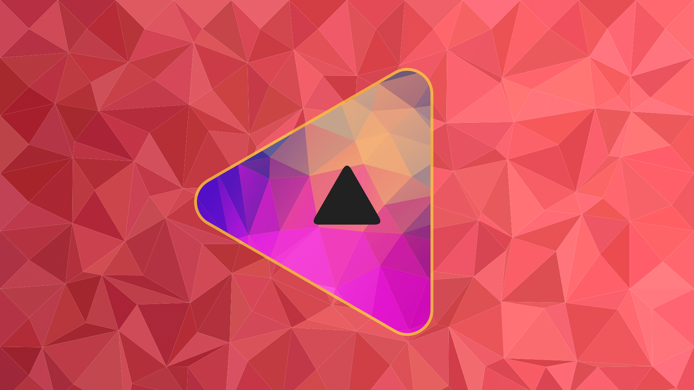
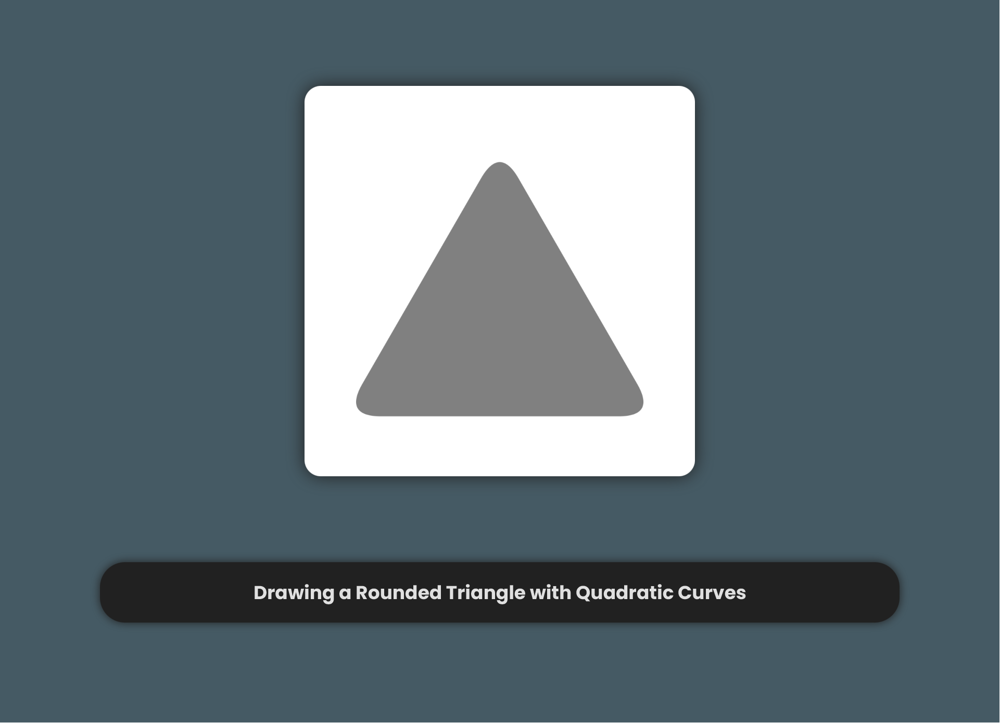
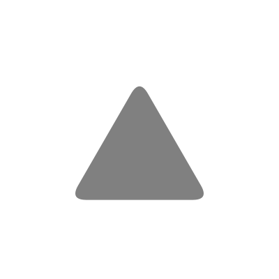

<!-- Copyright (c) 2023 Tobias Briones. All rights reserved. -->
<!-- SPDX-License-Identifier: CC-BY-4.0 -->
<!-- This file is part of https://github.com/tobiasbriones/blog -->

# Drawing a Rounded Triangle via Quadratic Curves (2023/12/22)



<p align="center">
<b>
Derived from
<a href="static/notice#cover">Pixabay</a> Background Images
</b>
</p>

---

I added support for rounded triangles to the Canvas Play JavaFX project using
quadratic Bézier curves.

I was in a hurry for this shape since I'm resembling the fractal
[I drew for fun in JS some months ago](https://blog.mathsoftware.engineer/an-excited-time-drawing-mandala-fractals-today-2023-04-06).

Rounded triangles will be part of my still unpublished blog EP for drawing a
"Sierpinski Petal Fractal in JavaFX."

I used quadratic Bézier curves to define the borders given the radius at each of
the three vertexes.

Moreover, I took extra time today to build the presentation from the drawing so
the code is left clear —as always, optimizing for quality and caring about my
readers.



The "low-level" canvas code follows the same step-by-step model.

`Canvas Drawing of a Rounded Triangle`

```java
ctx.beginPath();
ctx.moveTo(base.sx(), base.cy());
ctx.lineTo(base.ex(), base.cy());

ctx.quadraticCurveTo(
    base.ex() + arc,
    base.cy(),
    right.ex(),
    right.ey()
);

ctx.lineTo(right.sx(), right.sy());

ctx.quadraticCurveTo(
    base.cx(),
    base.cy() - height,
    left.ex(),
    left.ey()
);

ctx.lineTo(left.sx(), left.sy());

ctx.quadraticCurveTo(
    base.sx() - arc,
    base.cy(),
    base.sx(),
    base.cy()
);
```

So, the test is left to give some guarantees about the API stability.

`Experimental Canvas Play API | Rounded Triangle Test Case`

```java
@Test
void drawEquilateralRoundTriangle() {
    var color = Color.GRAY;

    actualCanvas(canvas -> {
        var prodCanvas = new FxProdCanvas(canvas, 1.0);

        prodCanvas
            .drawingCtx(TriangleDrawing::of)
            .apply(
                new RoundedTriangle(
                    new EquilateralTriangle(
                        200.0,
                        CANVAS_WIDTH / 2.0,
                        CANVAS_HEIGHT / 2.0
                    ),
                    24.0
                )
            )
            .fill(color);
    });

    matchImage("rounded-equilateral-triangle.png");
}
```



The concern with quadratic curves is that they won't necessarily resemble an
ellipse, which may be (in general) the standard definition for quadratic
polygons besides
[rounded rectangles](/designing-a-rounded-rectangle-against-pragmatic-misconceptions#rounded-rectangle)
I designed mathematically via ellipses for the soft corners.

So, using a technique like quadratic curves can generalize to solve the problem
for any rounded polygon, but I have to be careful with the design —as always.

Supporting rounded rectangles and triangles is a great step for the current
Canvas Play in JavaFX while solving many other design challenges under the
hood.
