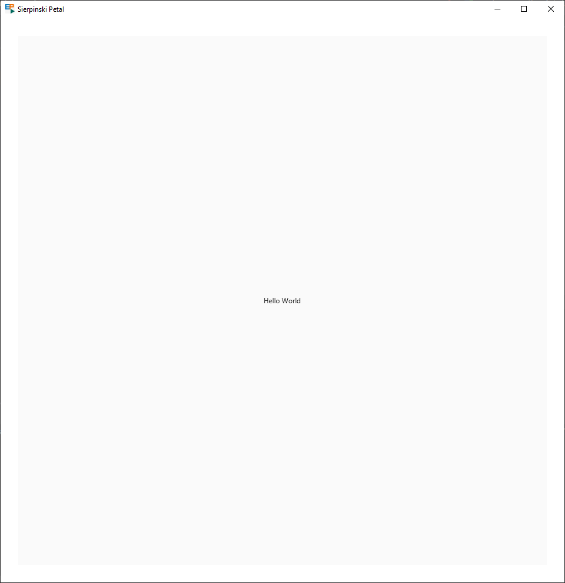

<!-- Copyright (c) 2023 Tobias Briones. All rights reserved. -->
<!-- SPDX-License-Identifier: CC-BY-4.0 -->
<!-- This file is part of https://github.com/tobiasbriones/blog -->

# Drawing a Sierpinski Petal Mandala Fractal in JavaFX

## Getting Started

Tools and project setup are given next, so you can build the basics for
developing the underlying drawing in JavaFX.

As said in
[Getting Started | Building Slides from Screenshots App in JavaFX](/building-slides-from-screenshots-app-in-javafx#getting-started),
you can get started and let the *package name* be `engineer.mathsoftware.blog.
sierpinskipetal` for this app.

It's important to note the `module-info.java` in the module's source root
(`src` dir), as we use Java modules to import JavaFX mods in this case.
Exporting your root package is also necessary, as JavaFX is a framework that
uses reflection and needs to find your `Main` class.

The initial modules should be the following.

`Initial App Modules | module-info.java`

```java
module engineer.mathsoftware.blog.sierpinskipetal {
    requires javafx.controls;
    requires javafx.swing;
    exports engineer.mathsoftware.blog.sierpinskipetal;
}
```

With this, Java and JavaFX should be available on your machine, as well as the
dev tools, environment, and starting project, so we can develop the JavaFX code.

### Package App

This package will implement the JavaFX GUI application.

I applied an MVC architectural pattern to design the `app` `package` since the
GUI part of the application is minimal. Otherwise, I'd use MVP[^x] to design
JavaFX desktop apps. I thought about it, but the tradeoff was remarkable since
applying MVP for a basic GUI would imply an extra overhead for this article, and
I can't burn readers with one of my in-house MVP[^x] libs [^x].

[^x]: Or MVVM if possible

[^x]: Notice that MVC is a poor old-school design, e.g., it uses concrete
    classes, unlike MVP, which is a bit better and relies on "contract"
    interfaces that enrich our design with better abstractions

[^x]: MVC is a horrible (and most popular out there) pattern outdated from
    Android apps written ten years ago (I used it in 2013), but it's good for 
    basic GUIs if there's no better support from the GUI tooling

So the complex part of this package will be the `Canvas` graphics instead.

First, create the `package` from the base `sierpinskipetal` one:

`Definition of the "app" Package | package app`

```java
/**
 * Implements the JavaFX application for drawing and animating the underlying
 * proposed graphics (e.g., sierpinski petal fractals).
 */
package engineer.mathsoftware.blog.sierpinskipetal.app;
```

Two classes will be added next:

- `AppView`: Visual component that renders our GUI and graphics.
- `AppController`: Logic control of the view.

The package will be accessed via the `AppView` class, so it keeps familiar with
what we had before:

`Hello World Moved to the App Package | class AppView`

```java
public class AppView {
    public static AppView newInstance() {
        var controller = new AppController();
        var view = new AppView(controller);

        controller.setView(view);
        return view;
    }

    private final VBox view;
    private final AppController controller;

    private AppView(AppController controller) {
        this.controller = controller;
        this.view = new VBox();
    }

    public Parent getRoot() {
        return view;
    }

    public void init() {
        var btn = new Button();

        btn.setText("Hello World");
        btn.setOnAction(actionEvent -> System.out.println("Hello World"));

        view.setAlignment(Pos.CENTER);
        view.getChildren()
            .add(btn);
        controller.init();
    }
}
```

`AppView` provides the `newInstance` static factory method that gets us a
properly built view with its `AppController` created and set up.

Now, the `getRoot` accessor will be used to add the `Parent` `Node` to the main
`Scene`.

The `init` method avoids abusing the view's constructor [^x].

[^x]: Abusing the constructor to build the whole GUI is an antipattern I always
    see in the Java culture

Now add the controller:

`Creation of AppController | class AppController`

```java
class AppController {
    private AppView view;

    AppController() {
        this.view = null;
    }

    void setView(AppView value) {
        this.view = value;
    }

    void init() {}
}
```

Then, any control logic will be placed there later.

Finally, the `Main` class will look like this:

`App Entry | Main.java`

```java
public class Main extends Application {
    private static final double WINDOW_WIDTH = 960.0;
    private static final double WINDOW_HEIGHT = 960.0;

    public static void main(String[] args) { launch(args); }

    private final AppView view = AppView.newInstance();

    @Override
    public void start(Stage primaryStage) {
        var scene = new Scene(view.getRoot(), WINDOW_WIDTH, WINDOW_HEIGHT);

        view.init();
        primaryStage.setTitle("Sierpinski Petal");
        primaryStage.setScene(scene);
        primaryStage.show();
    }
}
```

Which produces the same "Hello World" app [above](#getting-started) (but a
little bigger).

### Canvas View

It's time to create the canvas component to move our "Hello World" to
`Canvas`.

The view is `AppCanvasView` as follows:

`Creation of the App Canvas | class AppCanvasView`

```java
class AppCanvasView {
    private static final double CANVAS_WIDTH = 900.0;
    private static final double CANVAS_HEIGHT = 900.0;
    private static final Color bgColor = Color.web("#fafafa");
    private final Canvas canvas;

    AppCanvasView(AppController controller) {
        this.canvas = new Canvas();
    }

    Node getNode() {
        return canvas;
    }

    void init() {
        canvas.setWidth(CANVAS_WIDTH);
        canvas.setHeight(CANVAS_HEIGHT);

        draw();
    }

    void draw() {
        var ctx = canvas.getGraphicsContext2D();

        ctx.setFill(bgColor);
        ctx.fillRect(0.0, 0.0, CANVAS_WIDTH, CANVAS_HEIGHT);

        ctx.setFill(Color.web("#212121"));
        ctx.setTextAlign(TextAlignment.CENTER);
        ctx.setTextBaseline(VPos.CENTER);
        ctx.fillText("Hello World", CANVAS_WIDTH / 2.0, CANVAS_HEIGHT / 2.0);
    }
}
```

It has definitions for the `Canvas` size (that can be scaled later for advanced
high-resolution productions).

It has the `Canvas` `Node` that refers to the JavaFX component we're using.

The `init` method is available in this design, so views (or controllers) can be
initialized like the other objects we created in the `app` package.

The method `draw` is clearing the `Canvas` with a white-gray color and drawing
the "Hello World" text in the middle of the screen.

Notice that I'm not using `interface`s or further abstractions in this package
because of what I said above. For example, the methods `init`, `draw`, etc.,
should be part of a public API, and interfaces should be used to weaken the
coupling among objects (MVP-like), but that's not this package design's scope.

The result is the "Hello World" `Canvas` rendered in the middle of the window:

`Canvas Hello World`



This way, the application `Canvas` is integrated and ready to be employed.

### Testing Designs with a Playground

I created a `Playground` class to apply many concepts before going all the way
ahead with this article. It requires having experience with `Canvas`[^x], and I
encourage you to try it out to have a greater context (pun intended) on what
you're doing or to check ideas.

[^x]: The `Canvas` API is pretty similar for both JavaFX and HTML5, so the
    experience is mostly interoperable

The rules are simple. Write any code you'd like to test in the `Playground` as
if it were a *script*. I didn't leave convoluted code that's normally required,
like access modifiers, explicit conversions, all kinds of hints, etc., **so
I can focus on scripting inside `Playground` instead, as that's the purpose of
this class** [^x].

[^x]: Even if it's a playground, make sure to keep writing code that can be
    refactored; as I said in my **EP: TCP File System:** *"Projects are never
    perfect, and they evolve from prototypes or initial developments. I didn't
    make a mistake in writing that code that way. We just need to write code
    that can be refactorized."*

This is an idea of what my `Playground` currently looks like:

`Integrating an In-House Environment to Run Ideas in the App Canvas
| Creation of a Canvas Playground | class Playground`

```java
@SuppressWarnings("ALL")
class Playground {
    final Canvas canvas;
    final GraphicsContext ctx;
    final double scale;
    final double cycleDuration;
    final AnimationTimer loop;
    final int targetFps;
    final boolean record;
    double opacity;
    String title;

    double width() { return canvas.getWidth() / scale; }

    double height() { return canvas.getHeight() / scale; }

    double cx() { return width() / 2; }

    double cy() { return height() / 2; }

    Playground(Canvas canvas, double scale) {
        this.canvas = canvas;
        this.ctx = canvas.getGraphicsContext2D();
        this.scale = scale;
        this.cycleDuration = 2.0;
        this.targetFps = 24;
        this.record = true;
        this.loop = new FadeAnimLoop(
            this::draw,
            targetFps,
            cycleDuration,
            FadeAnimLoop.TimeMode.Relative
        );
        this.opacity = 1.0;
        this.title = "Drawing a Flower";
    }

    void play() {
        ctx.scale(scale, scale);
        loop.start();
    }

    void draw(
        int numAnim,
        double opacity,
        Cycle.State state,
        int tickCount,
        double cycleTime
    ) {
        this.opacity = opacity;
        title = "Drawing the Bird Cat";
        var cyclePos = cycleTime / cycleDuration;
        var radius = 100.0;
        var ellipseA = 1.2 * radius;
        var ellipseB = radius;
        var cx = cx();
        var cy = cy() + radius / 4;
        var color = Color.web("#131313");
        var centerColor = Color.web("#f0f28d");
        var anim = new BirdCat(
            radius,
            ellipseA,
            ellipseB,
            cx,
            cy,
            color,
            centerColor
        );
        // ... //
    }
    // ... //
}
```

Then you can call it from the `draw` method on `AppCanvasView`:

`Activating the Canvas Playground | met draw | class AppCanvasView`

```java
var playground = new Playground(canvas, CANVAS_SCALE);
playground.play();
```

You can pass a `CANVAS_SCALE` value to build more professional productions.

In nearly 2,000 LoC, I wrote two drawings with animations, the implementations
for the `FadeAnimLoop` `AnimationTimer`, a `Cycle` FSM object[^x] that manages
the state of the animation[^x].

[^x]: OOP should be used to implement FSMs with mutable states instead of
    idiotic "real world" analogies

[^x]: Non-programmers who come from other fields are usually like, "I wasn't
    able to figure it out," when it comes to non-trivial visualizations since
    writing working programming logic is hard (not to say well-engineered code),
    so here, in these cases, **I decouple the state from other systems to 
    bound it** —*Unbounded mutable state is always a red flag 🚩*

In addition, I also implemented simulation recording, so, for example, I can
export the animations at *any resolution and frame rate* without frame loss.

With this, you can play around before writing the final application code for 
drawing and animating.

## Drawing a Flower
