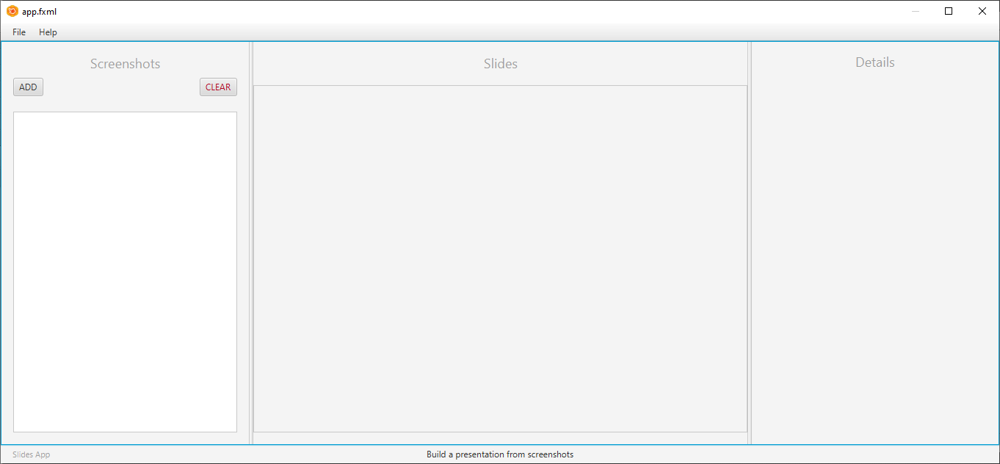
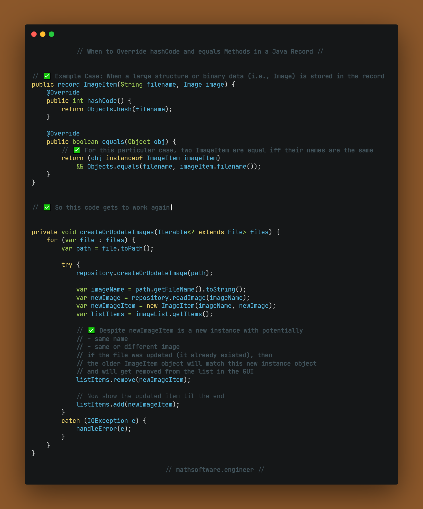
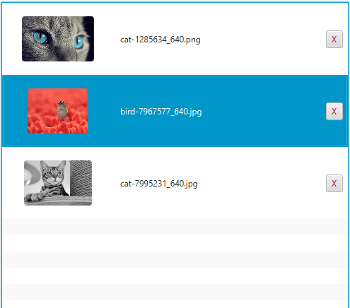
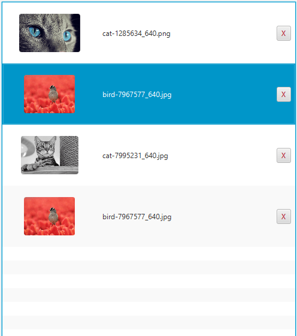
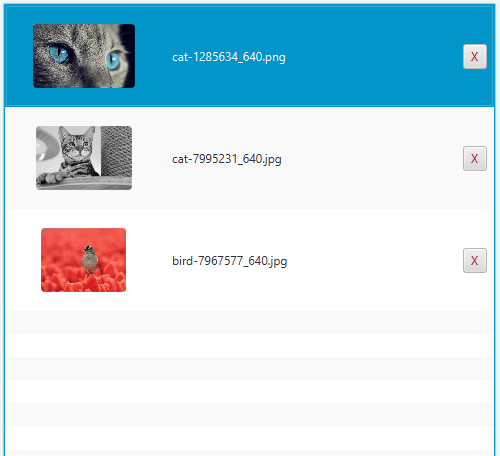

<!-- Copyright (c) 2023 Tobias Briones. All rights reserved. -->
<!-- SPDX-License-Identifier: CC-BY-4.0 -->
<!-- This file is part of https://github.com/tobiasbriones/blog -->

# Building Slides from Screenshots App in JavaFX

## Getting Started

First, make sure to have Java 20+ installed on your development machine. You
might need:

- [SDKMAN](https://sdkman.io).
- [Java installer from foojay.io](https://foojay.io/download).
- [IntelliJ IDEA](https://www.jetbrains.com/idea).
- [Scene Builder](https://gluonhq.com/products/scene-builder).

I highly suggest using the **Zulu (FX) distribution** to get the FX mods out of
the box!

For creating a new JavaFX app, follow
[Beginning JavaFX Applications with IntelliJ IDE \| foojay.io](https://foojay.io/today/beginning-javafx-with-intellij)
with one of the approach given by the author. I suggest using the "Plain"
approach for this project.

Our app package name is `engineer.mathsoftware.blog.slides`.

The following is the initial app project.

`module-info.java`

```java
module engineer.mathsoftware.blog.slides {
    requires javafx.controls;
    requires javafx.fxml;
    opens engineer.mathsoftware.blog.slides to javafx.fxml;
    exports engineer.mathsoftware.blog.slides;
}
```

<figcaption>
<p align="center"><strong>Definition of Application Modules</strong></p>
</figcaption>

As given above, it's required JavaFX `controls`, and `fxml` mods since I decided
to use FXML with the Scene Builder. Then, the main app package has to be opened
to the `fxml` mod, so it can use reflection on our app, as well as exporting it
so JavaFX in general can see our app via reflection.

Now, we move forward the main package.

`package-info.java`

```java
/**
 * Provides a desktop application that converts screenshots into professional
 * slides that tell a story.
 */
package engineer.mathsoftware.blog.slides;
```

<figcaption>
<p align="center"><strong>Main Application Package</strong></p>
</figcaption>

`Main.java`

```java
public class Main extends Application {
    private static final double WINDOW_WIDTH = 1360.0;
    private static final double WINDOW_HEIGHT = 640.0;

    public static void main(String[] args) {
        launch(args);
    }

    @Override
    public void start(Stage primaryStage) {
        var root = new VBox();
        var scene = new Scene(root, WINDOW_WIDTH, WINDOW_HEIGHT);
        var btn = new Button();

        btn.setText("Hello World");
        btn.setOnAction(actionEvent -> System.out.println("Hello World"));

        root.setAlignment(Pos.CENTER);
        root.getChildren()
            .add(btn);

        primaryStage.setTitle("Slides");
        primaryStage.setScene(scene);
        primaryStage.show();
    }
}
```

<figcaption>
<p align="center"><strong>Initial Hello World App</strong></p>
</figcaption>


<figcaption>
<p align="center"><strong>Hello World</strong></p>
</figcaption>

### Initial Master-View-Detail Layout with Drag-and-Drop ListView

I already developed the initial application layout (and logic) —which are
relatively heavy—, so I'll add the FXML version here with a preview to see
what's being developed.

This is the
[initial layout app.fxml file](https://github.com/tobiasbriones/blog/blob/main/swe/dev/java/javafx/drawing/productivity/building-slides-from-screenshots-app-in-javafx/slides/src/main/resources/app.fxml)
that looks like:



<figcaption>
<p align="center"><strong>Scene Builder: Initial app.fxml</strong></p>
</figcaption>

The layout tree (briefly) consists of:

- A split pane that defines the Master-View-Detail:
    - A **master view** with a user input pane to manage the image files.
    - A **view pane** that will show the slides rendered.
    - A **detail pane** that will hold the properties for generating the slides.

It requires events for the file drag-and-drop, and some buttons.

It also has a menu bar that can be trivially implemented later.

The current layout tree consists of:

```
├── VBox
    ├── MenuBar
        ├── Menu (File)
            ├── MenuItem (New)
            ├── MenuItem (Open Working Directory)
            ├── SeparatorMenuItem
            ├── MenuItem (Clear)
            ├── SeparatorMenuItem
            └── MenuItem (Quit)
        └── Menu (Help)
            └── MenuItem (About Slides EP)
    ├── SplitPane
        ├── VBox
            ├── VBox
                ├── Label (Screenshots)
                └── HBox
                    ├── Button (ADD)
                    └── HBox
                        └── Button (CLEAR)
            └── ListView
        ├── VBox
            ├── Label (Slides)
            └── ScrollPane
                └── AnchorPane
                    └── HBox
                        └── ImageView
        └── AnchorPane
            └── Label (Details)
    └── HBox
        ├── HBox
            └──Label (Slides App)
        ├── HBox
            └── Label (Build a presentation from screenshots)
        └── HBox
```

For integrating this layout, the root view has to be loaded from the FXML
resource `app.fxml` in the root of the `resources` project's directory.

`start | Main`

```java
var root = FXMLLoader.<Parent>load(
    Objects.requireNonNull(getClass().getResource("/app.fxml"))
);
```

<figcaption>
<p align="center"><strong>Loading the FXML Resource</strong></p>
</figcaption>

Then, `AppController` will handle the input events.

```java
public class AppController {
    @FXML
    public void initialize() {}

    @FXML
    private void onDragOver(DragEvent dragEvent) {}

    @FXML
    private void onDragDropped(DragEvent dragEvent) {}

    @FXML
    private void onDragExited(DragEvent dragEvent) {}

    @FXML
    private void onAddButtonAction(ActionEvent event) {}

    @FXML
    private void onClearButtonAction() {}
}
```

<figcaption>
<p align="center"><strong>Initial Application Controller</strong></p>
</figcaption>

## Application Data

The application will handle data related to image files that make up the
presentation, which will be stored in a local directory.

A basic image item needs to be loaded into the list of images.

`ImageItem.java`

```java
public record ImageItem(String filename, Image image) {
    @Override
    public int hashCode() {
        return Objects.hash(filename);
    }

    @Override
    public boolean equals(Object obj) {
        return (obj instanceof ImageItem imageItem)
            && Objects.equals(filename, imageItem.filename());
    }
}
```

<figcaption>
<p align="center"><strong>Definition of an Application Image Item with Name
and Image</strong></p>
</figcaption>

Notice, how the `hashCode` and `equals` methods had to be overwritten because of
the `Image` object[^x][^x].

[^x]: In this case, two `ImageItem`s are equal if their names are equal

[^x]: The binary `Image` field made it impossible to update the same item from a
    `List` with different object instances but the same name

This item will model the images (screenshots) saved to the application data
directory. Notice this will be a simple directory tree with a depth of 1 with no
subdirectories.

The items need to be stored and loaded from our local storage.

For this, I defined the `DataRepository` API.

`DataRepository.java | ...slides.data`

```java
public interface DataRepository {
    void createOrUpdateImage(Path imagePath) throws IOException;

    void createImage(Path imagePath) throws IOException;

    List<ImageItem> readAllImages() throws IOException;

    Image readImage(String imageName) throws IOException;

    void updateImage(Path imagePath) throws IOException;

    void deleteImage(String imageName) throws IOException;

    void deleteAllImages() throws IOException;
}
```

<figcaption>
<p align="center"><strong>Application Data API</strong></p>
</figcaption>

I also wrote a `Data` utility class to hold important functions.

`Data.java | ...slides.data`

```java
public final class Data {
    private static final String EXTENSION_DOT = ".";
    private static final String[] supportedExtensions = { "png", "jpg" };

    public static boolean isFileSupported(Path path) {
        var filter = filterValidNames(Stream
            .of(path)
            .map(Path::getFileName)
            .map(Path::toString)
        );
        return filter.size() == 1;
    }

    public static boolean areValidImageFiles(Collection<? extends File> files) {
        var filter = filterValidNames(files.stream().map(File::getName));
        return filter.size() == files.size();
    }

    private static List<String> filterValidNames(Stream<String> name) {
        var valid = List.of(supportedExtensions);
        return name
            .filter(x -> x.contains(EXTENSION_DOT))
            .map(x -> x.substring(x.lastIndexOf(EXTENSION_DOT) + 1))
            .filter(valid::contains)
            .toList();
    }

    private Data() {}
}
```

<figcaption>
<p align="center"><strong>Application Data Filters</strong></p>
</figcaption>

That way, we'll know whether a given file list (that can be dropped into the
`ListView`) has supported file extensions which will avoid polluting the data
directory with random files and ensure more correctness in our logic.

These definitions will allow us to perform data operations in our application.

### Local Storage Implementation

The implementation of the `DataRepository` is straightforward.

It uses the `java.nio.file` API to access the file system, and the code written
before.

`Data.java | ...slides.data`

```java
public class LocalDataRepository implements DataRepository {
    private final String root;

    public LocalDataRepository(String root) { this.root = root; }

    @Override
    public void createOrUpdateImage(Path imagePath) throws IOException {
        var imageName = imagePath.getFileName().toString();

        if (Files.exists(pathOf(imageName))) {
            updateImage(imagePath);
        }
        else {
            createImage(imagePath);
        }
    }

    @Override
    public void createImage(Path imagePath) throws IOException {
        requireFileExists(imagePath);
        requireValidFile(imagePath);
        requireLocalStorage();

        var imageName = imagePath.getFileName().toString();

        Files.copy(imagePath, pathOf(imageName));
    }

    @Override
    public List<ImageItem> readAllImages() throws IOException {
        var images = new ArrayList<ImageItem>();
        var files = Files
            .walk(pathOf(""), 1)
            .filter(Data::isFileSupported);

        try (files) {
            for (var file : files.toList()) {
                var img = new Image(Files.newInputStream(file));
                images.add(new ImageItem(file.getFileName().toString(), img));
            }
        }
        return images;
    }

    @Override
    public Image readImage(String imageName) throws IOException {
        var path = pathOf(imageName);

        requireFileExists(path);
        requireLocalStorage();

        return new Image(Files.newInputStream(path));
    }

    @Override
    public void updateImage(Path imagePath) throws IOException {
        var imageName = imagePath.getFileName().toString();

        requireFileExists(imagePath);
        requireLocalStorage();

        deleteImage(imageName);
        createImage(imagePath);
    }

    @Override
    public void deleteImage(String imageName) throws IOException {
        var path = pathOf(imageName);

        requireFileExists(path);
        requireLocalStorage();

        Files.delete(path);
    }

    @Override
    public void deleteAllImages() throws IOException {
        requireLocalStorage();
        var walk = Files
            .walk(pathOf(""), 1)
            .filter(Files::isRegularFile);

        try (walk) {
            for (var path : walk.toList()) {
                Files.delete(path);
            }
        }
    }

    private void requireLocalStorage() throws IOException {
        var rootPath = pathOf("");

        if (!Files.exists(rootPath)) {
            Files.createDirectory(rootPath);
        }
    }

    private Path pathOf(String filename) {
        return Path.of(root, filename);
    }

    private static void requireFileExists(Path path) throws IOException {
        if (!Files.exists(path)) {
            throw new IOException("File " + path + " does not exist");
        }
    }

    private static void requireValidFile(Path path) throws IOException {
        if (!Data.isFileSupported(path)) {
            throw new IOException("File " + path + " is not supported");
        }
    }
}
```

<figcaption>
<p align="center"><strong>Implementation of "DataRepository" on
"LocalDataRepository"</strong></p>
</figcaption>

This realization of `DataRepository` allows us to access our `data` directory
application images.

## Master Pane


<figcaption>
<p align="center"><strong>Master Pane</strong></p>
</figcaption>


<figcaption>
<p align="center"><strong>Dragging Files</strong></p>
</figcaption>


<figcaption>
<p align="center"><strong>Files Updated</strong></p>
</figcaption>


<figcaption>
<p align="center"><strong>Drag Canceled: Invalid Files</strong></p>
</figcaption>


<figcaption>
<p align="center"><strong>Drag Canceled</strong></p>
</figcaption>


<figcaption>
<p align="center"><strong>Delete Item</strong></p>
</figcaption>


<figcaption>
<p align="center"><strong>Clear All</strong></p>
</figcaption>

## Why the Hash Code and Equals Methods Had to be Overwritten

I already [explained this](#application-data), but I want to provide more
documentation.

This snipped explains why, according to the use case I had with this app.



<figcaption>
<p align="center"><strong>Why Override Hash Code and Equals Methods in a Record</strong></p>
</figcaption>

To depict this behavior:

Let's say I want to update the bird image by drag-and-drop.



<figcaption>
<p align="center"><strong>Updating an Existing Image</strong></p>
</figcaption>

If we don't explicitly override the `record` `hashCode`, and `equals` methods
according to our model, the `Image` **binary field** will introduce the **side
effect**:



<figcaption>
<p align="center"><strong>Bug: Updating an Existing Image</strong></p>
</figcaption>

That is, when we add an existing image to the app, the list of images in the GUI
doesn't remove the old image since it takes both (old and new) images as
different by being **different instances** of **the same model**.

Even though the *file system keeps correctness* (as that's an application logic
affair), that default `record` behavior still leads to correctness (and
performance since you don't want to compute an `Image` hash) *issues on the
front-end* (as that's a GUI affair).

This also shows us that we can have some side effects on less important parts of
a system while **keeping a robust design in the domain**. I optimize as much
as possible for the domain, and any professional software engineer also must.

Now, by fixing this detail, we get the correct behavior in the front-end as
well:



<figcaption>
<p align="center"><strong>Expected: Updating an Existing Image</strong></p>
</figcaption>

Binary files are always a red flag 🚩 as they're external systems that have to
be pushed to the boundaries, like in FP: the DSL is part of the system, and side
effects go to the boundaries.

This case shows one example of when to override the default implementation of a
Java `record` that has large or binary fields and how a side effect can be
mitigated in a system.
