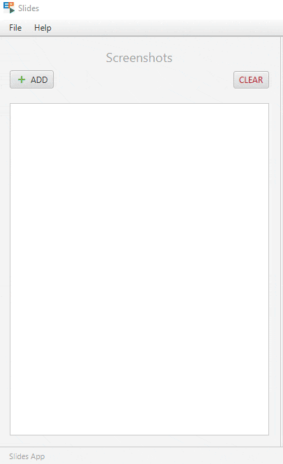

<!-- Copyright (c) 2023 Tobias Briones. All rights reserved. -->
<!-- SPDX-License-Identifier: CC-BY-4.0 -->
<!-- This file is part of https://github.com/tobiasbriones/blog -->

# Building Slides from Screenshots App in JavaFX

## Sharing a Story from Screenshots

I wanted to build a little presentation from my daily work, so I took the
screenshots to work them out in Photopea[^x].

[^x]: Photopea is a free web app that resembles Photoshop and has been my
    choice for many years

The idea was to build a carousel presentation like
[this one](static/carousel.pdf), which I was editing in
[this PSD file](static/carousel.psd). It still didn't include captions, so
besides the editing, that puts *more off-topic work* for me.


Needless to say, those apps like Photoshop, Google Docs, Office, etc., are
general-purpose (i.e., mediocre) and manual. Plus, you even have to pay a
subscription or watch ads for a monolith you will barely use much.

I need composition, **I just engineer my domain-specific systems**.

I lately took this experience as the final motivation to start materializing the
automation of these systems without requiring the monolithic products mentioned.
I'm working this materialization out via my new —and first blog with project—
**EP: Slides**, here in this article.

### Domain Engineering

These general-purpose software out there cannot be composed.

Even if they have (bloated) AI assistance, macros, or even APIs
(if at all), they're just products for profit. Photoshop can paint an image, but
it'll never understand source code or your specific system. M$ Word or LaTeX
**will never understand what an equation means, *as in mathematics***, etc.

They need bloated features like AI that take huge deep learning models to
develop and train and have heavy licensing and marketing because they're general
purpose. For instance, products that suck need capitalism
(marketing) to *sell them*, but *they're not the solution to the problems*.

If you're a domain expert, you **simplify matters** to the specific domain, and
**the more you simplify, the less bloated** AI, marketing, analytics and
engineering you have because *you address the problems instead of the symptoms*.

AI can have its place to automate *external systems* which I wanted to leave
clear in this development, but it'll never replace the underlying domain as
they're independent tools.

That is, you need to *understand* **how AI should be useful to automate
works *for* our domain language** instead of buying mundane
general-purpose software that uses AI as magic. Notice *the difference between
automation and magic*.

For example, grammar checkers are not technical, so you get a lot of errors
marked because they don't *understand* computer and math languages and idioms.
They only want you to pay a subscription to fix all the "issues" ~~you have~~
they sell you. Their dream is to remove all the "issues 💸," so your original
tone even changes, and ends up sounding like a robotic agent or someone else.

In the end, you have to be proficient in English (i.e., the domain) to know what
you're doing because any "magic" tool was made just for the sake of a profit
agenda, thus bloated under the hood. You have to compose your tools instead of
paying for generic ones that turn into workarounds and will never return most of
the investment.

Another clear example is ChatGPT, which can generate mundane Python or any
popular mainstream language or framework code but struggles with ultra-niche
technologies like Purescript or even JavaFX. It makes up unexisting APIs and
code that wouldn't compile. These unpopular techs require domain expertise, and
there will be (hopefully) never enough data to train or fine-tune those
ultra-bloated magic-based (and unethical with IP legal issues) models with
technology that requires actual engineering.

In the end, you must be proficient in your domain and realize that tools like
ChatGPT are nothing but a faster way to *automate* what you otherwise have to
search in Google results.

General-purpose software is useful *but not engineering-grade*. On the other
hand, mathematical software must be engineering-grade by nature.

You should refrain from saying, "It was ~~generated~~ by AI" when, in fact, the
reality of how AI should work comes to "It was *automated* by AI." The exception
would be only when the whole tool (as a final product) is named after AI, e.g.,
"AI generated image."

There are likely possible ways to make AI work for our domain language (as said
above).

I figured out one simple way to leverage an AI application for this project, so
it serves as a good example.

Recall the domain engineering automation concepts of what this comes about even
though my purpose this time is to develop these ideas conservatively in Java as
an example project.

## Getting Started

First, make sure to have Java 20+ installed on your development machine. You
might need:

- [SDKMAN](https://sdkman.io).
- [Java Installation Guide from foojay.io](https://foojay.io/java-quick-start/install-java).
- [IntelliJ IDEA](https://www.jetbrains.com/idea).
- [Scene Builder](https://gluonhq.com/products/scene-builder).

I highly suggest using the **Zulu (FX) distribution** to get the FX mods out of
the box!

For creating a new JavaFX app, follow
[Beginning JavaFX Applications with IntelliJ IDE \| foojay.io](https://foojay.io/today/beginning-javafx-with-intellij)
with one of the approach given by the author. I suggest using the "Plain"
approach for this project.

Our app package name is `engineer.mathsoftware.blog.slides`.

The following is the initial app project.

`Definition of Application Modules | module-info.java`

```java
module engineer.mathsoftware.blog.slides {
    requires javafx.controls;
    requires javafx.fxml;
    opens engineer.mathsoftware.blog.slides to javafx.fxml;
    exports engineer.mathsoftware.blog.slides;
}
```

As given above, it's required JavaFX `controls`, and `fxml` mods since I decided
to use FXML with the Scene Builder. Then, the main app package has to be opened
to the `fxml` mod, so it can use reflection on our app, as well as exporting it
so JavaFX in general can see our app via reflection.

Now, we move forward the main package.

`Main Application Package | package-info.java`

```java
/**
 * Provides a desktop application that converts screenshots into professional
 * slides that tell a story.
 */
package engineer.mathsoftware.blog.slides;
```

`Initial Hello World App | Main.java`

```java
public class Main extends Application {
    private static final double WINDOW_WIDTH = 1360.0;
    private static final double WINDOW_HEIGHT = 640.0;

    public static void main(String[] args) {
        launch(args);
    }

    @Override
    public void start(Stage primaryStage) {
        var root = new VBox();
        var scene = new Scene(root, WINDOW_WIDTH, WINDOW_HEIGHT);
        var btn = new Button();

        btn.setText("Hello World");
        btn.setOnAction(actionEvent -> System.out.println("Hello World"));

        root.setAlignment(Pos.CENTER);
        root.getChildren()
            .add(btn);

        primaryStage.setTitle("Slides");
        primaryStage.setScene(scene);
        primaryStage.show();
    }
}
```


At this point, the JavaFX application is set up, so the development can 
take place.

### Initial Master-View-Detail Layout with Drag-and-Drop ListView

I already developed the initial application layout (and logic) — which are
relatively heavy —, so I'll add the FXML version here with a preview to see
what's being developed.

This is the initial layout [app.fxml](slides---ep/src/main/resources/app.fxml)
file that looks like:


The layout tree (briefly) consists of:

- A split pane that defines the Master-View-Detail:
    - A **master view** with a user input pane to manage the image files.
    - A **view pane** that will show the slides rendered.
    - A **detail pane** that will hold the properties for generating the slides.

It requires events for the file drag-and-drop, and some buttons.

It also has a menu bar that can be trivially implemented later.

The current layout tree consists of:

`Initial App Layout Tree`

```
├── VBox
    ├── MenuBar
        ├── Menu (File)
            ├── MenuItem (New)
            ├── MenuItem (Open Working Directory)
            ├── SeparatorMenuItem
            ├── MenuItem (Clear)
            ├── SeparatorMenuItem
            └── MenuItem (Quit)
        └── Menu (Help)
            └── MenuItem (About Slides EP)
    ├── SplitPane
        ├── VBox
            ├── VBox
                ├── Label (Screenshots)
                └── HBox
                    ├── Button (ADD)
                    └── HBox
                        └── Button (CLEAR)
            └── ListView
        ├── VBox
            ├── Label (Slides)
            └── ScrollPane
                └── AnchorPane
                    └── HBox
                        └── ImageView
        └── AnchorPane
            └── Label (Details)
    └── HBox
        ├── HBox
            └──Label (Slides App)
        ├── HBox
            └── Label (Build a presentation from screenshots)
        └── HBox
```

For integrating this layout, the root view has to be loaded from the FXML
resource `app.fxml` in the root of the `resources` project's directory.

`Loading the FXML Resource | start | Main.java`

```java
var root = FXMLLoader.<Parent>load(
    Objects.requireNonNull(getClass().getResource("/app.fxml"))
);
```

Then, `AppController` will handle the input events.

`Initial Application Controller | AppController.java`

```java
public class AppController {
    @FXML
    public void initialize() {}

    @FXML
    private void onDragOver(DragEvent dragEvent) {}

    @FXML
    private void onDragDropped(DragEvent dragEvent) {}

    @FXML
    private void onDragExited(DragEvent dragEvent) {}

    @FXML
    private void onAddButtonAction(ActionEvent event) {}

    @FXML
    private void onClearButtonAction() {}
}
```

This gives an initial layout to the app with a controller to set some structure
as far as it's currently going. This includes a master-view-detail app layout,
where the master pane will be loaded with images via drag-and-drop.

## Application Data

The application will handle data related to image files that make up the
presentation, which will be stored in a local directory.

A basic image item needs to be loaded into the list of images.

`Definition of an Application Image Item with Name and Image | ImageItem.java`

```java
public record ImageItem(String filename, Image image) {
    @Override
    public int hashCode() {
        return Objects.hash(filename);
    }

    @Override
    public boolean equals(Object obj) {
        return (obj instanceof ImageItem imageItem)
            && Objects.equals(filename, imageItem.filename());
    }
}
```

Notice, how the `hashCode` and `equals` methods had to be overwritten because of
the `Image` object[^x][^x].

[^x]: In this case, two `ImageItem`s are equal if their names are equal

[^x]: The binary `Image` field made it impossible to update the same item from a
    `List` with different object instances but the same name

This item will model the images (screenshots) saved to the application data
directory. Notice this will be a simple directory tree with a depth of 1 with no
subdirectories.

The items need to be stored and loaded from our local storage.

For this, I defined the `DataRepository` API.

`Application Data API | DataRepository.java | package data`

```java
public interface DataRepository {
    void createOrUpdateImage(Path imagePath) throws IOException;

    void createImage(Path imagePath) throws IOException;

    List<ImageItem> readAllImages() throws IOException;

    Image readImage(String imageName) throws IOException;

    void updateImage(Path imagePath) throws IOException;

    void deleteImage(String imageName) throws IOException;

    void deleteAllImages() throws IOException;
}
```

I also wrote a `Data` utility class to hold important functions.

`Application Data Filters | Data.java | package data`

```java
public final class Data {
    private static final String EXTENSION_DOT = ".";
    private static final String[] supportedExtensions = { "png", "jpg" };

    public static boolean isFileSupported(Path path) {
        var filter = filterValidNames(Stream
            .of(path)
            .map(Path::getFileName)
            .map(Path::toString)
        );
        return filter.size() == 1;
    }

    public static boolean areValidImageFiles(Collection<? extends File> files) {
        var filter = filterValidNames(files.stream().map(File::getName));
        return filter.size() == files.size();
    }

    private static List<String> filterValidNames(Stream<String> name) {
        var valid = List.of(supportedExtensions);
        return name
            .filter(x -> x.contains(EXTENSION_DOT))
            .map(x -> x.substring(x.lastIndexOf(EXTENSION_DOT) + 1))
            .filter(valid::contains)
            .toList();
    }

    private Data() {}
}
```

That way, we'll know whether a given file list (that can be dropped into the
`ListView`) has supported file extensions which will avoid polluting the data
directory with random files and ensure more correctness in our logic.

These definitions will allow us to perform data operations in our application.

### Local Storage Implementation

The implementation of the `DataRepository` is straightforward.

It uses the `java.nio.file` API to access the file system, and the code written
before.

`Implementation of "DataRepository" on "LocalDataRepository"
| Data.java | package data`

```java
public class LocalDataRepository implements DataRepository {
    private final String root;

    public LocalDataRepository(String root) { this.root = root; }

    @Override
    public void createOrUpdateImage(Path imagePath) throws IOException {
        var imageName = imagePath.getFileName().toString();

        if (Files.exists(pathOf(imageName))) {
            updateImage(imagePath);
        }
        else {
            createImage(imagePath);
        }
    }

    @Override
    public void createImage(Path imagePath) throws IOException {
        requireFileExists(imagePath);
        requireValidFile(imagePath);
        requireLocalStorage();

        var imageName = imagePath.getFileName().toString();

        Files.copy(imagePath, pathOf(imageName));
    }

    @Override
    public List<ImageItem> readAllImages() throws IOException {
        var images = new ArrayList<ImageItem>();
        var files = Files
            .walk(pathOf(""), 1)
            .filter(Data::isFileSupported);

        try (files) {
            for (var file : files.toList()) {
                var img = new Image(Files.newInputStream(file));
                images.add(new ImageItem(file.getFileName().toString(), img));
            }
        }
        return images;
    }

    @Override
    public Image readImage(String imageName) throws IOException {
        var path = pathOf(imageName);

        requireFileExists(path);
        requireLocalStorage();

        return new Image(Files.newInputStream(path));
    }

    @Override
    public void updateImage(Path imagePath) throws IOException {
        var imageName = imagePath.getFileName().toString();

        requireFileExists(imagePath);
        requireLocalStorage();

        deleteImage(imageName);
        createImage(imagePath);
    }

    @Override
    public void deleteImage(String imageName) throws IOException {
        var path = pathOf(imageName);

        requireFileExists(path);
        requireLocalStorage();

        Files.delete(path);
    }

    @Override
    public void deleteAllImages() throws IOException {
        requireLocalStorage();
        var walk = Files
            .walk(pathOf(""), 1)
            .filter(Files::isRegularFile);

        try (walk) {
            for (var path : walk.toList()) {
                Files.delete(path);
            }
        }
    }

    private void requireLocalStorage() throws IOException {
        var rootPath = pathOf("");

        if (!Files.exists(rootPath)) {
            Files.createDirectory(rootPath);
        }
    }

    private Path pathOf(String filename) {
        return Path.of(root, filename);
    }

    private static void requireFileExists(Path path) throws IOException {
        if (!Files.exists(path)) {
            throw new IOException("File " + path + " does not exist");
        }
    }

    private static void requireValidFile(Path path) throws IOException {
        if (!Data.isFileSupported(path)) {
            throw new IOException("File " + path + " is not supported");
        }
    }
}
```

This realization of `DataRepository` allows us to access our `data` directory
application images.

## Master Pane

The first part of the app is a master pane that lists the images.


This pane will be able to list the images, add new image(s) via drag-and-drop
and or a `Button` with `FileChooser`, delete an image, delete all images, and
rearrange them in the order they will appear in the presentation.

### Initializing the App Controller

The `AppController` will need some fields.

`Members of "AppController" | class AppController`

```java
private static final String DATA_ROOT = "data";
private final DataRepository repository;
@FXML private Button addButton;
@FXML private Label statusLabel;

public AppController() {
    this.repository = new LocalDataRepository(DATA_ROOT);
}
```

A good initialization will be needed too.

`Initialization of "AppController" | class AppController`

```java
@FXML
public void initialize() {
    statusLabel.setText("Slides App");

    initAddButton();
}

private void initAddButton() {
    var icAdd = new Image(
        Objects.requireNonNull(
            getClass().getResourceAsStream("/ic_add.png")
        )
    );
    var addImageView = new ImageView(icAdd);

    addImageView.setFitWidth(18.0);
    addImageView.setFitHeight(18.0);
    addButton.setGraphic(addImageView);
}
```

Including other methods will be helpful as well.

`Other Methods | class AppController`

```java
private void handleError(IOException e) {
    setStatus(e.getMessage());
    e.printStackTrace();
}

private void setStatus(String msg) {
    statusLabel.setText(msg);
}
```

Now the controller set up to keep adding the other features.

### Drag and Drop

One engaging feature of this app is its file drag-and-drop, where you can create
or update one or many images just as simple.


If the files are [accepted](#application-data) by our app then they will be
added.


They won't be added if rejected (e.g., a Photopea ".psd" file). Per
[our rules](#application-data), one invalid file is enough to reject all of
them.


So our `DragEvent` cancels further actions with the clipboard files.

Another way the `DragEvent` can finish is when you just cancel the drop action
with your mouse by leaving the files out.


The events are set from the `app.fxml` view already, so the controller 
implementation is left.

The three events that will be required for this app consist of:

- **Drag Over:** Files are being dragged onto the `ListView`, so they will 
  either be accepted or rejected.
- **Drag Dropped:** Files were deposited into the app.
- **Drag Exited:** Cancels the drag as files dragged with the mouse are out of 
  scope.

`Drag Event Implementations | class AppController`

```java
@FXML
private void onDragOver(DragEvent dragEvent) {
    var dragboard = dragEvent.getDragboard();

    if (dragboard.hasFiles()) {
        if (Data.areValidImageFiles(dragboard.getFiles())) {
            setStatus("Dragging files...");
            dragEvent.acceptTransferModes(TransferMode.COPY);
        }
        else {
            setStatus("Drag canceled (invalid files)");
        }
        dragEvent.consume();
    }
}

@FXML
private void onDragExited(DragEvent dragEvent) {
    if (!dragEvent.isDropCompleted()) {
        setStatus("Drag canceled");
    }
    dragEvent.consume();
}

@FXML
private void onDragDropped(DragEvent dragEvent) {
    var board = dragEvent.getDragboard();

    if (board.hasFiles()) {
        createOrUpdateImages(board.getFiles());
        setStatus("Files updated");
        dragEvent.setDropCompleted(true);
        dragEvent.consume();
    }
    else {
        setStatus("Drag canceled (empty)");
    }
}
```

These implementations will allow the drag-and-drop feature in our application.

### List View

The list in the master pane is a key for completing this implementation.

First, a custom cell renderer needs to be created, obviously.

If you remember or are homesick for the Android old school like me, that would
come in handy a lot.

`Implementation of the Cell Items for the List View | class ImageItemCell`

```java
class ImageItemCell extends ListCell<ImageItem> {
    interface Listener {
        void onDelete(ImageItem item);
    }

    private final Listener l;
    private final HBox view;
    private final ImageView imageView;
    private final Label nameLabel;
    private final Button deleteButton;
    private final Tooltip tip;

    ImageItemCell(Listener l) {
        super();
        this.l = l;
        this.view = new HBox();
        this.imageView = new ImageView();
        this.nameLabel = new Label();
        this.deleteButton = new Button();
        this.tip = new Tooltip();

        init();
    }

    @Override
    protected void updateItem(ImageItem item, boolean empty) {
        super.updateItem(item, empty);
        if (item == null || empty) {
            setText(null);
            setGraphic(null);
        }
        else {
            updateItem(item);
        }
    }

    private void init() {
        var imageParent = new HBox();

        imageView.setFitWidth(128.0);
        imageView.setFitHeight(64.0);
        imageView.setPreserveRatio(true);

        imageParent.setPrefWidth(144.0);
        imageParent.setPrefHeight(96.0);
        imageParent.setAlignment(Pos.CENTER);
        imageParent.getChildren().add(imageView);

        var maxNameLength = 20;

        nameLabel
            .textProperty()
            .addListener((observable, oldValue, newValue) -> {
                if (newValue.length() > maxNameLength) {
                    var txt = newValue.substring(0, maxNameLength) + "...";
                    nameLabel.setText(txt);
                }
            });

        var deleteParent = new HBox();

        deleteButton.setText("X");
        deleteButton.setStyle("-fx-text-fill: #b00020;");

        HBox.setHgrow(deleteParent, Priority.ALWAYS);
        deleteParent.setSpacing(16.0);
        deleteParent.setAlignment(Pos.CENTER_RIGHT);
        deleteParent.getChildren().add(deleteButton);

        Tooltip.install(view, tip);

        view.setPrefHeight(96.0);
        view.setAlignment(Pos.CENTER_LEFT);
        view.setSpacing(16.0);
        view.getChildren().addAll(imageParent, nameLabel, deleteParent);
    }

    private void updateItem(ImageItem item) {
        nameLabel.setText(item.filename());
        imageView.setImage(item.image());
        imageView.setSmooth(true);

        var boundingBox = imageView.getLayoutBounds();
        var clip = new Rectangle(
            boundingBox.getWidth(), boundingBox.getHeight()
        );

        clip.setArcWidth(8.0);
        clip.setArcHeight(8.0);
        imageView.setClip(clip);

        deleteButton.setOnAction(event -> onDeleteButtonAction(item));
        tip.setText(item.filename());

        setGraphic(view);
    }

    private void onDeleteButtonAction(ImageItem item) {
        var alert = new Alert(
            Alert.AlertType.CONFIRMATION,
            "Delete " + item.filename() + "?",
            ButtonType.YES,
            ButtonType.NO
        );
        alert.showAndWait();

        if(alert.getResult() == ButtonType.YES) {
            l.onDelete(item);
        }
    }
}
```

I also added a `Tooltip` so the full file name is shown when you hover the item
and a maximum length for the text to be covered with an ellipsis if long.

Moreover, I set a rounded corner of the image in the method `updateItem` via
`imageView.setClip(clip);`, and set the confirmation `Alert` in the method
`onDeleteButtonAction` that sends the event to delete the item to the
`ImageItemCell.Listener` (the controller).

So, that's the `ListView` item implementation you see in the screenshots.

Then, this is integrated into the controller.

First, the cell callback that was defined can be realized by the controller,
i.e., `implements ImageItemCell.Listener` which is followed by:

`Integration of the List View and Data Repository into the App Controller
| class AppController`

```java
@FXML private ListView<ImageItem> imageList;

@FXML
public void initialize() {
    // ... //
    imageList.setCellFactory(param -> new ImageItemCell(this));

    loadImageList();
}

@Override
public void onDelete(ImageItem item) {
    try {
        repository.deleteImage(item.filename());
        imageList.getItems().remove(item);
        setStatus("Item deleted");
    }
    catch (IOException e) {
        handleError(e);
    }
}

@Override
public void onDelete(ImageItem item) {
    try {
        repository.deleteImage(item.filename());
        imageList.getItems().remove(item);
    }
    catch (IOException e) {
        handleError(e);
    }
}

private void loadImageList() {
    try {
        var images = repository.readAllImages();
        imageList.setItems(FXCollections.observableList(images));
    }
    catch (IOException e) {
        handleError(e);
    }
}

private void createOrUpdateImages(Iterable<? extends File> files) {
    for (var file : files) {
        var path = file.toPath();
    
        try {
            repository.createOrUpdateImage(path);
        
            var imageName = path.getFileName().toString();
            var newImage = repository.readImage(imageName);
            var newImageItem = new ImageItem(imageName, newImage);
            var listItems = imageList.getItems();
        
            listItems.remove(newImageItem);
            listItems.add(new ImageItem(imageName, newImage));
        }
        catch (IOException e) {
            handleError(e);
        }
    }
}

private void deleteAllImages() {
    try {
        repository.deleteAllImages();
        imageList.getItems().clear();
        setStatus("All items deleted");
    }
    catch (IOException e) {
        handleError(e);
    }
}

private void handleError(IOException e) {
    statusLabel.setText(e.getMessage());
    e.printStackTrace();
}
```

At this point, the list with drag-and-drop was built which is a big part of
this master pane.

### Deleting Items

For deleting an item, you click on the delete button of the item, and a
confirmation `Alert` will finish this action.


To delete all the items, the "clear" `Button` will "do the trick".


Therefore, here we go with our controller again.

`Implementation of Deleting Actions (the "Danger Zone") | class AppController`

```java
@FXML private Parent view;

@FXML
private void onAddButtonAction() {
    var chooser = new FileChooser();

    chooser.setTitle("Open Files");
    chooser.getExtensionFilters().addAll(
        new FileChooser.ExtensionFilter(
            "Image Files (*.png, *.jpg)",
            "*.png",
            "*.jpg"
        )
    );
    var files = chooser.showOpenMultipleDialog(view.getScene().getWindow());

    if (files != null) {
        createOrUpdateImages(files);
    }
}

@FXML
private void onClearButtonAction() {
    var alert = new Alert(
    Alert.AlertType.CONFIRMATION,
        "Delete all the data?",
        ButtonType.YES,
        ButtonType.NO
    );
    alert.showAndWait();

    if (alert.getResult() == ButtonType.YES) {
        deleteAllImages();
    }
}
```

This provides a safe delete mechanism for our application images.

### Arranging Image Items via More Drag and Drop

Our presentation order will be the one shown in the images `ListView` that
already supports a drag-and-drop event for adding or updating files to the app,
and now it needs one more implementation for arranging its items via this fancy
mechanism.



By arranging the images loaded into the master pane via another ergonomic
drag-and-drop mechanism, we can set important information for the slides such
as, their order in the final presentation.

#### Cell Drag and Drop Implementation

First, a new event will need to be defined in the `ImageItemCell` `Listener`,
namely, `void onArrange(int draggedIdx, int destIdx);`. So, our abstract list of
images (the data structure) gets sorted when this happens (then updates the
view).

`Updating the Init Method of "ImageItemCell" | met init | class ImageItemCell`

```java
setDragAndDropItemSort();

getStyleClass().add("cell");
```

`Drag and Drop Events Needed | class ImageItemCell`

```java
private void setDragAndDropItemSort() {
    setOnDragDetected(this::onDragDetected);
    setOnDragOver(this::onDragOver);
    setOnDragEntered(this::onDragEntered);
    setOnDragExited(this::onDragExited);
    setOnDragDropped(this::onDragDropped);
    setOnDragDone(DragEvent::consume);
}
```

`Drag Event Implementations to Rearrange a List Cell | class ImageItemCell`

```java
private void onDragDetected(MouseEvent event) {
    var item = getItem();

    if (item == null) {
        return;
    }

    var idx = getListView().getItems().indexOf(item);
    var dragboard = startDragAndDrop(TransferMode.MOVE);
    var content = new ClipboardContent();

    content.putString(String.valueOf(idx));
    dragboard.setDragView(view.snapshot(null, null));
    dragboard.setContent(content);

    event.consume();
}

private void onDragOver(DragEvent event) {
    if (event.getGestureSource() != this && event.getDragboard().hasString()) {
        event.acceptTransferModes(TransferMode.MOVE);
        event.consume();
    }
}

private void onDragEntered(DragEvent event) {
    if (event.getGestureSource() != this && event.getDragboard().hasString()) {
        getStyleClass().add("entered");
        event.consume();
    }
}

private void onDragExited(DragEvent event) {
    if (event.getGestureSource() != this && event.getDragboard().hasString()) {
        getStyleClass().remove("entered");
        event.consume();
    }
}

private void onDragDropped(DragEvent event) {
    var item = getItem();

    if (item == null) {
        return;
    }

    var dragboard = event.getDragboard();

    if (dragboard.hasString()) {
        var items = getListView().getItems();
        int draggedIdx = Integer.parseInt(dragboard.getString());
        int destIdx = items.indexOf(item);

        l.onArrange(draggedIdx, destIdx);

        event.setDropCompleted(true);
        event.consume();
    }
}
```

First, notice that if you're not careful, you'll introduce side effects to
these kinds of events, as we can have many event implementations. In this case,
the drag events fall into the `ListView` (the "bigger") and are also listened
from each of its cells, that is, each `ImageItemCell`.

What controls this crazy state sharing, if you notice, are the calls to the
`consume` method of the `DragEvent`s. Setting `setDropCompleted` to `true` also
helps with this.

So, I carefully **tested the app so both drag-and-drop events for files and for
arranging cells work properly**.

The drag view is set to a *snapshot* of the cell being dragged. This is the
graphic you see on the tip of your mouse when dragging something on the screen.

There are some CSS classes to apply a visual effect on the cells when dragging
one cell onto another. These classes have to be added to the app from a CSS
file.

That was with respect to the `ImageItemCell`. Now this feature has to be added
to the `AppController` part.

#### Controller Update

The previous changes have to be implemented in the app controller.

I lately made the app less coupled, so we'll work with a `images` `List`
stored in the controller as the "source of truth" for the image data. Then, this
list will behave **reactively** to update the GUI.

`Setting up the App Controller for the "onArrange" Event | class AppController`

```java
private final ObservableList<ImageItem> images;

public AppController() {
    // ... //
    this.images = FXCollections.observableArrayList();
}

@FXML
public void initialize() {
    // ... //
    imageList.setItems(images);
    // ... //
}

@Override
public void onArrange(int draggedIdx, int destIdx) {
    var dragged = images.get(draggedIdx);
    var dest = images.get(destIdx);

    images.set(draggedIdx, dest);
    images.set(destIdx, dragged);
    imageList.getSelectionModel().clearAndSelect(destIdx);
    setStatus("Item arranged");
}

private void loadImageList() {
    try {
        var loadedImages = repository.readAllImages();

        images.clear();
        images.addAll(loadedImages);
    }
    catch (IOException e) {
        handleError(e);
    }
}
```

What's mostly new here, is the `onArrange` event that was defined before in the
`ImageItemCell` `Listener`. This method updates the data, and this data is
reactive, so it automatically updates the `ListView` which was bound to the
`images` list via `imageList.setItems(images)`.

The dragged cell is also selected when dropping it into its new position via
`imageList.getSelectionModel().clearAndSelect(destIdx)`.

Cells are swapped and automatic scroll is missing which are limitations to this
implementation. The wanted behaviour may probably be more advanced but that's
out of the scope of this EP.

Now both the cell and controller implementations are in sync.

#### App CSS Styles

It was time to introduce some CSS here to add a class to the list cell when
another item is being dragged to it.

`CSS Styles for Dragging a List Cell into Another Cell | app.css`

```css
.cell {
    -fx-border-width: 2px;
    -fx-border-radius: 4px;
    -fx-border-color: transparent;
}

.entered {
    -fx-border-color: #4FC3F7;
}
```

I also added a new method in `Main.java` to help load these resources.

`Loading CSS Styles into the App | met start | class Main`

```java
scene.getStylesheets().add(
    loadResource("app.css").toExternalForm()
);
```

`Method that Loads an App Resource by File Name | class Main`

```java
private URL loadResource(String name) {
    return Objects.requireNonNull(
        getClass().getClassLoader().getResource(name)
    );
}
```

Now, the CSS classes defined above can be used to style the `ListView` cells.

#### Order of the Presentation Slides

With all this, we now have the arrangement of the images done as well as the
master pane complete.

## Menu Bar

This menu is trivial to write now.


First, we add the events to the FXML, and the controller.

`Events for Handing the Menu Bar Items | class AppController`

```java
@FXML private void onAddMenuItemAction() {}

@FXML private void onOpenWDMenuItemAction() {}

@FXML private void onClearMenuItemAction() {}

@FXML private void onQuitMenuItemAction() {}

@FXML private void onAboutMenuItemAction() {}
```

I made minor modifications, like changing the name of a `MenuItem` from "New" to
"Add" for more clarity of action.

They do the following:

- **Add:** Opens the `FileChooser` just like pressing the existing "Add"
  `Button` to *add* (or update) an image.
- **OpenWD:** Opens the app data directory (*working directory*) into the system
  file explorer so you can browse over the original application images.
- **Clear:** Same as the *"Clear" `Button`*.
- **Quit:** *Closes* the app.
- **About:** Shows a basic `Alert` with info *about* the application.

So first I extracted a method to reuse it:

`Extraction of Methods in "AppController" for Code Reuse | class AppController`

```java
@FXML
private void onAddButtonAction() {
    openFileViaFileChooser();
}

@FXML
private void onClearButtonAction() {
    showDeleteAllAlert();
}

private void openFileViaFileChooser() { /* Impl. */ }

private void showDeleteAllAlert() { /* Impl. */ }
```

The Swing JavaFX module has to be added to the application modules
(`module-info.java`) via `requires javafx.swing;` as it's required to call to
the `awt` `Desktop` API to open the system file explorer.

Finally, the implementations are left to finish this menu.

`Implementation of Menu Events | class AppController`

```java
@FXML
private void onAddButtonAction() {
    openFileViaFileChooser();
}

@FXML
private void onClearButtonAction() {
    showDeleteAllAlert();
}

@FXML
private void onAddMenuItemAction() {
    openFileViaFileChooser();
}

@FXML
private void onOpenWDMenuItemAction() {
    if (Desktop.isDesktopSupported()) {
        try {
            Desktop.getDesktop().open(new File(DATA_ROOT));
        }
        catch (IOException | UnsupportedOperationException e) {
            setStatus(e.getMessage());
        }
    }
    else {
        setStatus("Desktop is not supported");
    }
}

@FXML
private void onClearMenuItemAction() {
    showDeleteAllAlert();
}

@FXML
private void onQuitMenuItemAction() {
    Platform.exit();
}

@FXML
private void onAboutMenuItemAction() {
    var alert = new Alert(
        Alert.AlertType.INFORMATION,
        "Slides App | blog | mathsoftware.engineer",
        ButtonType.CLOSE
    );

    alert.showAndWait();
}
```

This was the application now has a functioning menu bar.

## View Detail and App Domain

The detail pane is the one to the right that allows the user to set up the
information to apply to the slides, and the application domain has been defined
via several types to power all these concepts.

The view pane is the middle one showing the result of rendering the slide, and
this will require much more work before we start drawing something on this view.

Some refactorizations are needed to keep the project maintainable.

Then the master pane developed before has to be related to the view pane via
a  `Pagination`.

Once the initial application domain is defined, the detail pane can be worked
out to enable the configurations that will be applied to the drawing in the view
pane.

### Refactorizations on Data and UI

First, some refactorizations I did at this stage.

`Project Package Refactorization`

```
.
├── data
│   ├── Data.java
│   ├── DataRepository.java
│   ├── ImageItem.java
│   ├── LocalDataRepository.java
│   └── pacakge-info.java
└── ui
    ├── AppController.java
    ├── ImageItemCell.java
    ├── Main.java
    └── pacakge-info.java
```

Leading to a project module like:

`Project Module After Refactorization | module-info.java`

```java
module engineer.mathsoftware.blog.slides {
    requires javafx.controls;
    requires javafx.fxml;
    requires javafx.swing;
    exports engineer.mathsoftware.blog.slides.data;
    exports engineer.mathsoftware.blog.slides.ui;
    opens engineer.mathsoftware.blog.slides.ui to javafx.fxml;
}
```

Notice I moved `ImageItem` from `ui` to `data` as it makes more sense as I said
in
[Removing Cyclic Dependencies, Java vs Go (2023-05-28)](https://blog.mathsoftware.engineer/removing-cyclic-dependencies--_--java-vs-go-2023-05-28).

Now the project has more support to accept the next changes for the view and 
detail panes as well as the application logic.

### Pagination

This component is a page indicator that will keep in sync with the list of
images loaded into the master pane.


After updating the `app.fxml` file, the logic is next.

`Pagination Implementation | class AppController`

```java
@FXML
private Pagination pagination;
@FXML
private ImageView slideView;

@FXML
public void initialize() {
    /* ... */
    initMasterView();
}

private void initMasterView() {
    updatePaginationCount();

    images.addListener((InvalidationListener) l -> updatePaginationCount());

    imageList
        .getSelectionModel()
        .selectedIndexProperty()
        .map(Integer.class::cast)
        .addListener((observable, oldValue, newValue) ->
            pagination.setCurrentPageIndex(newValue)
        );

    imageList
        .getSelectionModel()
        .select(0);

    pagination
        .currentPageIndexProperty()
        .map(Integer.class::cast)
        .addListener((observable, oldValue, newValue) ->
            imageList.getSelectionModel().select(newValue)
        );

    slideView
        .imageProperty()
        .bind(imageList
            .getSelectionModel()
            .selectedItemProperty()
            .map(ImageItem::image)
        );
    slideView
        .fitWidthProperty()
        .bind(viewPaneBox
            .widthProperty()
            .subtract(32)
        );
}

private void updatePaginationCount() {
    var size = images.size();

    if (size > 0) {
        pagination.setVisible(true);
        pagination.setPageCount(images.size());
    }
    else {
        pagination.setVisible(false);
        pagination.setPageCount(1);
    }
}
```

The pagination has a page count that is set to the size of the images loaded
into the app via `pagination.setPageCount(images.size())`, and set to `1`
(default) if there are no items, besides setting it invisible. This is because
the minimum page count of a `Pagination` can only be `1`, so we have to hide it
when there are no pages.

Then, this count is updated when the list of images changes.

By default, the first list item is selected, so the app is not empty as long as
there are images.

When an item of the `ListView` is selected, the property is listened, so it
updates the `Pagination` index via `pagination.setCurrentPageIndex(newValue)`.

On the other hand, when the `Pagination` changes its index, the selected item in
the `ListView` is updated via `imageList.getSelectionModel().select
(newValue)`.

Then, I put a `ImageView` in the view pane to show the selected image in the app
as a PoC for this feature, but this view will be replaced with a `Group` later,
to be able to perform the drawings.

The image list and pagination will be in sync, so the app becomes more usable
with this new control.

### Slides

It's time to start creating the models for this application.

`Application "Slide" Sum Type | interface Slide`

```java
public sealed interface Slide {
    record CodeSnippet(String code) implements Slide {}

    record CodeShot(Image image) implements Slide {}

    record Screenshot(Image image) implements Slide {}
}
```

A `Slide` consists of:

- `CodeSnippet`: A slide containing source code (from a given PL) styled as a
  pretty image.
- `CodeShot`: A screenshot image of source code (e.g., screenshot of the IDE
  editor).
- `Screenshot`: A random screenshot.

I also defined a basic enum to define the slides as simple iterable items.

`Application "SlideItem" Sum Type | enum SlideItem`

```java
public enum SlideItem {
    CodeSnippet,
    CodeShot,
    Screenshot
}
```

The (programming[^x]) language is required to style the slides, so it can be
associated to a slide content.

[^x]: It doesn't have to be a GP PL, like HTML or CSS which are niche languages

`Application Language Support | enum Language`

```java
public enum Language {
    CSharp,
    CSS,
    Golang,
    Haskell,
    HTML,
    Java,
    JavaScript,
    Kotlin,
    Lean,
    PureScript,
    Python,
    Rust,
    TypeScript
}
```

Defining some colors will be useful for the possible drawings that can appear
on the slides.

`Application Basic Color Palette | enum Palette`

```java
public enum Palette {
    Good("#4caf50"),
    Error("#b00020");

    private final String colorCode;

    Palette(String color) {
        this.colorCode = color;
    }

    public String colorCode() {
        return colorCode;
    }
}
```

So, we can define some relations for these types. A took the language color used
by GitHub and set them to the languages that were added before.

`Utility Class "Colors" | class Colors`

```java
public final class Colors {
    public static Color color(Palette palette) {
        return Color.web(palette.colorCode());
    }

    public static Color color(Language language) {
        var code = switch (language) {
            case CSharp -> "#178600";
            case CSS -> "#563d7c";
            case Golang -> "#00ADD8";
            case Haskell -> "#5e5086";
            case HTML -> "#e34c26";
            case Java -> "#b07219";
            case JavaScript -> "#f1e05a";
            case Kotlin -> "#A97BFF";
            case Lean -> "#83579A";
            case PureScript -> "#1D222D";
            case Python -> "#3572A5";
            case Rust -> "#dea584";
            case TypeScript -> "#2b7489";
        };
        return Color.web(code);
    }

    private Colors() {}
}
```

This way the app can be extended by mapping color values to the domain types.

Regarding configurations, we can add some important settings like the target 
size for the slides.

`Establishing Slide Resolutions | record SlideSize`

```java
public record SlideSize(double width, double height) {
    public enum Predefined {
        HD(new SlideSize(1_280.0, 720.0)),
        FHD(new SlideSize(1_920.0, 1_080.0));

        public static Predefined from(SlideSize size) {
            if (size.equals(FHD.value())) {
                return FHD;
            }
            return HD;
        }

        private final SlideSize value;

        public SlideSize value() {
            return value;
        }

        Predefined(SlideSize value) {
            this.value = value;
        }
    }
}
```

Since screenshots will not likely be greater than FHD, these predefined
resolutions will come in handy.

In the long run, we'll also need to compile and save the whole presentation, so
here's a basic configuration that will provide this insight.

`Presentation Configuration | record PresentationConfig`

```java
public record PresentationConfig(SlideSize size, Path savePath) {}
```

So, it can be editable from the detail pane. A field for the size (HD, FHD), and
the path to store the compilations.

All this is for now, the application domain that establishes the main logic to
build the rest of GUI details.

### Reusing Enums by Converting Them into English Strings

Enums can straightforwardly be used as an iterable sum type to define, among
others, the values for the `ComboBox`es. What stops us is the ability to turn
them into readable English values.

JavaFX's utilities provide a `StringConverter` abstract class to turn `Object`s
into `String`s and vice-versa.

I'll leave my implementation here, and let the reader figure it out.

`Utility Class "Enums" | class Enums`

```java
public final class Enums {
    public static final class EnglishConverter<T extends Enum<T>> extends StringConverter<T> {
        private static final Pattern PATTERN = Pattern
            .compile("([A-Z]+[a-z]*)");
        private static final Pattern SPACED_PATTERN = Pattern.compile(" ");
        private final Class<T> type;

        public EnglishConverter(Class<T> type) {
            super();
            this.type = type;
        }

        @Override
        public String toString(T object) {
            return PATTERN
                .matcher(object.name())
                .results()
                .map(MatchResult::group)
                .reduce((word1, word2) -> word1 + " " + word2)
                .orElse("");
        }

        @Override
        public T fromString(String string) {
            var name = SPACED_PATTERN.matcher(string).replaceAll("");
            try {
                return Enum.valueOf(type, name);
            }
            catch (IllegalArgumentException e) {
                e.printStackTrace();
            }
            return null;
        }
    }

    private Enums() {}
}
```

This `EnglishConverter` implementation will allow to use `enum`s more directly
as English values to the views without losing the identity between a `enum`
domain type, and a primitive `String` (i.e., the `enum` is set as the view value
but *displayed* as a `String`).

### Detail Pane

Eventually, we come across the detail pane on the right of the GUI that allows
to program what information will be taken to render what's shown in the view
pane in the middle.


I added a CSS class to style the title `Label`s for example.

`Class "title" for Bold Text | app.css`

```css
.title {
    -fx-font-weight: bold;
}
```

These styles can be added as a class to the (`Label`) nodes via SceneBuilder.

First, declare the new fields in the controller, and add logic for what should
be done. Of course, I figured all this out before.

`Initialization of the Detail Pane | class AppController`

```java
@FXML private ComboBox<SlideItem> slideComboBox;
@FXML private ComboBox<Language> languageComboBox;
@FXML private ComboBox<SlideSize.Predefined> sizeComboBox;
@FXML private TextField saveField;

@FXML
public void initialize() {
    /* ... */
    initDetail();
}

private void initDetail() {
    var slideProperty = slideComboBox.valueProperty();

    slideComboBox.getItems().addAll(SlideItem.values());
    slideComboBox.setConverter(new Enums.EnglishConverter<>(SlideItem.class));
    slideComboBox.setValue(SlideItem.CodeSnippet);

    languageComboBox.getItems().addAll(Language.values());
    languageComboBox.setConverter(new Enums.EnglishConverter<>(Language.class));
    languageComboBox.setValue(Language.Java);
    languageComboBox
        .visibleProperty()
        .bind(slideProperty
            .isEqualTo(SlideItem.CodeSnippet)
            .or(slideProperty.isEqualTo(SlideItem.CodeShot))
        );

    sizeComboBox
        .getItems()
        .addAll(SlideSize
            .Predefined.values()
        );
    sizeComboBox
        .getSelectionModel()
        .select(0);

    saveField
        .setText(Path
            .of(DATA_ROOT, "out")
            .toAbsolutePath()
            .toString()
        );

    codeSnippetBox
        .visibleProperty()
        .bind(slideProperty
            .isEqualTo(SlideItem.CodeSnippet)
        );
}
```

Here, some views have to be hidden if they're not applicable according to the
setup of the other values. For example, `codeSnippetBox` is only showed when
the `Slide` type is set to `CodeSnippet`.

The main `ComboBox` is `slideComboBox` that defines what kind of `Slide` is the
current selected item, so it'll be rendered according to that model.

As you can see, we use the `EnglishConverter` written before, and set the
default value of `slideComboBox` to `SlideItem.CodeSnippet` although I might
change those settings later.

In the detail pane, many settings can be added and adapted to define the
rendering of the slides.

## View Pane and Drawing

The view pane displays the result of applying the information from the detail
pane on the right side to the input images from the master pane on the left
side. This view shows the drawings applied to build the presentation.


### Drawing Package

The drawing logic will go to the `drawing` `package` of the application.

First, I defined a `SlideDrawing` type to represent the editing applied to a
`Slide`.

`Definition of "SlideDrawing" | interface SlideDrawing | package drawing`

```java
public interface SlideDrawing {
    void setup(SlideSize slideSize);

    void draw(Slide slide);
}
```

Then, I added a realization of this interface via a `class` based on a `Group`
node.

Using a `Group` in JavaFX is normal to draw basic shapes available in the
platform.

The performance of this implementation is not great yet. Since this is an
example project I won't go into pre-optimizations a lot.

I've experienced a few side effects while working with drag events and
imperative code for editing and composing images, and I'm not delving into more
lower-level optimizations for now 😑.

Now, the first drawing implementation will build a `Slide` of type
`Screenshot`.

`Initial Implementation of "SlideDrawing" Based on a "Group" Parent
| class GroupSlideDrawing | package drawing`

```java
public class GroupSlideDrawing implements SlideDrawing {
    private final HBox view;
    private SlideSize size;

    public GroupSlideDrawing(HBox view) {
        this.view = view;
        this.size = SlideSize.Predefined.HD.value();
    }

    @Override
    public void setup(SlideSize slideSize) {
        if (slideSize == null) {
            return;
        }
        size = slideSize;
    }

    @Override
    public void draw(Slide slide) {
        var drawing = switch (slide) {
            case Slide.CodeShot codeShot -> drawCodeShot(codeShot);
            case Slide.CodeSnippet codeSnippet -> drawCodeSnippet(codeSnippet);
            case Slide.Screenshot screenshot -> drawScreenshot(screenshot);
        };

        view.getChildren().clear();
        view.getChildren().add(drawing);
    }

    private Group drawCodeShot(Slide.CodeShot codeShot) {
        // TODO
        return new Group();
    }

    private Group drawCodeSnippet(Slide.CodeSnippet codeSnippet) {
        // TODO
        return new Group();
    }

    private Group drawScreenshot(Slide.Screenshot screenshot) {
        // TODO
        return new Group();
    }
}
```

Then here we draw a `Screenshot` `Slide`.

`Drawing of a Screenshot Slide | class GroupSlideDrawing | package drawing`

```java
private Group drawScreenshot(Slide.Screenshot screenshot) {
    var group = new Group();
    var backgroundView = new Rectangle();
    var screenshotView = new ImageView();
    var width = size.width();
    var height = size.height();
    var image = screenshot.image();
    var imageLeft = (width - image.getWidth()) / 2.0;
    var imageRight = (height - image.getHeight()) / 2.0;

    backgroundView.setWidth(size.width());
    backgroundView.setHeight(size.height());
    backgroundView.setFill(Color.WHITE);

    // Scale so it fits the ScrollPane better
    group.setScaleX(0.5);
    group.setScaleY(0.5);

    drawImage(image, screenshotView);

    screenshotView.setSmooth(true);
    screenshotView.setX(imageLeft);
    screenshotView.setY(imageRight);

    group.getChildren().addAll(backgroundView, screenshotView);
    return group;
}

private static void drawImage(Image image, ImageView iv) {
    var shadow = new DropShadow();
    var arc = getImageCornerRadius(image);

    var roundedImage = getRoundedImage(image, iv, arc);

    shadow.setColor(Color.web("#212121"));
    shadow.setRadius(48.0);

    iv.setEffect(shadow);
    iv.setImage(roundedImage);
}

private static double getImageCornerRadius(Image image) {
    var minDim = Math.min(image.getWidth(), image.getHeight());
    var unitDim = 48.0;
    var unitArc = 16.0 / 4.0;
    var proportion = minDim / unitDim;
    return proportion >= 1.0 ? proportion * unitArc : unitArc * 4.0;
}

private static Image getRoundedImage(Image image, ImageView iv, double arc) {
    var clip = new Rectangle();
    var params = new SnapshotParameters();

    params.setFill(Color.TRANSPARENT);

    clip.setWidth(image.getWidth());
    clip.setHeight(image.getHeight());
    clip.setArcWidth(arc);
    clip.setArcHeight(arc);

    iv.setImage(image);
    iv.setClip(clip);

    var roundedImage = iv.snapshot(params, null);

    iv.setClip(null);
    return roundedImage;
}
```

First, I take a `Group` as the parent of the drawing which is a basic "layout"
to manually add the child positions. This basically resembles the
`FrameLayout` from Android.

We can add nodes and shapes as children to the group, and they'll **blend**,
allowing us to build up our `Scene`.

We can add the background straightforwardly with a `Rectangle` `Shape` and the
image — which is more complex — via a good old `ImageView` `Node`.

I added a temporal scale to the (`group`) parent, so the drawing fits the
screen, as I'm not implementing zooming features any time soon.

I implemented the method `getImageCornerRadius` to set relative rounded corner
values to the images so they keep the proportion. I based my measure as it was a
round icon, then played with the proportions to settle down.

Since `Group` is a lower-level layout, we have the flexibility to position the
children, like the image I put in the center of the parent, via its methods
`setX` and `setY`.

I implemented the method `getRoundedImage` to build a rounded image from an
`Image` and its `ImageView` with a given `arc` value (computed by
`getImageCornerRadius`).

As you can see, **the code here is much more imperative and temporal coupled**.

To get the rounded image, you have to create a clip `Shape` consisting of a
rounded `Rectangle` resembling the dimensions of the image. Now you set the
image, and clip to the `ImageView`, and build a screenshot of the `ImageView`.
Then, remove the clip from the image view to release any side effect.

The shadow effect can be achieved by setting a `DropShadow` `Effect` to the
`ImageView`.

As I said, these steps depend on the order in which they're called due to the
imperativeness of the code.

But that's not it 😂, more imperative code is waiting. The images have to be
resized as per the configuration of the slide we put.

If the given image is too big — either in width or height — it has to be resized
to fit the parent.

`Fitting the Image Size into the Drawing Group
| class GroupSlideDrawing | package drawing`

```java
private Group drawScreenshot(Slide.Screenshot screenshot) {
    /* ... */
    var image = screenshot.image();

    /* ... */

    screenshotView.setPreserveRatio(true);
    fitImageView(screenshotView, image);
    drawImage(image, screenshotView);
    centerImageView(screenshotView);

    /* ... */
}

private void centerImageView(ImageView iv) {
    var imageLeft = (size.width() - iv.getFitWidth()) / 2.0;
    var imageTop = (size.height() - iv.getFitHeight()) / 2.0;
    iv.setX(imageLeft);
    iv.setY(imageTop);
}

private void fitImageView(ImageView iv, Image originalImage) {
    var w = originalImage.getWidth();
    var h = originalImage.getHeight();

    iv.setFitWidth(w);
    iv.setFitHeight(h);

    // If the original image is bigger (out of bound) resize the ImageView
    if (size.width() < w || size.height() < h) {
        if (size.width() < w) {
            var hRatio = iv.getFitHeight() / iv.getFitWidth();

            iv.setFitWidth(size.width());
            iv.setFitHeight(size.width() * hRatio);
        }
        if (size.height() < h) {
            var wRatio = iv.getFitWidth() / iv.getFitHeight();

            iv.setFitWidth(size.height() * wRatio);
            iv.setFitHeight(size.height());
        }
    }
}

private static Image getRoundedImage(Image image, ImageView iv, double arc) {
    /* ... */
    // Use the size of the ImageView instead of the original Image now
    clip.setWidth(iv.getFitWidth());
    clip.setHeight(iv.getFitHeight());
    /* ... */
}
```

Now we fit the size of the `ImageView`, draw the image, and set its position to
center it.

To fit the `ImageView`, first, the size of the original `Image` is set. If these
are out of bounds, the `ImageView` is resized keeping the proportions.

Now, when we want to know the dimensions of the image, the "source of truth"
becomes the `ImageView` instead of the original `Image`.

This is the initial implementation of the drawing package that now enables us to
draw a screenshot slide into the view pane of the application.

### Drawing View

To separate the responsibilities and avoid making the controller a bigger
coupled object, other classes can take the functions of some views. This will
allow to integrate the drawing package to the app GUI.

With the current development, I added a class in the `ui` `package` to manage
the GUI logic for the view pane.

This `class` can be extracted as an abstraction by using an `interface`, but
it's unnecessary to over-engineer there.

`Implementation of "SlideDrawingView" | class SlideDrawingView | package ui`

```java
class SlideDrawingView {
    public record SlideState(
        SlideItem slideItem,
        ImageItem imageItem,
        Language language,
        String code,
        SlideSize size
    ) {}

    interface ChangeListener {
        void onSlideChange(SlideState state);

        void setState(ImageItem item);
    }

    private final SlideDrawing drawing;
    private final ObjectProperty<SlideItem> slideProperty;
    private final ObjectProperty<ImageItem> imageProperty;
    private final ObjectProperty<Language> languageProperty;
    private final ObjectProperty<String> codeProperty;
    private final ObjectProperty<SlideSize> sizeProperty;
    private ChangeListener l;
    private boolean isStateLoading;

    SlideDrawingView(HBox view) {
        this.drawing = new GroupSlideDrawing(view);
        this.slideProperty = new SimpleObjectProperty<>();
        this.imageProperty = new SimpleObjectProperty<>();
        this.languageProperty = new SimpleObjectProperty<>();
        this.codeProperty = new SimpleObjectProperty<>();
        this.sizeProperty = new SimpleObjectProperty<>();
        this.l = null;
        this.isStateLoading = false;
    }

    void setOnChangeListener(ChangeListener value) { l = value; }

    ObjectProperty<SlideItem> slideProperty() { return slideProperty; }

    ObjectProperty<ImageItem> imageProperty() { return imageProperty; }

    ObjectProperty<Language> languageProperty() { return languageProperty; }

    ObjectProperty<String> codeProperty() { return codeProperty; }

    ObjectProperty<SlideSize> sizeProperty() { return sizeProperty; }

    void init() {
        InvalidationListener updateAll = ignore -> updateSlide();

        slideProperty.addListener(updateAll);
        languageProperty.addListener(updateAll);
        codeProperty.addListener(updateAll);
        sizeProperty.addListener(updateAll);
        imageProperty.addListener(this::onImageChange);
    }

    private void onImageChange(
        ObservableValue<? extends ImageItem> observable,
        ImageItem oldValue,
        ImageItem newValue
    ) {
        isStateLoading = true;

        // Avoids rendering while all properties are being set
        if (l != null) {
            l.setState(newValue);
        }
        isStateLoading = false;

        // Update manually
        updateSlide();
    }

    private void updateSlide() {
        if (isStateLoading) {
            return;
        }
        if (imageProperty.isNull().get()) {
            return;
        }

        var item = slideProperty.get();
        var slide = switch (item) {
            case CodeSnippet -> new Slide.CodeSnippet(codeProperty.get());
            case CodeShot -> new Slide.CodeShot(imageProperty.get().image());
            case Screenshot ->
                new Slide.Screenshot(imageProperty.get().image());
        };

        drawing.setup(sizeProperty.get());
        drawing.draw(slide);

        if (l != null) {
            l.onSlideChange(new SlideState(
                slideProperty.get(),
                imageProperty.get(),
                languageProperty.get(),
                codeProperty.get(),
                sizeProperty.get()
            ));
        }
    }
}
```

I've defined the `SlideState` `record` so **we can save the slide state**.
Persistence is another feature that will be needed, at least at the memory
level.

The `ChangeListener` notifies when a slide changes and when the state has to be
set for a given `ImageItem`. The state of an item (slide) includes all params
shown in the detail pane, for example.

Next, the GUI properties of this object are defined so we can communicate more
efficiently between objects.

Most of the time, I add a mandatory `init` method to my custom views to avoid
*abusing the constructor*.

In `init`, we set the properties to call `updateSlide` whenever they change.
This is a faster-to-develop approach that is not optimized which is not part of
my scope now, as I said before.

As a special case, when the image changes, `onImageChange` is called to perform
a state loading through the `ChangeListener` since the change of an image means
our slide also changed, so we have to update the state of the new slide visible
on screen.

I just added a flag `isStateLoading`, to avoid rendering when the state is being
loaded, to avoid multiple updates in vain when all the properties are being set
at once.

Finally, to update the slide, we build the `Slide` from its property value and
use the `SlideDrawing` implementation (`GroupSlideDrawing`) we did before to
render what has to be rendered.

Recall that `GroupSlideDrawing` has the reference of our `Group` view, so it
will draw on that node.

Then, `onSlideChange` is triggered through the `ChangeListener`, so the
controller will be able to persist these changes.

This view will enable us to add changes to the GUI part of the drawing without
overwhelming the controller and integrating other logic from the drawing
package.

#### Updating the Controller with the Drawing View

The controller will handle the recently created view that draws the slides.

This view has a listener, that will be realized into the controller class, that
is, we add the interface `SlideDrawingView.ChangeListener` to the `class`
signature, and implement it next.

`Integration of the Drawing View into the Controller
| class AppController | package ui`

```java
private final Map<ImageItem, SlideDrawingView.SlideState> changes;

public AppController() {
    /* ... */
    this.changes = new HashMap<>();
}

@FXML
public void initialize() {
    /* ... */
    initSlideDrawingView();
}

@Override
public void onSlideChange(SlideDrawingView.SlideState state) {
    changes.put(state.imageItem(), state);
}

@Override
public void setState(ImageItem item) {
    if (!changes.containsKey(item)) {
        return;
    }
    var state = changes.get(item);

    slideComboBox.setValue(state.slideItem());
    languageComboBox.setValue(state.language());
    codeTextArea.setText(state.code());
    sizeComboBox.setValue(SlideSize.Predefined.from(state.size()));
}

private void initSlideDrawingView() {
    slideDrawingView = new SlideDrawingView(slideBox);

    slideDrawingView.init();
    slideDrawingView
        .slideProperty()
        .bind(slideComboBox
            .valueProperty()
        );
    slideDrawingView
        .imageProperty()
        .bind(imageList
            .getSelectionModel()
            .selectedItemProperty()
        );
    slideDrawingView
        .languageProperty()
        .bind(languageComboBox
            .valueProperty()
        );
    slideDrawingView
        .codeProperty()
        .bind(codeTextArea
            .textProperty()
        );
    slideDrawingView
        .sizeProperty()
        .bind(sizeComboBox
            .valueProperty()
            .map(SlideSize.Predefined::value)
        );

    slideDrawingView.setOnChangeListener(this);
}
```

As I explained before, we can now see the `Map` that will store the in-memory
state. This maps a `ImageItem` to a `SlideState`.

When a slide changes, the event is received by `onSlideChange` from
`SlideDrawingView.ChangeListener`, and the change is trivially stored. From this
same listener, we receive the `setState` event, which loads the state associated
with that item, if any.

Then, the initialization of this view is straightforward, like the other
initializations we've done. Notice that we must call the `init` method from our
custom `SlideDrawingView` here, as I said. Then we only have to bind the
properties and the change listener.

With all this, we now have a full minimal implementation that allows us to draw
a slide of type screenshot on the view pane, and from now on, we only need to
extend this framework to add many other functionalities to the app, like the
others kinds of slides remaining, or more visuals as well.

## Code Snippet Slide

Rendering code snippets as a pretty image with styled code for any programming
language is a gorgeous challenge with powerful results that resembles us a
process when developing an IDE.


I pulled the PL colors assigned on GitHub to style the background to give
context to the slide. The frames have shadows and rounded corners, and the code
is styled the same as my IntelliJ settings, except for specific language tokens.

The slides work for as many languages as needed.

I also added caption support to end up automating my job further.

Regarding automation, I'll keep writing my DSLs and systems with my latest
MathSwe standards.


I quickly wrote a parser with various regex and data types to give semantics
to the code. Recall that it has to work for any PL for this EP. I'm not adding a
specific PL syntax style to this EP.

With this, I can automate my workflow, eliminate the need for *many*
general-purpose bloated/monolithic/manual tools like Photoshop, build an API,
and do plenty of more work. Of course, among many others, for example, LaTeX 🦍
is an archaic tool I've always wanted to eradicate, so there we go...

Another insight I got about how to increase the productivity of these
domain-specific systems is to pre-parse their input via AI.

Notice **AI can be a bridge between the general-purpose input and the
domain-specific one, but the underlying domain will always exist**[^x].

[^x]: I mention this because many idiots believe the marketing idea that "AI is
    everything" (same for other marketing-hyped concepts like capitalism or
    OOP), while in fact, **we always need good ol' math and engineering**, so AI
    (capitalism, OOP, etc.) is just one small part of a system

Among the graphic rendering of the slide, they're all about JavaFX `Node`s like
`Shape`s and normal GUI views. For backgrounds, a `Rectangle` shape is good. For
the code chunks they're `Text` nodes in a `TextFlow` parent.

We can get to build an IDE with these APIs. I didn't need to use a lower-level
`Canvas`. It was enough with JavaFX nodes, which shows how JavaFX is a powerful
platform for engineering applications.

I had to do various refactorizations, and specific implementations of details,
of course, so I'll just show an overview of the development from now on and
skip the details.

This way, the code snippet type of slide was left implemented as a beautiful
page of custom-styled code with captions which is another big step for me to get
more automation of content.

### Adding a New Empty Slide

Since code snippets make sense to go in a brand-new slide only, I created a
"new" button to add empty slides.


Then, a new `ImageItem` is created with the logo of an EP app by default. Recall
these are intended to build the slide from source code instead of images, and it
doesn't have to be perfect as this is an example project.


This will require some minor features like saving `Image`s via the
`DataRepository` (because it only supported *copying the file images* from your
directory, so far).

`Definition of Method to Add an Image Object to the Data Repository
| interface DataRepository | package data`

```java
void createOrUpdateImage(ImageItem item) throws IOException;
```

`Implementation of "createOrUpdateImage" into "LocalDataRepository"
| class LocalDataRepository | package data`

```java
@Override
public void createOrUpdateImage(ImageItem item) throws IOException {
    requireLocalStorage();

    var path = pathOf(item.filename());
    var renderedImage = SwingFXUtils.fromFXImage(item.image(), null);
    ImageIO.write(renderedImage, "png", path.toFile());
}
```

The GUI change is also straightforward in the controller after updating the FXML
view.

`Implementation of Button to Create New Slides
| class AppController | package ui`

```java
@FXML
private Button newButton;

@FXML
public void initialize() {
    /* ... */
    initNewButton();
    /* ... */
}

@FXML
private void onNewButtonAction() {
    var dialog = new TextInputDialog();

    dialog.setTitle("Slide Name");
    dialog.setHeaderText(null);
    dialog.setContentText("Enter the slide name:");
    dialog
        .showAndWait()
        .filter(x -> !x.isBlank())
        .ifPresent(this::createNewSlide);
}

private void createNewSlide(String name) {
    var newImage = new Image(Objects.requireNonNull(
        getClass().getClassLoader().getResourceAsStream("app-512x512.png")
    ));
    var newItem = new ImageItem(name + ".png", newImage);

    try {
        repository.createOrUpdateImage(newItem);
        images.remove(newItem);
        images.add(newItem);
        setStatus("New slide created");
    }
    catch (IOException e) {
        handleError(e);
    }
}

private void initNewButton() {
    var icNew = new Image(
        Objects.requireNonNull(
            getClass().getResourceAsStream("/ic_new.png")
        )
    );
    var newImageView = new ImageView(icNew);

    newImageView.setFitWidth(18.0);
    newImageView.setFitHeight(18.0);
    newButton.setGraphic(newImageView);
}
```

Notice how we make use of the freshly implemented `createOrUpdateImage` of
`DataRepository` in the method `createNewSlide`. As said, I pass my EP icon as a
default slide image, and then it's stored in the data directory of the app.

By adding brand-new slides to the app, we're able to work with code snippet
slides more consistently, as these don't require image files to be generated but
source code instead.

### Updating the Model with the Slide Language and Caption

To update the model, I added `Language` as a `record` component, so one slide
can be rendered as per its language if applicable.

`Adding the Language to a Slide and the Caption Record | interface Slide`

```java
public sealed interface Slide {
    record CodeSnippet(
        String code,
        Language language,
        Optional<Caption> caption
    ) implements Slide {}

    record CodeShot(
        Image image,
        Language language,
        Optional<Caption> caption
    ) implements Slide {}

    record Screenshot(
        Image image,
        Optional<Caption> caption
    ) implements Slide {}

    Optional<Caption> caption();

    record Caption(String title, String subtitle) {}
}
```

Notice the `Caption` product type is not part of the `Slide` sum type, but a
standalone `record` in that interface.

Now, the slides have more complete data to work on further implementations.

### Code Shot Slide

This is the another kind of slide supported by the application, and it's
trivially implemented by just drawing the frame background with the color of the
slide language.

This is almost the same as the screenshot slide that was done in the beginning.

This kind of slide consists of a screenshot of code (not actual code), so e.g.,
you can capture you're IDE and explain what's in the screenshot.


`Code Shot Slide Implementation | class GroupSlideDrawing | package drawing`

```java
private Group drawCodeShot(Slide.CodeShot codeShot) {
    /* ... */
    var image = codeShot.image();
    var lang = codeShot.language();
    var langColor = Colors.color(lang);

    /* ... */
}
```

We get the color by `Language` via `Colors.color(lang)` — colors that were added
above.

Other elements like captions can be added the same way they will be showed
later.

Later, I added a class `ScreenshotDrawing` to the `drawing` `package` to reuse
this code between `Screenshot` and `CodeShot` `Slide` implementations.

This concludes the simple implementation for this kind of slide, so we already
have a minimum implementation for "screenshot", and "code shot" slides.
Finishing the "code snippet" slide is left to complete this EP.

### Package Lang

To define the language elements, I added a package for this domain that provides
the logic for definitions and parsings.

I defined `Element`s to partition the possibilities we have in a set of language
semantics that can be generally found.

This implementation is general-purpose, so it works on any language, but it's
not specific to each language. That would be a ton of more work for me 🤪.

`Definition of Language Elements | interface Element | package lang`

```java
public sealed interface Element extends Enums.ToEnum<ElementItem> {
    record Keyword(String value) implements Element {}

    record Symbol(String value) implements Element {}

    record Type(String value) implements Element {}

    record Number(String value) implements Element {}

    record StringLiteral(String value) implements Element {}

    record Comment(String value) implements Element {}

    record Other(String value) implements Element {}

    record TokenParsing(Element element) {}

    String value();

    @Override
    default Class<ElementItem> enumType() {
      return ElementItem.class;
    }
}
```

The sum type consists of `Keyword | Symbol | Type | Number | StringLiteral | Comment | Other`.
They all have a `String` value to hold their token.

The `TokenParsing` type allows to return (wrap) a `Element` value when parsing
the raw `String`.

The details about enums is just an implementation I made to transform  $$1:1$$
`interface` sum types into basic `enum` sum types.

`Type "ToEnum" that Allows to Convert an Object to an Enum Type | class Enums`

```java
public interface ToEnum<T extends Enum<T>> {
    Class<T> enumType();

    default T toEnum() {
        return Enum.valueOf(enumType(), getClass().getSimpleName());
    }
}
```

So, I can add `ElementItem` paired with the previous `Element` `interface` type.

`Enum Sum Type "ElementItem" to Complement the "Element" Interface Sum Type
| enum ElementItem | package lang`

```java
public enum ElementItem {
    Keyword,
    Symbol,
    Type,
    Number,
    StringLiteral,
    Comment,
    Other
}
```

This can be trivially done in Haskell from *homogeneity*, but Java like any
other mundane mixed-paradigm language, is *heterogeneous*, so an `enum` is a
**different structure** than an `interface`. Not to say, OOP brings the whole
jungle: interfaces are used as an all-in-one for many other affairs, too.

I defined the keywords in a utility class[^x].

[^x]: I used ChatGPT to generate the keywords, and GitHub language colors, i.e.,
    the mechanical job

`Definitions of Language Keywords | class Spec | package lang`

```java
public static Class<? extends Enum<?>> keywordTypeOf(Language language) {
    return switch (language) {
        case CSharp -> CSharp.Keyword.class;
        case CSS -> null;
        case Golang -> Golang.Keyword.class;
        case Haskell -> Haskell.Keyword.class;
        case HTML -> null;
        case Java -> Java.Keyword.class;
        case JavaScript -> JavaScript.Keyword.class;
        case Kotlin -> Kotlin.Keyword.class;
        case Lean -> Lean.Keyword.class;
        case PureScript -> Purescript.Keyword.class;
        case Python -> Python.Keyword.class;
        case Rust -> Rust.Keyword.class;
        case TypeScript -> TypeScript.Keyword.class;
    };
}
```

I obviously skipped the 500 LoC for the mechanical definition of each keyword in
this class. So, here you can see how to get the keywords.

I also skipped markup or DSLs like CSS, HTML since they're quite different 😐.

Now, another utility class (missing Kotlin and functional languages so much 🤔)
to define the colors 🎨 for the language elements.

`Definitions of Language Element Colors | class SchemeColors | package lang`

```java
public final class SchemeColors {
    public static Color color(Element element) {
        return switch (element.toEnum()) {
            case Keyword -> Color.web("#7986cb");
            case Symbol -> Color.web("#cc7832");
            case Number -> Color.web("#0288d1");
            case StringLiteral -> Color.web("#558b2f");
            case Other -> Color.WHITE;
        };
    }

    private SchemeColors() {}
}
```

Finally, I implemented a parser to get the tokens by language from the raw
strings. This has many details I won't show. I'll just show the declarative
part of it: the regex.

`Regex Used to Parse Language Elements | class Parser | package lang`

```java
private static final Pattern STRING_PATTERN
    = Pattern
    .compile("(['\"])([^'\"]*)(['\"])");
private static final Pattern SINGLE_LINE_COMMENT_PATTERN
    = Pattern
    .compile("(//)(.*)(\\r\\n|\\r|\\n)");
private static final String PASCAL_CASE_GROUP_REGEX
    = "([A-Z][a-zA-Z0-9]*)";
private static final Pattern PASCAL_CASE_TYPE_PATTERN
    = Pattern
    .compile
        ( "([ (.,:]{1}|:{2}|::)"
        + PASCAL_CASE_GROUP_REGEX
        + "([ (.,:\\[]{1}|:{2}|::)"
        );

public static List<String> tokens(String code){
    var delimiters = List.of(
        "\n",
        " ",
        ";",
        "=",
        "+",
        "-",
        "*",
        "/",
        ",",
        ":",
        "?",
        "(",
        ")",
        "<",
        ">",
        "[",
        "]",
        "."
    );
    var delimiterPatterns
        = delimiters
        .stream()
        .map(delimiter -> "\\" + delimiter)
        .collect(Collectors.joining("|"));
    var delimiterPattern
        = "(?<=" + delimiterPatterns + ")|(?=" + delimiterPatterns + ")";
    /* ... */
}
```

The underlying details are a long story I won't mention as it's out of scope,
but it was a good exercise to rehearse regular expressions, and work out some
abstract connects.

This allowed me to build the general-purpose heavy logic behind the front-end
that styles the code snippets to produce beautiful slides for pretty much any
source language.

### Code Snippet Drawing

Finally, the front-end implementation in the drawing package will put the lang
package together, so it can be added to the GUI app.

Recall that the `package` `drawing` contains the implementations to render the
slides into JavaFX nodes.

I leave the full implementation next.

`Implementation of the Code Snippet Drawing
| class CodeSnippetDrawing | pacakage drawing`

```java
class CodeSnippetDrawing {
    private final SlideSize size;
    private final Group group;
    private final Rectangle frame;
    private final TextFlow flow;
    private final CaptionRenderer captionRenderer;
    private final SlideSize.Predefined sizeItem;
    private final double padding;
    private final double flowPadding;
    private final double textSize;
    private final double arc;

    CodeSnippetDrawing(SlideSize size) {
        this.size = size;
        this.group = new Group();
        this.frame = new Rectangle();
        this.flow = new TextFlow();
        this.captionRenderer = new CaptionRenderer();
        this.sizeItem = SlideSize.Predefined.from(size);
        this.padding = 96.0 * switch (sizeItem) {
            case HD -> 1.0;
            case FHD -> 1.25;
        };
        this.flowPadding = 64 * switch (sizeItem) {
            case HD -> 1.0;
            case FHD -> 1.25;
        };
        this.textSize = 20.0 * switch (sizeItem) {
            case HD -> 1.0;
            case FHD -> 1.5;
        };
        this.arc = 48.0;

        captionRenderer.setContentArc(arc);
        captionRenderer
            .widthProperty()
            .bind(flow
                .widthProperty()
            );
        captionRenderer
            .xProperty()
            .set(padding + flowPadding);
        captionRenderer
            .yProperty()
            .bind(frame.
                heightProperty()
                .add(padding * 2.0)
            );
    }

    Group draw(Slide.CodeSnippet codeSnippet) {
        var code = codeSnippet.code();
        var lang = codeSnippet.language();
        var langColor = Colors.color(lang);

        renderCodeSnippetFrame(code, lang);
        codeSnippet.caption().ifPresent(captionRenderer::renderCaption);

        var background = new Rectangle();

        background.setWidth(size.width());
        background
            .heightProperty()
            .bind(frame
                .heightProperty()
                .add(padding * 2.0)
                .add(captionRenderer.heightProperty())
                .add(padding * CaptionRenderer.zeroIfNoCaption(codeSnippet))
            );
        clearRect(group, langColor, background);
        group.getChildren().addAll(frame, flow);

        codeSnippet.caption().ifPresent(caption -> captionRenderer.draw(group));
        return group;
    }

    private void renderCodeSnippetFrame(String code, Language lang) {
        var shadow = newShadow();

        frame.setFill(Color.web("#212121"));
        frame.setWidth(size.width() - padding * 2.0);
        frame
            .heightProperty()
            .bind(flow
                .heightProperty()
                .add(flowPadding * 2.0)
            );
        frame.setX(padding);
        frame.setY(padding);
        frame.setArcWidth(arc);
        frame.setArcHeight(arc);
        frame.setEffect(shadow);

        renderCodeSnippetFlow(code, lang);
    }

    private void renderCodeSnippetFlow(String code, Language lang) {
        var parser = new Parser<>(Spec.keywordTypeOf(lang));
        var font = Font.font("JetBrains Mono", textSize);
        var boldFont = Font.font(
            font.getFamily(),
            FontWeight.BOLD,
            font.getSize()
        );

        Parser
            .tokens(code)
            .stream()
            .map(parser::parseToken)
            .forEach(parsing -> {
                var text = new Text();
                var el = parsing.element();

                text.setText(el.value());
                text.setFill(SchemeColors.color(el));
                text.setFont(el.toEnum() == ElementItem.Type ? boldFont : font);

                flow.getChildren().add(text);
            });

        flow.setMaxWidth(size.width() - padding * 2.0 - flowPadding * 2.0);
        flow.setPrefWidth(size.width() - padding * 2.0 - flowPadding * 2.0);
        flow.setLayoutX(padding + flowPadding);
        flow.setLayoutY(padding + flowPadding);
    }
}
```

I defined some polite sizes in the constructor, so it looks good.

The method `draw` will return the `Group` with the slide drawn on it, similar to
what's been done before.

To render the code nicely, the method `renderCodeSnippetFlow` employs the
`Parser` developed previously and parses the tokens from the raw `code`
`String` variable that comes with the underlying `Slide`.

Then, for each token, a `Text` `Node` is created with the token value (it can be
a keyword, symbol, etc.). The styles are gathered from what I defined as per my
IDE custom settings. For example, the text color is set from that dictated by
the `SchemeColors` ~~utility class~~ module via
`text.setFill(SchemeColors.color(el))`.

Regarding captions, if they're present, they'll be added to the `Group` as a
normal `VBox` with `Label`s and another `Rectangle` for its background. This
implementation is given by the class `CaptionRenderer` I added to the package
`drawing` as well, so it can be **reused to draw captions on any kind of
slide**.

All measures and bindings are set up correctly to build up the whole slide.

I added sent some methods to a utility class `Drawings`, like `clearRect`,
`getImageCornerRadius`, and `getRoundedImage`.

This drawing provides the group node with the code snippet rendered so that we
can add it to the app view pane.

#### Rendering Captions

This caption drawing implementation is reused by other kinds of slides as
mentioned before.

It consists of the class `CaptionRenderer` that was used in the
[Code Snippet Drawing](#code-snippet-drawing) snippet.

`Implementation of the Caption Drawing
| CaptionRenderer.java | pacakage drawing`

```java
class CaptionRenderer {
    private final Rectangle captionFrame;
    private final VBox captionBox;
    private final DoubleProperty heightProperty;
    private final DoubleProperty widthProperty;
    private final DoubleProperty xProperty;
    private final DoubleProperty yProperty;
    private double contentArc;

    CaptionRenderer() {
        this.captionFrame = new Rectangle();
        this.captionBox = new VBox();
        this.widthProperty = new SimpleDoubleProperty();
        this.heightProperty = new SimpleDoubleProperty();
        this.xProperty = new SimpleDoubleProperty();
        this.yProperty = new SimpleDoubleProperty();
        this.contentArc = 0.0;

        heightProperty
            .bind(captionBox
                .heightProperty()
            );
    }

    void setContentArc(double value) {
        contentArc = value;
    }

    DoubleProperty widthProperty() {
        return widthProperty;
    }

    DoubleProperty heightProperty() {
        return heightProperty;
    }

    DoubleProperty xProperty() {
        return xProperty;
    }

    DoubleProperty yProperty() {
        return yProperty;
    }

    void draw(Group drawing) {
        drawing.getChildren().addAll(captionFrame, captionBox);
    }

    void renderCaption(Slide.Caption caption) {
        var titleLabel = new Label();
        var subTitleLabel = new Label();
        var shadow = newShadow();
        var font = Font.font("Poppins", 24.0);
        var captionArc = contentArc * 2.0;
        var boldFont = Font.font(
            font.getFamily(),
            FontWeight.EXTRA_BOLD,
            36.0
        );

        captionBox.setAlignment(Pos.CENTER);
        captionBox.setSpacing(16.0);
        captionBox.setPadding(new Insets(32.0, 64.0, 32.0, 64.0));
        captionBox
            .prefWidthProperty()
            .bind(widthProperty);
        captionBox
            .layoutXProperty()
            .bind(xProperty);
        captionBox
            .layoutYProperty()
            .bind(yProperty);

        titleLabel.setText(caption.title());
        titleLabel.setTextFill(Color.web("#e0e0e0"));
        titleLabel.setFont(boldFont);
        titleLabel.setTextAlignment(TextAlignment.CENTER);
        titleLabel.getStyleClass().add("text");
        captionBox.getChildren().add(titleLabel);

        if (!caption.subtitle().isBlank()) {
            subTitleLabel.setText(caption.subtitle());
            subTitleLabel.setTextFill(Color.web("#e0e0e0"));
            subTitleLabel.setFont(font);
            subTitleLabel.setTextAlignment(TextAlignment.CENTER);
            subTitleLabel.getStyleClass().add("text");
            captionBox.getChildren().add(subTitleLabel);
            captionArc *= 2.0;
        }

        captionFrame.setFill(Color.web("#212121"));
        captionFrame
            .widthProperty()
            .bind(captionBox
                .widthProperty()
            );
        captionFrame
            .heightProperty()
            .bind(captionBox
                .heightProperty()
            );
        captionFrame
            .xProperty()
            .bind(captionBox
                .layoutXProperty()
            );
        captionFrame.
            yProperty()
            .bind(captionBox
                .layoutYProperty()
            );
        captionFrame.setArcWidth(captionArc);
        captionFrame.setArcHeight(captionArc);

        shadow.setRadius(shadow.getRadius() / 2.0);
        captionFrame.setEffect(shadow);
    }

    static double zeroIfNoCaption(Slide slide) {
        return slide.caption().isPresent() ? 1.0 : 0.0;
    }
}
```

By decoupling this responsibility, as shown above, I was able to draw same-style
captions for the other kinds of slides too.

#### Putting the Drawing Together

It's about time to complete the code snippet slide development.

By putting the `lang` and `drawing` packages together as was done before, we got
the drawing `Group` that relies on the logic defined in `lang` to render the
composition.

Adding the `CodeSnippetDrawing` to the `GroupSlideDrawing` (method
`drawCodeSnippet`) concrete implementation of `SlideDrawing` is all we need to
delegate this implementation. The `CodeSnippetDrawing` decouples the classes by
taking that responsibility out of `GroupSlideDrawing`.

This way, the code snippet slides are fully available in the application.

## Drawing Shapes

Rendering various kinds of shapes is a fit exercise to practice in this JavaFX
application. They can be lines, rectangles, or circles.


This can give you the ability to annotate certain parts of slides, and even
better, these annotations can be automated.

First, we must begin from the domain, in this case, the drawing definitions and
implementations for shapes that will support the app. After working out the
domain, we figure out any automation that can be applied to the domain
language, as said at the beginning of [Domain Engineering](#domain-engineering).

First, I defined the shapes I wanted to draw.

`Defining the App Shapes Sum Type | enum ShapeItem`

```java
public enum ShapeItem {
    Line,
    Rectangle,
    Circle
}
```

To start making this feature take shape (pun intended), let's go to the UI
updates on the controller side.

After updating the `app.fxml` file with the `ComboBox` to select the shape to
draw and `Button` for undoing changes, the logic on the controller is next.

`Implementing the Shapes UI | class AppController`

```java
@FXML private ComboBox<ShapeItem> shapeComboBox;
@FXML private ComboBox<Palette> shapePaletteComboBox;
@FXML private Button shapeBackButton;

private void initSlideDrawingView() {
    // ... //
    slideDrawingView
        .setViews(
            scrollPane,
            shapeComboBox,
            shapePaletteComboBox,
            shapeBackButton
        );
    // ... //
}
```

Then, another controller will be needed to separate the logic for the drawing on
top of the slides.

This new controller will therefore work with the `SlideDrawingView`.

`Adapting a new Controller for Drawing on Slides | class SlideDrawingView`

```java
private final SlideDrawingController controller;

SlideDrawingView(HBox view) {
    this.controller = new SlideDrawingController();
    // ... //
}

void setViews(
    ScrollPane scrollPane,
    ComboBox<ShapeItem> shapeComboBox,
    ComboBox<Palette> shapePaletteComboBox,
    Button shapeBackButton
) {
    controller.setScrollPane(scrollPane);
    controller.setShapeComboBox(shapeComboBox);
    controller.setShapePaletteComboBox(shapePaletteComboBox);
    controller.setShapeBackButton(shapeBackButton);
}
```

Leading to the implementation of the UI inputs performed by user drawings.

`Handling Drawings on Top of Slides | SlideDrawingController.java`

```java
class SlideDrawingController {
    private final Deque<ShapeRenderer> shapes;
    private final ObjectProperty<ShapeItem> shapeProperty;
    private final ObjectProperty<Palette> paletteProperty;
    private Group group;
    private ScrollPane scrollPane;
    private boolean shiftPressed;

    SlideDrawingController() {
        shapes = new LinkedList<>();
        paletteProperty = new SimpleObjectProperty<>();
        shapeProperty = new SimpleObjectProperty<>();
        group = null;
        scrollPane = null;
        shiftPressed = false;
    }

    void setDrawing(Group value) {
        if (group != null) {
           unbindEvents();
        }
        group = value;

        bindEvents();
        addShapes();
    }

    void setScrollPane(ScrollPane value) {
        scrollPane = value;
    }

    void setShapeComboBox(ComboBox<ShapeItem> value) {
        value.getItems().addAll(ShapeItem.values());
        value.setConverter(new Enums.EnglishConverter<>(ShapeItem.class));
        value.getSelectionModel().select(0);
        shapeProperty.bind(value.valueProperty());
    }

    void setShapePaletteComboBox(ComboBox<Palette> value) {
        value.getItems().addAll(Palette.values());
        value.setConverter(new Enums.EnglishConverter<>(Palette.class));
        value.getSelectionModel().select(0);
        paletteProperty.bind(value.valueProperty());
    }

    void setShapeBackButton(Button value) {
        var icBack = new Image(
            Objects.requireNonNull(
                getClass().getResourceAsStream("/ic_back.png")
            )
        );
        var iv = new ImageView(icBack);

        iv.setFitWidth(18.0);
        iv.setFitHeight(18.0);
        value.setGraphic(iv);
        value.setOnAction(event -> popShape());
    }

    private void bindEvents() {
        group.setOnMousePressed(event -> {
            if (event.getButton() != MouseButton.SECONDARY) {
                return;
            }
            var startX = event.getX();
            var startY = event.getY();
            var shape = pushShape();

            shape.start(startX, startY);

            scrollPane.setPannable(false);
        });
        group.setOnMouseDragged(event -> {
            if (event.getButton() != MouseButton.SECONDARY) {
                return;
            }
            if (shapes.peek() == null) {
                return;
            }
            var shape = shapes.peek();
            var currentX = event.getX();
            var currentY = event.getY();
            var normX = normalizeX(currentX);
            var normY = normalizeY(currentY);

            shape.keepProportions(shiftPressed);
            shape.end(normX, normY);
            shape.render();
        });

        group.setOnMouseReleased(event -> scrollPane.setPannable(true));

        group.sceneProperty().addListener((observable, oldValue, newValue) -> {
            newValue.setOnKeyPressed(event -> {
                if (event.getCode() == KeyCode.SHIFT) {
                  shiftPressed = true;
                }
            });

            newValue.setOnKeyReleased(event -> {
                if (event.getCode() == KeyCode.SHIFT) {
                  shiftPressed = false;
                }
            });
        });
    }

    private void unbindEvents() {
        group.setOnMousePressed(null);
    }

    private void addShapes() {
        shapes.forEach(shape -> shape.setGroup(group));
    }

    private ShapeRenderer pushShape() {
        var renderer = new ShapeRenderer();
        var shape = switch (shapeProperty.get()) {
            case Rectangle -> new Rectangle();
            case Circle -> new Circle();
        };

        renderer.setGroup(group);
        renderer.setShape(shape);
        renderer.setPalette(paletteProperty.get());

        shapes.push(renderer);
        return renderer;
    }

    private void popShape() {
        if (shapes.isEmpty()) {
            return;
        }
        var shape = shapes.pop();

        shape.remove();
    }

    private double normalizeX(double x) {
        var bounds = group.getBoundsInLocal();
        return Math.max(0.0, Math.min(bounds.getWidth() - 1.0, x));
    }

    private double normalizeY(double y) {
        var bounds = group.getBoundsInLocal();
        return Math.max(0.0, Math.min(bounds.getHeight() - 1.0, y));
    }
}
```

As you can see, there's a `Deque` of `ShapeRenderer` containing the stack of
shapes drawn on the Slide. By leveraging the stack data structure via the LIFO (
Last In First Out) property provided by `Deque` (impl. via `LinkedList`), the 
"undo" button can be trivially implemented.

When binding events, a shape is set to be rendered, and the scroll pane is no
longer pannable, which disables the scroll on the slide view while drawing a
shape. This continues until the process is complete, and then the scroll pane
gets back to normal.

The `SHIFT` key is detected to read when the user wants to keep the proportions
of the shape. This will be useful when implementing their rendering.

The color to paint the shapes comes from the `Palette` enum, with `Good` and
`Error` values.

The rest are implementation details.

Finally, the `ShapeRenderer` responsible for drawing a shape is coming next.

`Implementing Rendering of Shapes | ShapeRenderer.java | package drawing`

```java
public class ShapeRenderer {
    private final Shape shape;
    private final Palette palette;
    private Group group;
    private double startX;
    private double startY;
    private double endX;
    private double endY;
    private boolean keepProportions;

    public ShapeRenderer(Shape shape, Palette palette) {
        this.shape = shape;
        this.palette = palette;
        this.group = null;
        this.startX = 0.0;
        this.startY = 0.0;
        this.endX = 0.0;
        this.endY = 0.0;
        this.keepProportions = false;
    }

    public void setGroup(Group newGroup) {
        group = newGroup;

        group.getChildren().add(shape);
    }

    public double getStartX() {
        return startX;
    }

    public double getStartY() {
        return startY;
    }

    public double getEndX() {
        return endX;
    }

    public double getEndY() {
        return endY;
    }

    public void remove() {
        group.getChildren().remove(shape);
    }

    public void keepProportions(boolean proportions) {
        keepProportions = proportions;
    }

    public void start(double x, double y) {
        startX = x;
        startY = y;
    }

    public void end(double x, double y) {
        endX = x;
        endY = y;
    }

    public void render() {
        switch (shape) {
            case Line line -> renderLine(line);
            case Rectangle rectangle -> renderRectangle(rectangle);
            case Circle circle -> renderCircle(circle);
            default ->
                throw new IllegalStateException("Unexpected shape: " + shape);
        }
    }

    private void renderLine(Line line) {
        var color = Colors.color(palette);

        line.setStartX(startX);
        line.setStartY(startY);
        line.setStrokeWidth(2.0);
        line.setStroke(color);
        line.setFill(color);

        if (keepProportions) {
            var xDiff = Math.abs(startX - endX);
            var yDiff = Math.abs(startY - endY);
            var horizontal = xDiff >= yDiff;

            if (horizontal) {
                line.setEndX(endX);
                line.setEndY(startY);
            }
            else {
                line.setEndX(startX);
                line.setEndY(endY);
            }
        }
        else {
            line.setEndX(endX);
            line.setEndY(endY);
        }
    }

    private void renderRectangle(Rectangle rectangle) {
        var width = Math.abs(endX - startX);
        var height = Math.abs(endY - startY);
        var arc = getCornerRadius(width, height);

        rectangle.setX(Math.min(startX, endX));
        rectangle.setY(Math.min(startY, endY));
        rectangle.setWidth(width);
        rectangle.setHeight(height);
        rectangle.setArcWidth(arc);
        rectangle.setArcHeight(arc);
        rectangle.setStrokeWidth(2.0);
        rectangle.setStroke(Colors.color(palette));
        rectangle.setFill(Color.TRANSPARENT);
    }

    private void renderCircle(Circle circle) {
        var width = Math.abs(endX - startX);
        var height = Math.abs(endY - startY);
        var radius = Math.max(width, height);

        circle.setCenterX(Math.min(startX, endX));
        circle.setCenterY(Math.min(startY, endY));
        circle.setRadius(radius);
        circle.setStrokeWidth(2.0);
        circle.setStroke(Colors.color(palette));
        circle.setFill(Color.TRANSPARENT);
    }
}
```

A `Group` (coming from `SlideDrawingView`, implemented via `GroupSlideDrawing`
at method `draw`) is used as a canvas to draw the shapes. Recall that `Group`
nodes are good in JavaFX for drawing shapes. So, this group is put on top of the
slide to create the composition.

The shapes are trivially drawn via JavaFX API and integrated into the
corresponding slide.

Notice the flag `keepProportions` is used to keep the aspect ratio of the shape
when the key `SHIFT` is pressed. This is useful to draw straight lines, for
instance.

Finally, I recorded a video to demonstrate the shapes feature in the app.


The drawing of lines, rectangles, and circles is a finished feature aimed at
making (off-domain) annotations on top of the (domain) slides and can be
extended properly thanks to computer science concepts applied to this
application module.

## Integrating AI via OCR

There's a feasible way to implement an AI application here, taking into account
the slides that were composed before. AI can operate on these slides to extract
further information, like text from screenshot-based slides.


The feature consists of detecting words from images (screenshots), so we have
valuable information for the user to accurately select or underline words
without relying on manual mouse precision.

From the image above, you can see how words on the IntelliJ screenshot are
selected and how I trivially underlined the main package
`engineer.mathsoftware.blog.slides` at once.

Notice how images or screenshots are out of the app domain since they're binary
or compiled data from the wild world, unlike code snippet slides where it'd be
relatively trivial to implement word selection since we have the source code in
the JavaFX `TextFlow` component, so it's part of the app domain.

An OCR implementation matches a strategic use case for showing how AI can
automate a system by working on external systems consisting of binary images
containing information that can be extracted and transformed into our domain
language.

## Designing an Auto Save Mechanism

## Automation of Screenshots and Code Snippets Content

I foresaw an opportunity to develop a gorgeous example project to start my
automation journey for content like screenshot stories and code snippet slides.

This is my first EP-with-blog, and it was extremely extensive. I blogged the
development process with high granularity and left insights, as always.

The implementation was feasible with JavaFX as expected, which shows how
**JavaFX is a powerful platform for well-defined engineering applications**.
Also remember that we can use Kotlin to further enrich the platform's
robustness.

There were good exercises for putting into practice tools such as JavaFX, the
newest Java 20+ features, and regular expressions.

The development of this EP was the next step to take — from theory to practice —
many design concepts and standards I had devised before.

The application consists of a master-view-detail pane with advanced features
like drag-and-drop, rendering of shapes, and source code. These features also
include others like exporting the production or adding AI support. **This system
allows us to optimize and build automated domain-specific presentations**. As a
math software engineer, such achievement boosts my automation tools one step
further in these graphical domains leading to fastening future undertakings.
