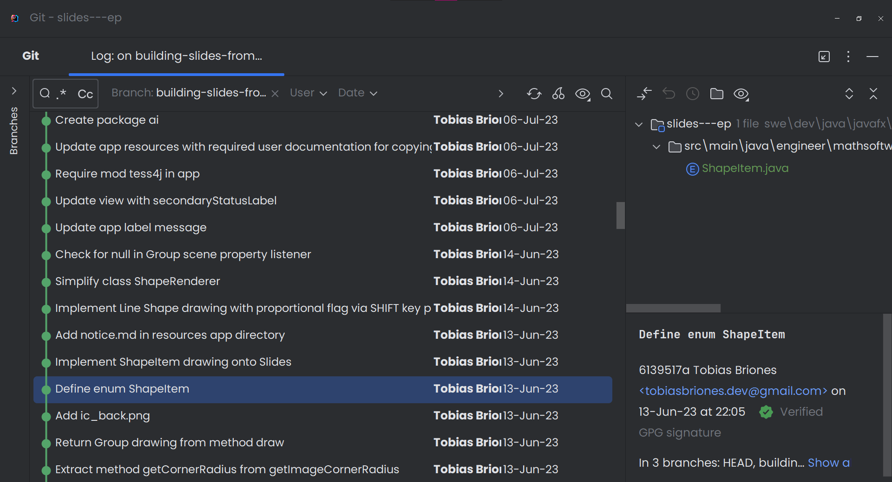

<!-- Copyright (c) 2023 Tobias Briones. All rights reserved. -->
<!-- SPDX-License-Identifier: CC-BY-4.0 -->
<!-- This file is part of https://github.com/tobiasbriones/blog -->

# Leveraging Git to Finish my Article (2023/10/09)

<b>Screenshot from IntelliJ IDEA</b>

---

After a long interlude, I'm writing the last three sections, checking the
conclusion, working out the abstract, and cover image for "Building Slides from
Screenshots App in JavaFX" —a great title where I granularly blogged the
development of a powerful JavaFX desktop app.

As said in
[this update in July](/finishing-writing-the-documentation-for-my-next-ep-2023-07-14),
I'm coming back to that article to finish it. I had left the EP and resources
finished already, so there's not much overhead for me to catch up.

I don't have any problem with leaving projects behind and coming months or years
later (even for my first projects from 2015 or so).

First, you have to be talented to be able to *make use of the tools*.

I write excellent commit messages (albeit not always to avoid over-engineering),
so **I don't just have projects but also *their history***.

I can leverage my licensed IntelliJ IDEA with powerful and modern-looking
features to —among many— get the information from project histories.

Since commits are well-made, tools can be leveraged to work better or
intelligently:

- One commit does one change.
- Well-written messages with the structure required. Not verbose or too terse
  either.
- At least, it tries to leave the project in a consistent state (compiling and
  passing tests).

Therefore, if I want to blog or get a date or any information, I can trivially
do it.

Anything that's text should be versioned, *like articles, not only code*.

Many commit messages can even be automated. For instance, commits when writing
articles are more obvious. I'll work on standardizing that, of course.

The benefit is that all this is part of the system. You can get contexts like
filtering by properties or the file tree. Git is a complex system, *it's not
for "uploading" or just push/pull projects*.

This way, I can only focus on the underlying article, and when I want to blog
about the project changes I made (EP inside the article), I can focus the git
tree on the directory of the project, so I only browse over project changes
(*source code*) and filter out article or documentation changes (*text in
English*).

Since commits are well-made, I can understand what, how, and why I did and write
about it without losing the hang of it.

I apply the same (FP) engineering principles for developing articles or anything
else.

If I commit something like a section or function, is because I'm 90-95% sure
that it's well-made, so I can focus and move forward.

That is, **anything committed is finished, so you commit only when you're *done*
**. This way, you remove all the overhead behind, but your system has to be
well-designed for this to work. It has to be lowly coupled
(yes, FP).

You don't want to *go back* to something already committed **unless it's a next
iteration** to maintain or improve the project. Thus, **your definition of
"done" has to be clear**.

In other words, if I'm doing something, then I'm doing it well. They're **small
changes but guaranteed** to be almost correct or "done" (if not then don't
commit yet).

For this to work, either in code or article projects, everything has to be lowly
coupled, so for instance, I can focus on one subsection or paragraph, and once
it's done, I don't have to worry about it because *it's not coupled to the rest
of the content*. It's just like functional programming.

Content has to be *homogeneous* to apply the *same principles*. *Everything is
an article* —as I recently said in
[Visualization Caption (2023/10/01)](/visualization-caption-2023-10-01#importance-of-captions).
Therefore, it can be a simple code snippet or image, but these have the same
function or article structure: abstract, body, and conclusion. This way, they're
*autonomous*, so once committed, there's little to nothing to change.

I, for one, finished most of the article when I published that update in July.
From what I said above, we can know that the current article in the development
branch is *almost* final.

So, for me, the article was finished in July (i.e., I have no worries), although
for readers, it's still not ready because it's not published to the public.

Delaying publishing time can be tricky, and I can think of better or more subtle
details in the meantime as well. The platform has had many feature updates, so
this huge article will read much better now than if I had published it months
ago.

Writing articles as advanced as those of mine is also crucial for engineering
*communication skills*.

After having worked on this wonderful project, I can happily leave these
internal takeaways of my experience with Git tooling to work on the project
documentation or article, updates, FP universal principles, and blog with EPs.

This way, development is optimal because it's about small changes that
immediately return the investment.
