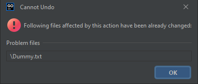
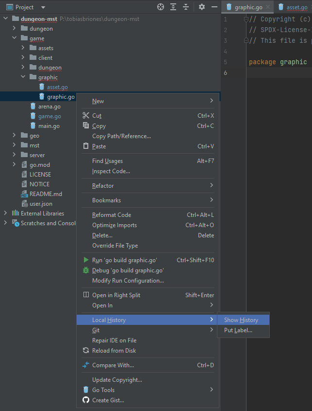
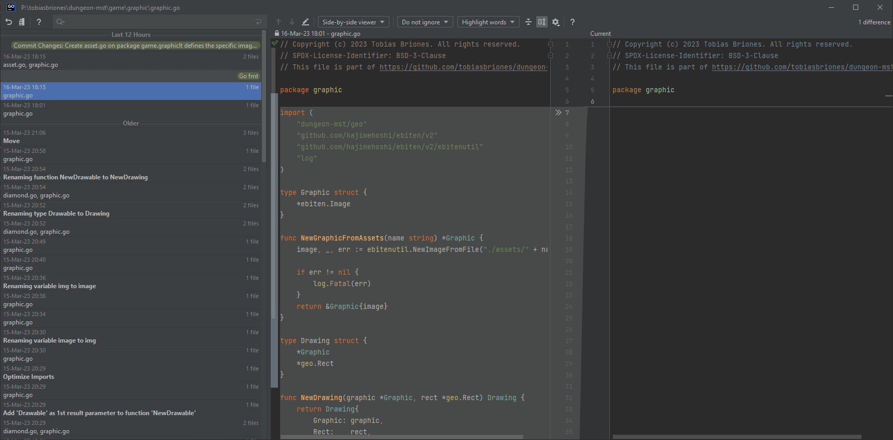
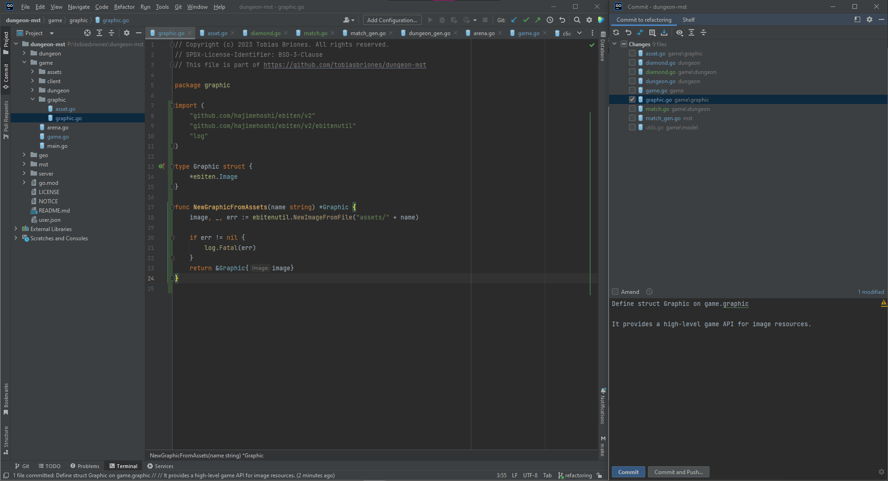

<!-- Copyright (c) 2023 Tobias Briones. All rights reserved. -->
<!-- SPDX-License-Identifier: CC-BY-4.0 -->
<!-- This file is part of https://github.com/tobiasbriones/blog -->

# How I Use JetBrains IDEs for Professional Dev

## Local History

### Recovering File History From Local Changes

<figcaption>

<strong>Local History: Cannot Undo</strong>

</figcaption>

<figcaption>

<strong>Local History</strong>

</figcaption>

<figcaption>

<strong>Local History: Local Diff</strong>

</figcaption>

<figcaption>

<strong>Local History: Commit 1</strong>

</figcaption>

<figcaption>

<strong>Local History: Commit 2</strong>

</figcaption>
