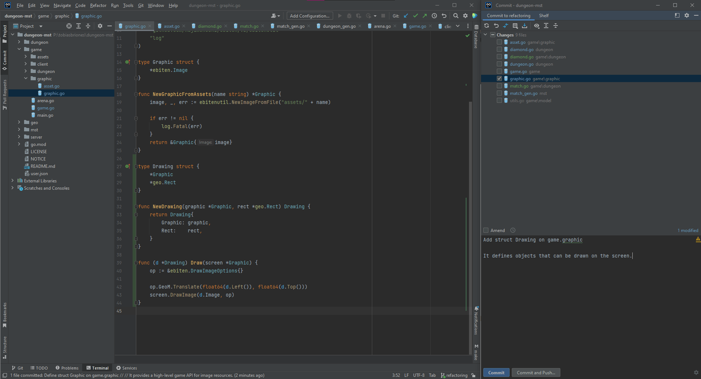

<!-- Copyright (c) 2023 Tobias Briones. All rights reserved. -->
<!-- SPDX-License-Identifier: CC-BY-4.0 -->
<!-- This file is part of https://github.com/tobiasbriones/blog -->

# How I Use JetBrains IDEs for Professional Dev

## Composable Views

## Real Keyboard Support

## First Class Tool Support

## Local History

Sometimes, git is still not available to save the changes made to our code, and
we need to leverage local tools to recover information.

It can happen when you're refactorizing or redesigning the code when it's still
unclear what particular changes should be committed to version control so
the history makes sense and is simple to review by peers.

Professional developers create a well-designed git history by first making good
commits that allow an understanding of a project's development.

The same engineering principles you know are also used for designing commits:
building small independent changes that deliver working code and passing tests.
So, you create a meaningful project history by applying fundamental engineering
principles like cohesion.

Other reasons can come when there's no even remote git support from the
organization. Although it seems like a bad joke, sometimes we have to work
with no git or no proper git support because of bureaucratic rules,
prototyping, code that is complicated to use because it's proprietary, etc.
So, unfortunately, those reasons run out of our scope, but we need to keep
being professional; there's no excuse!

There can be various reasons why we're working locally, and even though
**we're not** (partially or totally) using git in those moments, **the IDE or
text editor is using it**, so we can address incoming issues with no problems.

So, when for any reason we can't commit yet, sometimes we can get into trouble
and need to recover uncommitted local changes.

### Recovering File History From Local Changes

This happened to me when I was redesigning the initial codebase, and I was ready
with changes to save them, but a local error occurred which interrupted my
normal workflow.

I was working with several packages and I just can't apply a ball-of-mud [^x]
commit. As a professional engineer I have to understand what I'm doing (a.k.a.
domain expert), so I can also communicate more efficiently [^x].

[^x]: Ball of mud or spaghetti careless design

[^x]: I used this technique in another project for a tech interview I was
    immediately hired since I'm able to go back and forth with my IDE and use
    commits to explain what/why/how/when I did something, and these traits
    make you different from the crowd $$~98.5%$$ of other applicants who got
    rejected that year

Sometimes commits should be deferred for later since we're not sure about
changes, and we're still in a PoC[^x] stage, and committing changes to then
commit a change to uncommit them later and them commit them again is a whole
mess 😵[^x].

[^x]: PoC stands for Proof of Concept

[^x]: I can tell horror stories they've done with commits since is trivial
    to come up with unprofessional devs or so-called "engineers" these days

Once I had working changes, I applied some commits that follow good principles
so the project history grows smoothly or highly cohesively. Sometimes we can't
afford to do this $$100%$$ but it's fine, that's why engineers *design* and
mathematicians *model* (I'm both 😸).

Now, it's interesting that I found a realistic issue: for some reason — related
to Go tools I guess — I wasn't able to go back (CTRL+Z) and "lost" what I
did in that file:

<figcaption>

<strong>Local History: Cannot Undo</strong>

</figcaption>

I'm not afraid of those kinds of issues happening because I know I'm backed
with my professional experience and professional tools! So this is a normal
part of my routine[^x].

[^x]: Being experienced with tools is important to achieve this and that's
    why I chose IntelliJ products as I'm relatively well-versed and
    extremely familiar with them

After you have the issue, you go right click to the affecting file >
**Local History** > **Show History**, and then you get a git history 
the IDE (any modern IDE or text editor) creates under the hood:

<figcaption>

<strong>Local History</strong>

</figcaption>

<figcaption>

<strong>Local History: Local Diff</strong>

</figcaption>

Then you can recover your local changes and move on:

<figcaption>

<strong>Local History: Commit 1</strong>

</figcaption>

<figcaption>

<strong>Local History: Commit 2</strong>

</figcaption>

Goland helped me this way obtain unversioned modifications straightforwardly
and safely, and this feature has also been useful once in a while other times 
ago.
