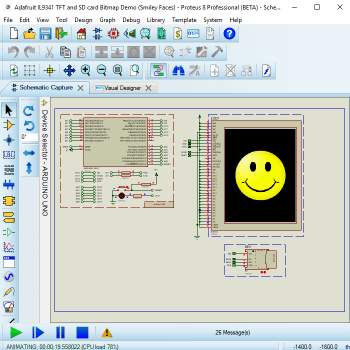
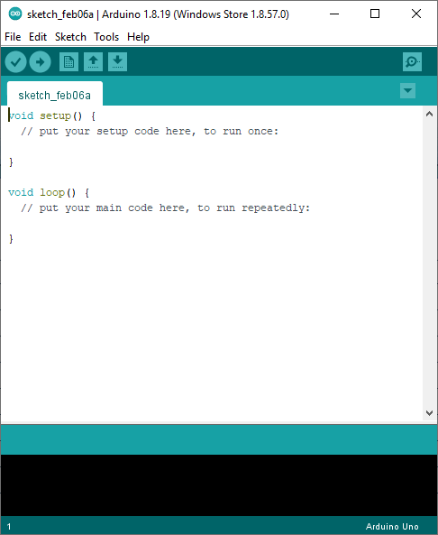
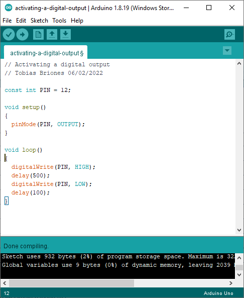
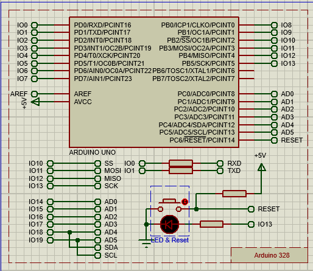
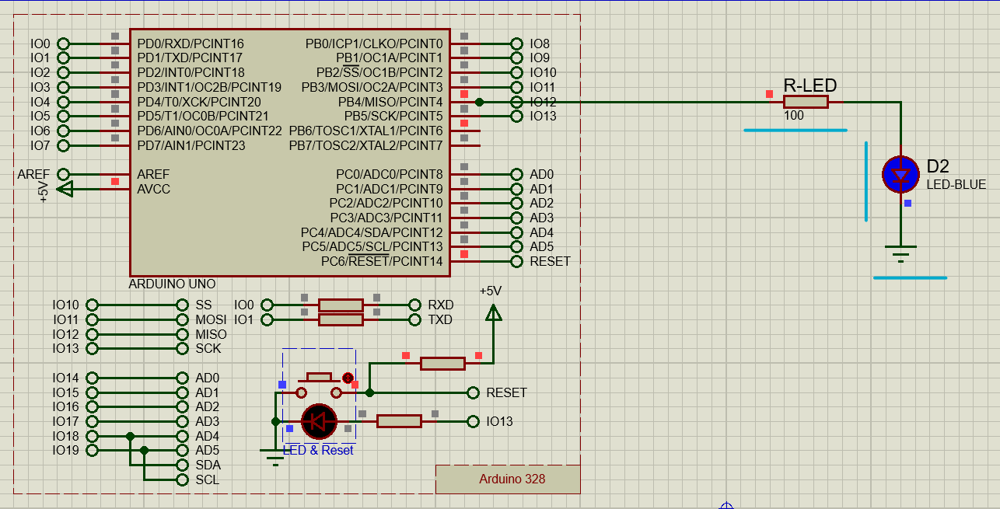

<link rel="icon" type="image/png" href="favicon.png">
<script src="https://polyfill.io/v3/polyfill.min.js?features=es6"></script>
<script id="MathJax-script" async src="https://cdn.jsdelivr.net/npm/mathjax@3/es5/tex-mml-chtml.js"></script>
<script type="text/x-mathjax-config">
  MathJax.Hub.Config({
    tex2jax: {
      inlineMath: [ ['$','$'], ["\\(","\\)"] ],
      processEscapes: true
    }
  });
</script>
# Arduino Laboratory: Activating a Digital Output

## Objectives

### General Objective

Develop and simulate an Arduino program that turns on and off iteratively an
LED.

### Specific Objectives

- Generate the object code (hex) of the Arduino program.
- Add an Arduino Uno board in Proteus.
- Design a trivial electronic circuit to connect the LED to the output of the
  Arduino in Proteus.
- Load and run the program in Proteus.

## Framework

To cover this laboratory, Arduino and Proteus are used to simulate the program
that will be developed.

### Arduino

Officially, we have that:

> Arduino is an open-source electronics platform based on easy-to-use hardware
> and software. It's intended for anyone making interactive projects.
> Source: Arduino.cc [@arduino-2022]

It highlights that it is an open source hardware platform which is a good
characteristic of current modern platforms and that are useful, since they have
their communities of open source contributors.

In addition, Arduino is:

> Arduino designs, manufactures, and supports electronic devices and software,
> allowing people around the world to easily access advanced technologies that
> interact with the physical world. Our products are straightforward, simple,
> and powerful, ready to satisfy users’ needs from students to makers and all
> the way to professional developers.
> Source: Arduino.cc [@arduino-2022]

To write the programs and get the object code (compiled in hex) you use Arduino
IDE which is the official Arduino IDE to program these boards and is available
from its
[official download](https://docs.arduino.cc/software/ide-v2/tutorials/getting-started/ide-v2-downloading-and-installing).

### Proteus Simulator

According to *Labcenter Electronics*[@labcenter-electronics-2022] -Proteus
provider company-:

> The Proteus Design Suite combines ease of use with a powerful feature set to
> enable the rapid design, test and layout of professional printed circuit
> boards.
> Source: *Labcenter Electronics*[@labcenter-electronics-2022]

#### Review

Proteus is software for use in areas such as electronic engineering where you
can do simulations of all kinds of electronic circuits. This software has been
very useful for both professionals and students, although it has already become
very obsolete and with high-cost monetization models because it has been many
decades already on the market. Personally, I have used Proteus in a basic way
since I studied electronics at high school.

#### Arduino Designer

The Proteus platform allows, among many others, designing and running
simulations in the Arduino board.

According to official information, with the capabilities of Proteus we can:

> Often the trickiest part of embedded development is the hardware design.
> The Arduino™ ecosystem goes a long way to solving this problem with lots of
> ready made shields. Visual Designer takes this into the software domain, using
> our professional schematic capture and Proteus VSM simulation engine to make
> simulation of complete Arduino systems possible. The Peripheral Gallery in
> Visual Designer then simplifies the whole process as it will autoplace and
> autoconnect the electronics on the schematic for you. Finally, Visual Designer
> provides high level methods to enable the control of the embedded system from
> a flowchart editor.
>
> In addition to full Arduino Shields we have included many
> individual sensors and modules from the Grove system and also added a bunch of
> useful parts as breakout boards. More advanced users can even place and wire
> their own custom hardware directly on the schematic using the thousands of
> simulation models in Proteus VSM.
>
> Source: *Arduino Simulation Software - Processor, Shields and Peripherals*
> [@labcenter-electronics-2022]

**Arduino Board in Proteus**



> Source: *Arduino Simulation Software - Processor, Shields and Peripherals*
> [@labcenter-electronics-2022]. Under fair use.

#### Install Arduino Board

If necessary, the Arduino library must be installed to Proteus. At the end of
the simple installation, you can add the card Arduino from the list of devices.
For more details, go to *How to Add Arduino Library in to Proteus 7 $\&$ 8*
[@instructables-2018].

### Compute the LED Resistor Value

The LED diode is usually powered from a direct $3-5V$ source. The current and
power of the LED is specified according to each diode, but it is knows in
advance that some approximate values work well for a simple LED to be used.
According to *Omni Calculator*[@szyk-2022] we need to know the following
variables:

- **Circuit Type:** Series or parallel.

- **n:** Number of connected LEDs.

- **V:** Voltage source.

- **$V_0$:** Voltage drop for each LED.

- **$I_0$:** Current per LED.

The most common standard values are serial configuration; power supplies or
batteries from $1.5-12V$; LED voltage of $1.7-3.6V$ which depends on the color
of the LEDs; and currents of$20-30mA$ [@szyk-2022].

As we know from Ohm's law $R = \frac{V}{I}$ so it should be applied in the
calculation of the resistor of the LED.

For other calculations with series configuration we have [@szyk-2022]:

- $$R = \frac{V - n*V_0}{I_0}$$.

- $$P_0 = V_0 * I_0$$.

- $$P = n * V_0 * I_0$$.

- $$P_r = I_0^2 * R$$.

## Experimental Procedure

The procedure consists of the implementation in Arduino IDE and in Proteus.

### Create Arduino Program

First you have to open a new project in Arduino IDE.

**Initial Sketch in Arduino IDE**



To update the name of the program go to File -\> Save As and select the
destination directory and program name. In this case, the name of the program
is "activating-a-digital-output".

The following simple program will be used for this lab:

```c
const int PIN = 12;

void setup() 
{
  pinMode(PIN, OUTPUT);
}

void loop() 
{
  digitalWrite(PIN, HIGH);
  delay(500);
  digitalWrite(PIN, LOW);
  delay(100);
}
```

**Final Sketch to Run**



To get the compiled hex binary from the source code, go to Sketch -\> Export
compiled binary. Now the compiled .hex files will be found in the directory
where the program was saved.

### Run Simulation in Proteus

To run the simulation, Proteus will be used.

When opening Proteus, go to File - New Project give the project a name.

Next - Select "Create an outline of the selected template" with the
"DEFAULT" option.

Next - Select "Do not create a PCB layout".

Next - Select with the Family options: ARDUINO, Controller:
Arduino Uno and Compiler: Arduino AVR (Proteus). Leave "Create selected. Quick
Start Files".

Next - Finish.

**Initial Set Up of Proteus with Arduino Uno**



The program that was written must be loaded into the simulator. Right-click on
the Arduino board and go to Properties. In select the binary file that was
compiled, which contains the bootloader. In this case, the file is
"activating-a-digital-output.ino.withbootloader.standard.hex".

Calculating the value of the resistance we have that with standard values

$$R_{LED} = \frac{5v}{20mA} = 100\Omega$$

If the resistance in commercial value is not exact, it should be rounded up or
apply another configuration to obtain the equivalent resistance.

**Final Circuit Set Up on Proteus**



## Analysis of Results

Upon successful execution of the program in Proteus, the $$D2$$ LED flashes
according to the iterations established in the program. Take into account that
the simulation can run more or less fast according to the speed of the
simulator.

The Arduino card issued the digital signals through pin $$12$$ which is defined
in the program loop.

## Conclusions

A program was developed in Arduino IDE that activates the signal of pin $$12$$
of the Arduino given a set interval. Then, a simulation of the circuit by adding
an LED as a load to the $$12$$ output of the Arduino. It was calculated from
beforehand the resistance of the LED so that it was protection for it.

See also: [Tobias Briones &#124; Course Project at UNAH-IS911: Microprocessors](https://github.com/tobiasbriones/cp-unah-is911-microprocessors).

## References

- [Arduino - Home (@arduino-2022)](https://www.arduino.cc)
- [Omni Calculator &#124; LED Resistor Calculator (@szyk-2022)](https://www.omnicalculator.com/physics/led)
- [Labcenter Electronics &#124; Arduino Simulation Software - Processor, Shields and Peripherals (@labcenter-electronics-2022)](https://www.labcenter.com/visualdesigner/arduino)
- [Instructables &#124; How to Add Arduino Library in to Proteus 7 \& 8 (@instructables-2018)](https://www.instructables.com/How-to-add-Arduino-Library-in-to-Proteus-7-8)
