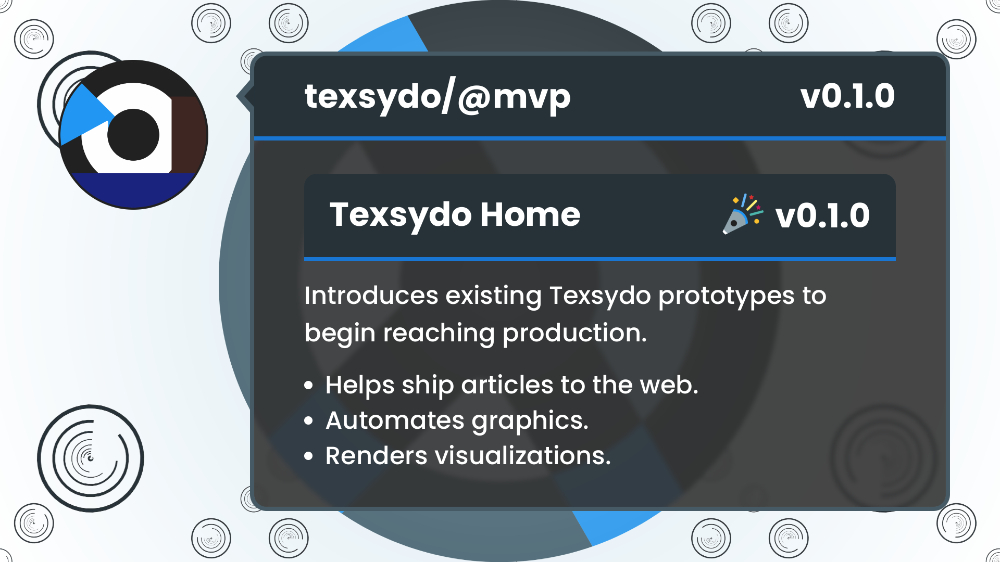
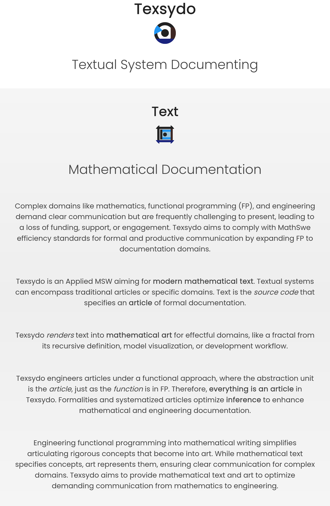

<!-- Copyright (c) 2024 Tobias Briones. All rights reserved. -->
<!-- SPDX-License-Identifier: CC-BY-4.0 -->
<!-- This file is part of https://github.com/tobiasbriones/blog -->

# Texsydo Home v0.1.0 | Texsydo MVP (2024/10/13)

Mathematics, engineering, and mathematical software (MSW) require formal and
concise documentation to optimize the delivery of complex technical results to
final users. Texsydo is an essential and ubiquitous MSW with existing prototypes
to address modern mathematical text and art. Existing prototypes help ship
articles to the web, automate graphics, and render visualizations. They will
transition to MVP later, but the home page can present them to begin reaching
production.

## New Home Page with Conceptualization and Prototypes

Many ad-hoc Texsydo prototypes,
like [the FX prototype](/testing-the-texsydo-fx-prototype-2024-09-03), are
migrating to the MathSwe Prototypes repository. Although they are not MVPs yet,
the landing page must present technical results in the Texsydo web home to
iterate quickly with high-level results.

- [New Home Page \| Texsydo MVP (2024/10/13)](/new-home-page---texsydo-mvp-2024-10-13).

GitHub release
at [Tsd.Math.Software v0.1.0: New Home Page with Conceptualization and Prototypes](https://github.com/texsydo/texsydo---mvp/releases/tag/v0.1.0).

Deployment preview `PR#5 v0.1.0`
at [Netlify](https://deploy-preview-5--texsydo.netlify.app/).

Texsydo web home at [Tsd.Math.Software](https://tsd.math.software).

The initial Texsydo MVP release provides the web home to deliver value in
production for all the existing technical results.

## Text

The "Text" section is the page abstract that conceptualizes Texsydo.

<figure>
    
    <figcaption>Text</figcaption>
</figure>

Texsydo unifies formal source code with natural and graphical languages in
modern mathematical documentation. Formalizing Texsydo allows the existing
technical results to deliver value and lead the project forward.

## Web

Texsydo Web is currently a complex prototype that can help create mathematical
articles for the web that follow MathSwe standards with Markdown and a
domain-specific system, making the process efficient and formal.

The [Web section](https://tsd.math.software#web) details all the existing
features even though the program is still unavailable to the public.

The Web CLI prototype provides article commands to create, list, build, serve
for development, and deploy to GitHub Pages.

The system provides a "Domain Dictionary" to define text transformations, which
empowers inference and removes redundancy while writing.

It supports "In-Article Projects" for articles that contain an example project
or files.

It supports development workflow to generate MathSwe cover images for PR and
Release blogs, making the development life cycle more efficient and complete.

The Texsydo Web prototype offers advanced features that have been refined over
the years, helping write modern articles in MathSwe. Texsydo Web will become
available to the public once its prototype transitions to an MVP.

## FX

Texsydo FX is currently another prototype that addresses the effects of
documentation graphics.

Texsydo Web calls FX to generate the cover images of standard articles, like PR
and Release blogs, delivering graphical assistance in the development process.

The Texsydo FX prototype will become MVP and available, like the Web prototype.
It focuses on providing clean graphical documentation to streamline complex
information.

## Canvas Play

The Canvas Play section is part of the Texsydo FX prototype that incorporates
experimental APIs to innovate new products with visualizations.

It supports Repsymo FX to render its model outputs. It shows how the machine
replacement model passes through Repsymo internals (i.e., the solver)
and ships results.

It renders `FHD 9/16` with custom slide duration visualizations from the
mathematical output of Repsymo to show all the steps to build the solution space
via recursion. Everything is minimalistic and contains complete information.

Moreover, Canvas Play also has APIs to build engineering specifications with
rulers, captions, and further definitions. The "Flower" animation shows a
step-by-step visualization of how to draw a flower with metrics.

FX aims for graphical specifications but also art. The "BirdCat" drawing
depicted a step-by-step animation teaching how to draw a cat that resembles a
bird with shapes and effects.

The Canvas Play project contains prototypes that enrich the scope of Texsydo FX
to provide value for academic, professional, and artistic projects.

## Home Page with Results of Texsydo Prototypes

Texsydo takes text, a source code specification of an article, and renders it
into mathematical documentation and art. Texsydo's functional principles state
that everything is an article specializing in specific domains. These
mathematical properties make the process efficient for the system and the
writer.

Such efficiencies are already present in the smart dictionary, development
workflow, and model visualization results this release publishes. Texsydo will
streamline the **mathematical text** workflow for mathematics, engineering, and
art.

The text and domain-specific concepts allow results such as infinitely scalable
visualization resolutions with other parameters like captions and automated
assistance with total accuracy.

Texsydo expands functional programming into articles for completeness. Cohesive
articles empower multidisciplinary professionals to fill the **spectrum from
academic to engineering**, denoting domain expertise.

The web home presents all the new prototype features at
[Tsd.Math.Software](https://tsd.math.software) with complete details.

The new Texsydo web home conceptualizes definitions to address modern
mathematical text and art. Then, it presents the latest prototype results across
the Web, FX, and Canvas Play sections. The Web prototype helps write enriched
Markdown articles for the web, the FX prototype automates cover images, and
Canvas Play provides experimental APIs and features based on evolving needs. The
prototypes will deliver value to final users when they transition to MVP,
recalling that Texsydo aims to reach the engineering grade.

