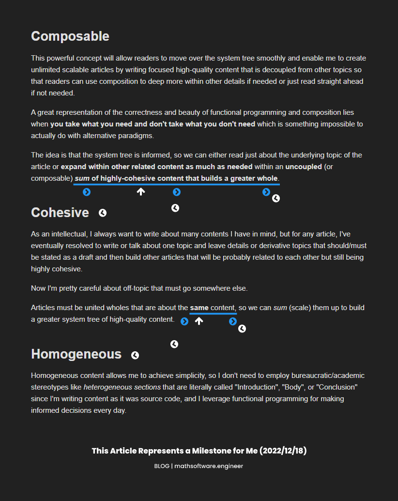
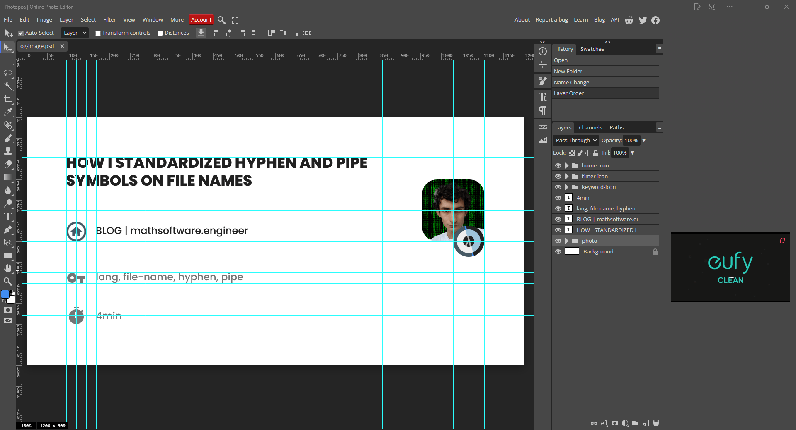
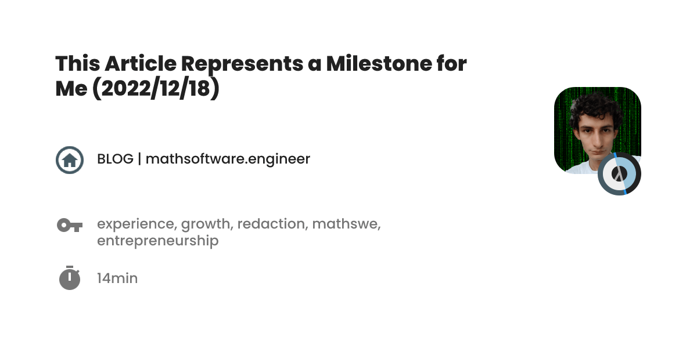

<!-- Copyright (c) 2022 Tobias Briones. All rights reserved. -->
<!-- SPDX-License-Identifier: CC-BY-4.0 -->
<!-- This file is part of https://github.com/tobiasbriones/blog -->

# This Article Represents a Milestone for Me (2022/12/18)

From recent results, I will develop my experience, content design, and some news
representing one of my latest milestones on 2022/12/18.

I have to say that
[this article](how-i-standardized-hypen-and-pipe-symbols-on-file-names) [I
published 3 days ago](https://github.com/tobiasbriones/blog/pull/20)
represents a milestone for MathSwe content as I've started to work with the
concepts of:

- Composable content.
- Cohesive content.
- Smooth homogeneous content that moves on the system tree.
- Got a new open graph cover.

## Composable

This powerful concept will allow readers to move over the system tree
smoothly and enable me to create unlimited scalable articles by writing
focused high-quality content that is decoupled from other topics so that
readers can use composition to deep more within other details if needed or
just read straight ahead if not needed.

A great representation of the correctness and beauty of functional programming
and composition lies when **you take what you need and don't take what you
don't need** which is something impossible to actually do with alternative 
paradigms.

The idea is that the system tree is informed, so we can either read just
about the underlying topic of the article or **expand within other related
content as much as needed** within an **uncoupled** (or composable) ***sum* of
highly-cohesive content that builds a greater whole**.

## Cohesive

As an intellectual, I always want to write about many contents I have in mind,
but for any article, I've eventually resolved to write or talk about one topic
and leave details or derivative topics that should/must be stated as a draft
and then build other articles that will be probably related to each other
but still being highly cohesive.

Now I'm pretty careful about off-topic that must go somewhere else.

Articles must be united wholes that are about the **same** content, so we can
*sum* (scale) them up to build a greater system tree of high-quality content.

## Homogeneous

Homogeneous content allows me to achieve simplicity, so I don't need to employ
bureaucratic/academic stereotypes like *heterogeneous sections* that are
literally called "Introduction", "Body", or "Conclusion" since I'm writing
content as it was source code, and I leverage functional programming for making
informed decisions every day.

All those boilerplate-based and off-topic sections are used to hold
academic monoliths[^1] and if you're clever enough, you must come out with your
DSLs because you're a domain expert completely able to provide actual value
instead of off-topic academic and corporate marketing.

[^1]: Think why Java used to be overly verbose since 90's and 00's software
    (and hardware) were monstrous monoliths and Java was the excellent 
    language for that era

Such sections (for example) are clearly noticed as off-topic since your
article has a central topic `X` and you're not talking about "Introduction", or
"Body" but `X`. Those generic boilerplate-driven titles recalls us of cheap
poorly-defined software.

### Generic Templates

Boilerplate-driven development is pretty common to see in cheap generic software
out there, due to top-down template-based imposed/bureaucratic hierarchies.

It's like: your app is about `Song-to-Text Recognition` not about stupid
`Controllers`, `Middlewares`, `Services`, or `UseCase`. You "sell" 
"song recognition" and similar works, but you don't "sell" "Controllers" and
such, so those generic buzzwords are stereotypes that bypass what an actual
engineer would do as a domain expert, so I expect modules called like say for
example `["song", "text", "transform", "control", "bass", "pitch", 
"amplitude", "some-ml-model"]` instead. Those modules depend on what you're 
particularly designing so if I tell you what modules to write it would be a
bureaucratic template (like OOD) instead of a DSL, hence DSLs are explicitly 
called "specific" although in FP I would just call them "languages".

Notice I'm not talking about "generic programming" here but generic ways that 
stereotype systems.

The only domain we can find that boilerplate is relatively correct to use is 
for prototypes or cheap software (like corporate apps) so the engineer has to
decide whether to employ them sometimes.

When being homogeneous, in the example above, an API is the same kind of
software a "business domain" is, a GUI tree is, or any module is. So there's no 
need to differentiate among them and say that APIs have a "Controller" as a
template. In other words, everything should be a domain, and this also applies 
to articles of course.

Articles are about the same idea, sometimes we need to think a bit more to
write **what has to be written** instead of using **generic templates** and
that endeavor leaves cheap articles behind and promotes high-quality content.

### How I Homogenized My Previous Article

I'm writing this article as a milestone for the paradigm shift and the updates 
about content structure is pretty interesting.

I've always put the abstract at the beginning of my writings and made them
as short as possible to resume the whole article.

Now notice how we normally would put sections for "Introduction",
"Conclusion", etc., when writing formal or semiformal content. As said above,
I don't write about "Introduction" or "Body", I'm not an "Introduction
Engineer", that is, those are stereotypes for generic/bureaucratic artifacts.

And bureaucrats enforce that kind of repetitive structure to be "correct"
when in fact they don't have an idea of what they're talking about.

Content **must be homogeneous** to give all benefits of its value,
**homogeneity is key for pureness**.

What I do is **apply informed designs** to systems, so I remove
boilerplate[^2] and make them 💯 original as if were a huge universe set where
every point is unique[^3], and we *sum* them up as a partition that induces the
equivalence classes[^4] with the *exact* properties we need which leads to
mathematical elegance and correctness as well as infinitely scalability.

[^2]: Boilerplate is proper of poorly-defined generic software like OO programs
    or also procedural Go programs

[^3]: All elements within a set are unique as the relation that defines 
    whether an element $$x \in X$$ is binary so $$x$$ belongs or not to $$X$$
    and although $$x$$ can be listed many times it is the same element

[^4]: Math or FP classes are not the same as OOP classes at all

I have to say I got quite excited with the previous paragraph 🤗 and it shows
one more time how I'm fully capable of leading the mathematical software
industry.

Now, notice how I got rid of the "Introduction" stereotype by moving smoothly
over the sections as if they were **functions** with input and output that can
obviously be composed, so I created a **particular** section that plays the
traditional "Introduction" section but being domain-specific or well-informed
instead of being generic:
[Hyphen and Pipe Symbols Semantics in File Names](how-i-standardized-hypen-and-pipe-symbols-on-file-names#hyphen-and-pipe-symbols-semantics-in-file-names).

That section **smoothly** introduces the reader without **imperatively**
saying it is an "Introduction" (can you see the beauty of FP and DSLs?).

Therefore, all sections can be composed together, and the reader only has to
read what it's needed and the content can be optimally displayed.

Also notice how all everything is homogeneous of course, so a section is the
same as a whole article or the whole 
[mathsoftware.engineer](https://mathsoftware.engineer) for me so that we can
leverage this pureness to get the most out of the content. That also means
that every section must have a micro abstract and conclusion to be smooth
so the reader can move from one section to another or skip them.

Then, the "Conclusion" came, so I took **all the inner sections** (without
abstract, title, and the conclusion itself) and **resumed what a reader who
*already read* the article has achieved** (a.k.a. conclusion) and make it
original:
[Standardize Hyphens and Pipes on File Names](how-i-standardized-hypen-and-pipe-symbols-on-file-names#standardize-hyphens-and-pipes-on-file-names),
noticing how I also **micro resumed the section title itself** to eradicate
the "Conclusion" boilerplate.

Then, that is the output of the article that you can "plug" into the next 
article to get greater value and that also builds a rich well-informed system.

### Check the Commits

See how I treated the domain-specific 
[introduction](https://github.com/tobiasbriones/blog/pull/20/commits/2681b15fe70ce0be4980066c7a4609e79b00cd91)
and
[conclusion](https://github.com/tobiasbriones/blog/pull/20/commits/f2e74ff736f67ecdf2acd5de014367ed2b634407)
as such. The commit messages go like `Add introduction...`, `Add conclusion...`
when it would normally be `Add section...`

### Do not Use Plurals

As a rule of thumb don't use plurals, I usually hate them as they represent
stereotypes and are complicated. Go as simple as possible, and plurals are
typically not simple at all!

One direct example of this for this topic is when they tell you to add to
your work sections:

- Objectives
- Conclusions
- Recommendations

Back in the time after writing my B.Math thesis when I began to post content
to [mathsoftware.engineer](https://mathsoftware.engineer) I stopped writing in
plurals and at least used the singular forms: "Objective", and "Conclusion".

When adding plurals you naturally write down a list of items next, so it
means you skip actual content for generic items.

Plurals also indicate that section is merely off-topic just to comply with
their low standards because you have to publish an "academic journal" that
is a huge monolith no one is going to read. I mean, objectives, and
recommendations, are contents that can be addressed anywhere else out there,
and adding them into the same "PDF" only makes it a bigger bureaucratic
top-down monolith.

## How I Applied Cohesion to This Same Article

This is an example of how I applied what I've been developing in this
article to this same article.

<figcaption>

<strong>How I Applied Cohesion to This Same Article</strong>

</figcaption>

From my illustration, it's easily readable to follow how I *connected*
sections by *concluding* with the idea of *the next section* so content is
*smooth*[^5], and it shows how it builds a **greater whole** out of
**composable** and **highly-cohesive** sections as if they were functions.

[^5]: Smooth curves are my definition of beauty

If you notice, all these concepts are *the same* (homogeneity again!), for
example, to be cohesive requires no off-topic to remove any fragmentation or
impurity, so it can build an entire whole (as per cohesion definition). When
removing impurities that fragment the whole into heterogeneous parts, we end
up with a homogeneous whole. To compose they need not have impurities so be
cohesive or homogeneous.

Also, notice how the unit of abstraction in FP is the function *itself*! 
while in alternative paradigms you have to come out with arbitrary 
(heterogeneous) workarounds.

Imagine if I talk about some off-topic then I wouldn't be able to compose
sections since if one only section is not able to build a united itself, then
it's even worse adding more together, they're ending nowhere.

Detecting impurities introduce relativity but that's another topic:
[Everything is Relative](everything-is-relative).

### Recursive Fun Fact

The above image is from this same article, so it plays well with the content
I developed, but I also wanted to add it to the section [Cohesive](#cohesive)
which appears in the screenshot as well!

That would've been a recursive move but only possible if done
programmatically as I'm not hacking into Photopea — a great and free version
of Photoshop —.

## Open Graph Cover

Lastly, I'll mention the new template I created for the social media preview of
the articles.

This is from my previous article, so for the record:

<figcaption>

<strong>First OG Cover from Previous Article | Photopea</strong>

Source: Screenshot | <it>Photopea</it> (under fair use)

</figcaption>

It contains the article title, the author image with the small and first[^6]
version of MathSwe logo I created[^7] attached to the bottom-right, and
icons[^8] for home, keywords, and reading time.

[^6]: The first MathSwe logo is too tiny and doesn't look well as a small 
    icon, so I then created a main version which is bigger and much better 
    and is displayed properly at any size but the reason I still don't use it's
    that I want to get it as a vector source code first, so I don't have to take
    a huge amount of time (I've made a huge amount of efforts over the years,
    and it's about time to automate and move forward now) fighting with 
    manual graphic editing on Photopea for beauty details like the smooth curves
    and my perfectionist measurements

[^7]: I got influence from my earlier and original creations (Piaxid) 
    for designing MathSwe of course

[^8]: I've always taken Google's Material Design as a first-class UI/UX 
    guideline so these icons are from (community-led) 
    [Material Design Icons](https://materialdesignicons.com) as well

And then, here is the current cover for this article:

<figcaption>

<strong>OG Cover</strong>

</figcaption>

A further step is to automate all this of course 👾.

### We Should Check Out the Pipe on the Home Value As Well

Notice how interesting is when I wrote about how I encode the pipe operator 
into file names in 
[How I Standardized Hyphen and Pipe Symbols on File Names](how-i-standardized-hypen-and-pipe-symbols-on-file-names)
and I also applied the pipe to the first cover image for that article.

I've also applied the pipe to one of the images above too.

In this case, these articles are hosted at
[Blog | Math Software Engineer](https://blog.mathsoftware.engineer) or the same,
[Blog | mathsoftware.engineer](https://blog.mathsoftware.engineer) and that 
means that you're reading the blog, so you see **what kind of content to 
expect**, and then it expands out to further details for the rest of the domain 
name.

Notice how `Blog` is a factual detail and then the pipe *composes* it to
build an entire and bigger whole altogether with the complete website. `Blog`
is a subset of `mathsoftware.engineer` (a subdomain technically), so this 
way we see how FP goes **from factual "small" truths to universal properties**, 
unlike *alternative* programming paradigms.

Also notice how reading is smooth as you can naturally do it from
top-to-bottom (I'm not talking about top-down structure but the position of your
"cursor") within the same level of abstraction, and you can go further to
the right for granular detail. In other words, the pipe creates the effect
of either keeping "inside" or moving away to another domain when applying it,
like for example, in this case, `mathsoftware.engineer` is a `Blog`s "exit".

## I am Infinitely Thankful

Whenever I want to get knowledge or take decisions I only have to use my math
and functional programming basis to infer a proper solution to each particular
problem, in other words, I only have to think to get new knowledge and 
answers which is an in-house first-class representation of simplicity induced 
by math and FP.

Programming, engineering, math, philosophy, research, and others have
systematically structured my brain all over the years.

Math, relativism, and functional programming have shifted my personal and
professional life to the next dimension of consciousness, and they're the ones 
whom I have to thank for everything I've built up and been able to understand
since when you get to this level you are just capable to do whatever you want as
an engineer.

In this article, I developed what I currently have as one of my milestones for
[mathsoftware.engineer](https://mathsoftware.engineer) and MathSwe content
including last-days insights and thoughts based on my
[previous article](how-i-standardized-hypen-and-pipe-symbols-on-file-names).

